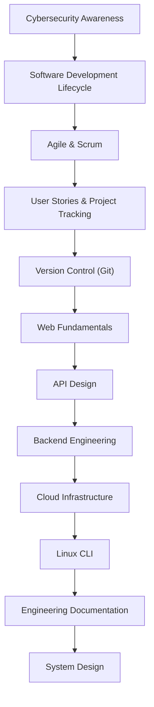

<p align="center">
  
</p>

<h1 align="center">🚀 Thynqit Labs – Foundational Engineering Bootcamp</h1>

<p align="center">
  
  
  
  
  
</p>

---

A structured, comprehensive foundational engineering curriculum curated by **Thynqit Labs**. It is designed to help software engineers understand modern software development, cloud systems, security practices, and scalable architecture.

This repository acts as a **step-by-step engineering handbook** that learners can follow sequentially.

It is suitable for:

- Software Developers
- QA Engineers
- DevOps Engineers
- Engineering Students
- Early-career Professionals
- Anyone transitioning into software engineering

---

## 🚨 Why This Exists

Most engineering teams struggle not because of lack of talent, but because of inconsistent fundamentals.

Different developers follow different practices.
Different projects follow different standards.

This leads to:
- Rework
- Misalignment
- Slower delivery

This bootcamp is designed to solve that by building a shared engineering foundation.

---

## ❌ Who This is NOT for

- Developers looking for quick tutorials
- People expecting copy-paste solutions
- Anyone not willing to think deeply about systems

---

## 🧑‍💼 For Engineering Teams & Companies

This curriculum can also be used to:

- Standardise engineering practices across teams
- Onboard new developers faster
- Improve code quality and delivery consistency
- Build a shared engineering language

If you’re building or scaling a team, this can serve as a foundational system.

---

# 📑 Table of Contents

- Overview
- Quick Navigation
- Learning Goals
- Curriculum Navigation Map
- Bootcamp Structure
- Curriculum Roadmap
- System Design Use Case
- Expected Learning Outcomes
- Repository Structure
- CLI Philosophy
- Contribution Guide
- License

---

# 📘 Overview

Modern software engineering requires more than programming knowledge.

Engineers must understand:

- Security awareness
- Software delivery processes
- Agile collaboration
- Version control
- APIs and backend systems
- Cloud infrastructure
- Linux command-line environments
- Architecture documentation
- System design

This curriculum introduces these topics progressively to build **real-world engineering intuition**.

---

# 🧭 Quick Navigation

Start your learning journey here:

- **Begin Learning → [Week 1](./week-01)**
- **Architecture Documentation → [Week 5](./week-05)**
- **Explore System Design → [Week 6](./week-06)**

---

# 🎯 Learning Goals

By completing this bootcamp, learners will:

- Understand modern software delivery workflows
- Build a security-first engineering mindset
- Use Git professionally
- Design APIs and databases
- Understand cloud infrastructure basics
- Learn Linux command-line fundamentals
- Understand scalable system design
- Produce professional engineering documentation
- Communicate architecture clearly

---

# 🗺 Curriculum Navigation Map

The program follows a progressive engineering learning path:



Each step builds upon the previous concept.

---

# 📚 Bootcamp Structure

The curriculum follows a **5-day work week learning structure**.

```
Week
 ├── Day 01
 │    ├── README.md
 │    ├── resources.md
 │    └── assignments.md
```

Each day contains:

- Concept explanations
- Curated learning resources
- Hands-on exercises
- Reflection questions

---

# 🛣 Curriculum Roadmap

## Week 1 – Security & Software Delivery Foundations
[Open Week 1](./week-01)

| Day | Topic |
|----|------|
| Day 1 | [Cybersecurity Fundamentals](./week-01/day-01) |
| Day 2 | [Software Development Lifecycle](./week-01/day-02) |
| Day 3 | [Agile & Scrum](./week-01/day-03) |
| Day 4 | [User Stories & Project Tracking](./week-01/day-04) |
| Day 5 | [Git Basics](./week-01/day-05) |

---

## Week 2 – Git Collaboration & Web Fundamentals
[Open Week 2](./week-02)

| Day | Topic |
|----|------|
| Day 6 | [Git Branching & Code Review](./week-02/day-06) |
| Day 7 | [How the Web Works](./week-02/day-07) |
| Day 8 | [HTTP Fundamentals](./week-02/day-08) |
| Day 9 | [Data Formats](./week-02/day-09) |
| Day 10 | [APIs & REST Design](./week-02/day-10) |

---

## Week 3 – Backend Engineering Foundations
[Open Week 3](./week-03)

| Day | Topic |
|----|------|
| Day 11 | [API Design Principles](./week-03/day-11) |
| Day 12 | [Database Design Fundamentals](./week-03/day-12) |
| Day 13 | [Authentication & Authorization](./week-03/day-13) |
| Day 14 | [Encryption & Security](./week-03/day-14) |
| Day 15 | [Testing Fundamentals](./week-03/day-15) |

---

## Week 4 – Cloud & Infrastructure
[Open Week 4](./week-04)

| Day | Topic |
|----|------|
| Day 16 | [Cloud Fundamentals](./week-04/day-16) |
| Day 17 | [DevOps & CI/CD](./week-04/day-17) |
| Day 18 | [Logging & Monitoring](./week-04/day-18) |
| Day 19 | [Networking Fundamentals](./week-04/day-19) |
| Day 20 | [Linux CLI for Engineers](./week-04/day-20) |

---

## Week 5 – # Product Thinking & Engineering Documentation
[Open Week 5](./week-05)

| Day | Topic |
|----|------|
| Day 21 | [Business Requirement Document](./week-05/day-21) |
| Day 22 | [Product Requirement Document](./week-05/day-22) |
| Day 23 | [Feature Specification](./week-05/day-23) |
| Day 24 | [API Specification & DB Schema](./week-05/day-24) |
| Day 25 | [Architecture Documentation](./week-05/day-25) |

---

## Week 6 – # System Design & Architecture
[Open Week 6](./week-06)

| Day | Topic |
|----|------|
| Day 26 | [System Design Basics](./week-06/day-26) |
| Day 27 | [Monolith Architecture](./week-06/day-27) |
| Day 28 | [Microservices Architecture](./week-06/day-28) |
| Day 29 | [Scalability Concepts](./week-06/day-29) |
| Day 30 | [Performance & Reliability](./week-06/day-30) |

---

# 🧱 System Design Use Case

Throughout the curriculum we will design a simplified **e-commerce platform inspired by Target.com**.

Learners will progressively build:

- Business Requirement Document (BRD)
- Product Requirement Document (PRD)
- Scope definition
- Feature specification
- User stories
- API design
- Database schema
- Architecture diagrams
- Monolith vs Microservices comparison

This teaches **end-to-end system thinking** rather than isolated concepts.

---

# 🏆 Expected Learning Outcomes

By completing this curriculum, learners will produce:

- Engineering architecture documentation
- API specifications
- Database schema designs
- System architecture diagrams
- Production-grade engineering workflows
- Scalable system design thinking

---

# 📂 Repository Structure

```
bootcamp-foundational
│
├── templates
│
├── week-01
├── week-02
├── week-03
├── week-04
├── week-05
└── week-06
```

---

# 💻 CLI Philosophy

Modern engineering environments frequently operate without graphical interfaces.

Engineers must be comfortable with:

- Git CLI
- Linux CLI
- Cloud terminal environments

Understanding CLI tools improves debugging ability and operational confidence.

---

# 🧭 How to Use This Repository

1. Follow modules sequentially.
2. Complete exercises before progressing.
3. Take notes and build small practical examples.
4. Discuss concepts with peers or mentors.
5. Revisit sections when working on real systems.

---

# 🌍 About Thynqit Labs

Thynqit Labs is an engineering-focused technology company building scalable mobile, web, cloud, and SaaS platforms.

We believe strong fundamentals create strong systems.

---

# 🤝 Contribution Guide

Contributions are welcome.

You can help by:

- Improving explanations
- Adding better learning resources
- Suggesting exercises
- Fixing documentation issues

Please open a Pull Request.

---

## ⭐ Support

If you find this useful:

- Star the repository
- Share it with your team
- Contribute improvements

---

# 📜 License

This project is licensed under the **MIT License**.

You are free to use, modify, and distribute this curriculum with attribution.

See the `LICENSE` file for full license details.