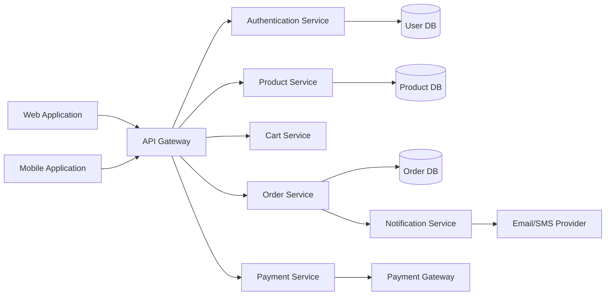
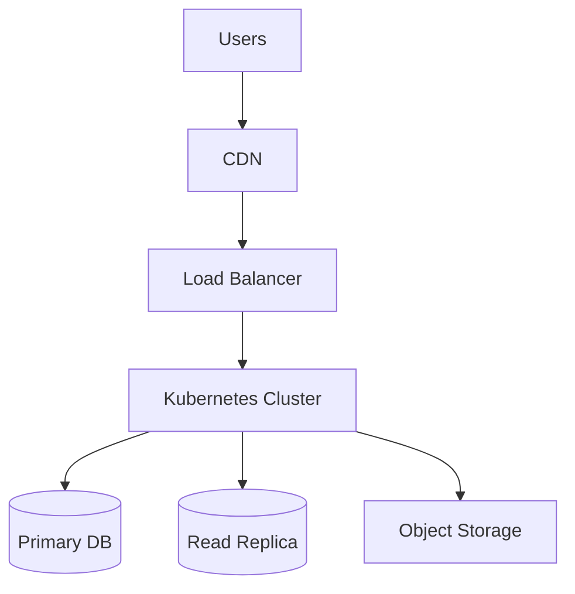

# High-Level Design (HLD) Template

> Part of the Thynqit Labs – Foundational Engineering Bootcamp

---

# 📌 Template Instructions

This template provides a structured format for documenting the high-level architecture of a system.

A High-Level Design (HLD) document focuses on:

```plaintext
HOW major system components interact with each other
```

The HLD is intended to help teams understand:

- overall system architecture
- major services and components
- communication flow
- deployment strategy
- scalability considerations
- security boundaries

This document should remain:

- architecture-focused
- technology-aware
- implementation-light

Avoid including:

- low-level code logic
- class-level implementation
- function-level design
- environment-specific operational details

---

# Document Information

| Field | Value |
|------|------|
| System Name | [SYSTEM_NAME] |
| Document Version | v1.0 |
| Prepared By | [AUTHOR_NAME] |
| Prepared Date | [DATE] |
| Reviewed By | [REVIEWER_NAME] |

---

# 1. System Overview

Provide a high-level summary of the system.

Include:

- business purpose
- core capabilities
- major users
- expected scale

---

## Example

```plaintext
The system enables customers to browse products, place orders, manage payments, and track deliveries through a scalable e-commerce platform.
```

---

# 2. Business Context

Describe the business problem being solved.

---

## Example

```plaintext
The organization requires a scalable e-commerce platform capable of supporting increasing online traffic, seamless checkout experience, and reliable order management.
```

---

# 3. Architecture Goals

Define primary architectural objectives.

| Goal ID | Goal |
|------|------|
| AG-001 | High scalability |
| AG-002 | High availability |
| AG-003 | Secure payment processing |
| AG-004 | Modular architecture |
| AG-005 | Fault tolerance |

---

# 4. High-Level Architecture Diagram

Add a high-level architecture diagram.

---

## Example Diagram



---

# 5. Major System Components

Describe major services/modules.

| Component | Responsibility |
|------|------|
| API Gateway | Central request routing |
| Authentication Service | User authentication and authorization |
| Product Service | Product catalog management |
| Cart Service | Shopping cart operations |
| Order Service | Order lifecycle management |
| Payment Service | Payment processing |
| Notification Service | Email and SMS notifications |

---

# 6. Client Applications

Define client applications interacting with the system.

| Client | Purpose |
|------|------|
| Web Application | Customer-facing web platform |
| Mobile Application | Mobile shopping experience |
| Admin Portal | Internal management dashboard |

---

# 7. External Integrations

List third-party systems integrated with the platform.

| Integration | Purpose |
|------|------|
| Payment Gateway | Payment processing |
| Logistics Provider | Shipment tracking |
| Email Service | Notifications |
| SMS Provider | OTP and alerts |

---

# 8. Communication Patterns

Define how components communicate.

| Communication Type | Example |
|------|------|
| REST APIs | Client to backend communication |
| Async Messaging | Notification processing |
| Database Queries | Service-to-database interactions |

---

# 9. Data Flow Overview

Describe high-level data movement.

---

## Example Flow

```plaintext
User places order
    ↓
Order Service validates cart
    ↓
Payment Service processes payment
    ↓
Order DB stores order
    ↓
Notification Service sends confirmation
```

---

# 10. Authentication & Authorization

Describe high-level security controls.

| Area | Design |
|------|------|
| Authentication | OAuth/JWT-based authentication |
| Authorization | Role-based access control (RBAC) |
| MFA | Optional multi-factor authentication |
| API Security | Token validation and rate limiting |

---

# 11. Scalability Considerations

Describe scaling strategies.

| Area | Strategy |
|------|------|
| Web Traffic | Load balancing |
| Product Catalog | CDN caching |
| Databases | Read replicas |
| Services | Horizontal scaling |

---

# 12. Reliability & Availability

Describe reliability goals and fault tolerance strategies.

| Area | Strategy |
|------|------|
| Service Failures | Retry mechanisms |
| High Availability | Multi-zone deployment |
| Monitoring | Centralized logging and alerts |
| Backups | Automated backups |

---

# 13. Deployment Overview

Describe deployment environment at a high level.

| Layer | Example |
|------|------|
| Frontend Hosting | CDN / Static Hosting |
| Backend Hosting | Kubernetes / Virtual Machines |
| Database | Managed PostgreSQL |
| Object Storage | Cloud Blob Storage |

---

# 14. Infrastructure Diagram (Optional)

Add infrastructure-level deployment diagram.

---

## Example



---

# 15. Security Considerations

Document important security expectations.

| Area | Requirement |
|------|------|
| Encryption | Data encrypted in transit and at rest |
| Secrets Management | Secure credential storage |
| Access Control | Least privilege principle |
| Logging | Security audit logs enabled |

---

# 16. Assumptions

Document architecture assumptions.

---

## Example

- Cloud provider supports auto-scaling
- Payment provider SLA meets business needs
- Mobile and web clients use same APIs

---

# 17. Constraints

Document known limitations.

| Constraint Type | Description |
|------|------|
| Budget | Limited infrastructure budget |
| Timeline | MVP delivery within 6 months |
| Compliance | Regulatory restrictions apply |

---

# 18. Risks

Identify architectural risks.

| Risk ID | Description | Impact |
|------|------|------|
| RISK-001 | Database bottleneck during sales events | High |
| RISK-002 | Third-party payment gateway downtime | High |
| RISK-003 | Improper caching strategy | Medium |

---

# 19. Future Enhancements

Document possible future architectural improvements.

| Enhancement | Purpose |
|------|------|
| Event-Driven Architecture | Better scalability |
| Multi-Region Deployment | Improved global availability |
| Service Mesh | Improved observability and security |

---

# 20. Approval & Sign-Off

| Name | Role | Approval Status |
|------|------|------|
| [NAME] | Engineering Lead | Pending |
| [NAME] | Solution Architect | Pending |
| [NAME] | Product Manager | Pending |

---

# 📚 Related Documents

| Document | Purpose |
|------|------|
| BRD | Business requirements |
| PRD | Product requirements |
| Feature Specification | Feature-level behavior |
| API Specification | API contracts |
| DB Schema | Data models |
| Low-Level Design (LLD) | Internal component-level design |

---

# Thynqit Labs

**Thynqit Labs – Foundational Engineering Bootcamp**

Building strong engineering foundations through practical system design, APIs, cloud, security, and production-grade engineering practices.