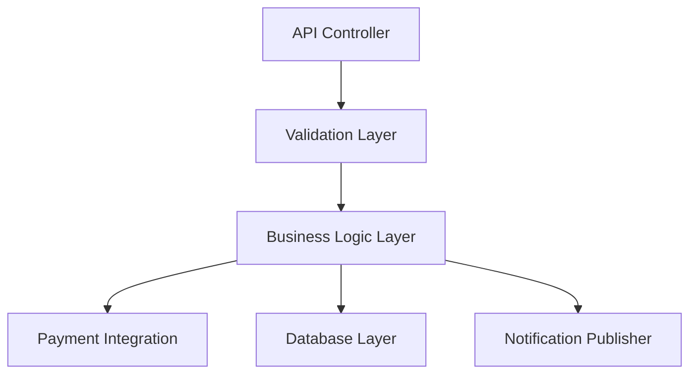
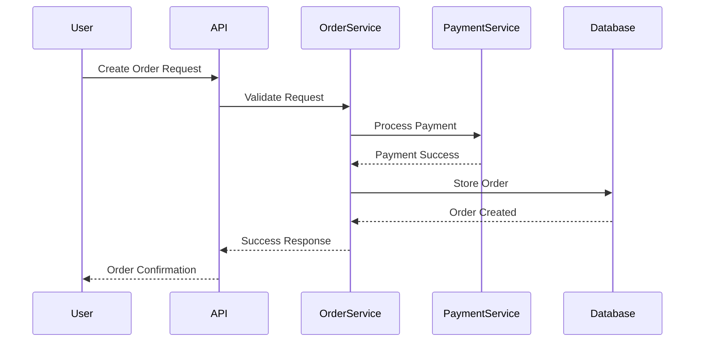

# Low-Level Design (LLD) Template

> Part of the Thynqit Labs – Foundational Engineering Bootcamp

---

# 📌 Template Instructions

This template provides a structured format for documenting the detailed internal design of a specific system component or service.

A Low-Level Design (LLD) document focuses on:

```plaintext
HOW individual components behave internally
```

The LLD is intended for:

- engineers
- backend developers
- frontend developers
- QA engineers
- technical reviewers

This document should define:

- internal workflows
- API behavior
- validations
- database interactions
- sequence flows
- error handling
- security controls
- logging and monitoring expectations

Unlike High-Level Design (HLD), this document goes deeper into implementation behavior while still avoiding actual production code.

---

# Document Information

| Field | Value |
|------|------|
| Module / Service Name | [MODULE_NAME] |
| System Name | [SYSTEM_NAME] |
| Document Version | v1.0 |
| Prepared By | [AUTHOR_NAME] |
| Prepared Date | [DATE] |
| Reviewed By | [REVIEWER_NAME] |

---

# 1. Module Overview

Provide a summary of the module or service.

Include:

- module purpose
- business capability
- key responsibilities

---

## Example

```plaintext
The Order Service manages order creation, order status updates, payment validation, and order lifecycle tracking.
```

---

# 2. Responsibilities

Define major responsibilities of the module.

| Responsibility ID | Description |
|------|------|
| RESP-001 | Validate order requests |
| RESP-002 | Create customer orders |
| RESP-003 | Coordinate payment processing |
| RESP-004 | Update order status |
| RESP-005 | Publish order notifications |

---

# 3. Component Architecture

Describe internal components/modules.

---

## Example Diagram



---

# 4. API Endpoints

List APIs exposed by this module.

| API | Method | Description |
|------|------|------|
| /orders | POST | Create order |
| /orders/{id} | GET | Retrieve order |
| /orders/{id}/cancel | POST | Cancel order |

---

# 5. Request Validation Rules

Define request validation logic.

| Field | Validation Rule |
|------|------|
| userId | Required |
| productId | Must exist in product catalog |
| quantity | Must be greater than zero |
| paymentMethod | Supported payment method required |

---

# 6. Business Logic Flow

Describe major business rules.

---

## Example

```plaintext
Validate request
    ↓
Validate inventory
    ↓
Validate payment
    ↓
Create order
    ↓
Store order data
    ↓
Publish notification event
```

---

# 7. Sequence Diagram

Describe request lifecycle.

---

## Example Sequence



---

# 8. Database Interactions

Describe database operations.

| Operation | Entity | Purpose |
|------|------|------|
| INSERT | Orders | Create new order |
| UPDATE | Orders | Update order status |
| INSERT | Payments | Store payment details |
| SELECT | Inventory | Validate stock availability |

---

# 9. Caching Strategy

Document caching behavior if applicable.

| Area | Strategy |
|------|------|
| Product Catalog | Redis cache |
| User Sessions | In-memory/session cache |
| Frequently Accessed Orders | Short-term cache |

---

# 10. Error Handling

Define expected failure scenarios.

| Scenario | Handling |
|------|------|
| Payment Failure | Return payment retry message |
| Product Out of Stock | Prevent order creation |
| Database Timeout | Retry operation |
| Invalid Authentication | Return 401 Unauthorized |

---

# 11. Retry & Resilience Strategy

Define retry logic and resilience handling.

| Area | Strategy |
|------|------|
| Payment APIs | Retry with exponential backoff |
| Notifications | Queue-based retries |
| External APIs | Circuit breaker pattern |

---

# 12. Logging & Monitoring

Define observability expectations.

| Area | Requirement |
|------|------|
| Request Logs | Log all incoming requests |
| Error Logs | Log failures with correlation IDs |
| Metrics | Capture API latency and error rates |
| Monitoring | Alerts for service degradation |

---

# 13. Security Controls

Document security expectations.

| Area | Requirement |
|------|------|
| Authentication | JWT validation |
| Authorization | RBAC checks |
| Encryption | Sensitive data encrypted |
| Input Validation | Prevent malicious requests |

---

# 14. Rate Limiting & Abuse Prevention

Document protection mechanisms.

| Area | Strategy |
|------|------|
| API Requests | Rate limiting |
| Login Attempts | Brute-force prevention |
| Public APIs | Request throttling |

---

# 15. Performance Considerations

Describe optimization strategies.

| Area | Optimization |
|------|------|
| Database Queries | Indexed queries |
| API Responses | Pagination |
| External Calls | Async processing |
| Heavy Operations | Background jobs |

---

# 16. Dependencies

Document module dependencies.

| Dependency | Purpose |
|------|------|
| Payment Service | Payment processing |
| Inventory Service | Product availability |
| Notification Service | Customer notifications |

---

# 17. Assumptions

Document implementation assumptions.

---

## Example

- Inventory service provides near real-time stock updates
- Payment gateway APIs are highly available
- Notification service supports retry handling

---

# 18. Constraints

Document known technical limitations.

| Constraint Type | Description |
|------|------|
| Legacy Systems | Existing payment provider required |
| Compliance | PCI compliance required |
| Performance | API latency under 500ms |

---

# 19. Risks

Identify implementation risks.

| Risk ID | Description | Impact |
|------|------|------|
| RISK-001 | Inventory synchronization delays | High |
| RISK-002 | Payment provider instability | High |
| RISK-003 | High API traffic spikes | Medium |

---

# 20. Test Considerations

Define testing expectations.

| Test Type | Scope |
|------|------|
| Unit Testing | Business logic validation |
| Integration Testing | External service integration |
| API Testing | Endpoint validation |
| Performance Testing | Load handling verification |

---

# 21. Open Questions

Track unresolved engineering questions.

| Question ID | Question | Owner |
|------|------|------|
| Q-001 | Should order creation be synchronous or async? | Engineering Team |
| Q-002 | What retry limit should payment APIs use? | Architecture Team |

---

# 22. Approval & Sign-Off

| Name | Role | Approval Status |
|------|------|------|
| [NAME] | Engineering Lead | Pending |
| [NAME] | Solution Architect | Pending |
| [NAME] | QA Lead | Pending |

---

# 📚 Related Documents

| Document | Purpose |
|------|------|
| BRD | Business requirements |
| PRD | Product requirements |
| Feature Specification | Feature behavior |
| API Specification | API contracts |
| DB Schema | Data model definitions |
| High-Level Design (HLD) | System-wide architecture |

---

# Thynqit Labs

**Thynqit Labs – Foundational Engineering Bootcamp**

Building strong engineering foundations through practical system design, APIs, cloud, security, and production-grade engineering practices.