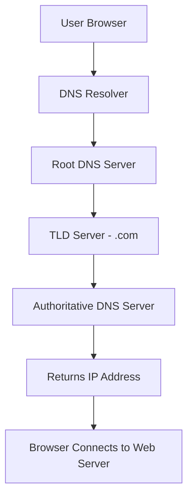
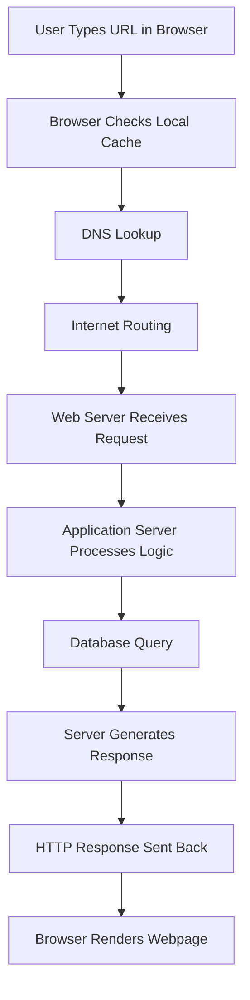
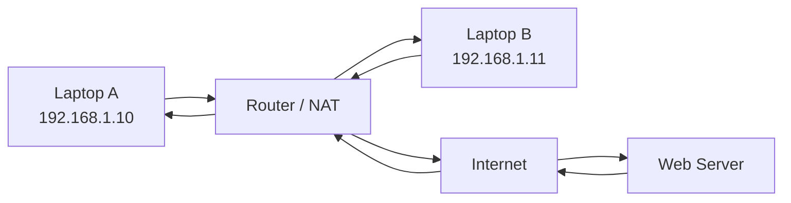

# Day 7 – How the Web Works

> Part of the Thynqit Labs – Foundational Engineering Bootcamp

---

## 📌 Overview

Modern software systems rely heavily on the web to communicate with users and other systems.

Every time a user opens a website, a complex sequence of events occurs behind the scenes involving:

- browsers
- domain name systems (DNS)
- servers
- application logic
- databases
- network infrastructure

Understanding how the web works helps engineers:

- debug network issues
- understand backend communication
- design scalable systems
- build reliable APIs

This module explains the journey of a web request from the moment a user enters a URL to the moment the browser renders the page.

---

## 🎯 Learning Objectives

By the end of this module, learners should be able to:

- Understand the difference between the Internet and the World Wide Web
- Explain the client–server model used in web systems
- Describe the role of domain names and DNS
- Understand what happens when a user enters a URL in a browser
- Differentiate between web servers and application servers
- Understand the difference between static and dynamic websites
- Explain how browsers render web pages

---

## 🧠 Core Concepts

### 1. Internet vs World Wide Web

The **Internet** is a global network of interconnected computers.

The **World Wide Web (WWW)** is a system built on top of the Internet that allows users to access websites using browsers.

In simple terms:

```
Internet → Infrastructure
Web → Applications running on the Internet
```

The web uses standardized protocols to enable communication between systems.

---

### 2. Client–Server Model

Web systems follow the **client–server architecture**.

Client:

- Web browser
- Mobile application
- CLI tools (curl, wget)

Server:

- Web server
- Application server
- API service

Communication flow:

```
Client → Request → Server
Server → Response → Client
```

The client asks for resources, and the server responds.

---

### 3. Domain Names and DNS

Humans use **domain names** to access websites.

Example:

```
https://example.com
```

Computers communicate using **IP addresses**.

Example:

```
93.184.216.34
```

The **Domain Name System (DNS)** translates domain names into IP addresses.

Example lookup:

```
example.com → 93.184.216.34
```

DNS Resolution Flow:



DNS acts like the **phone book of the internet**.

---

### 4. What Happens When You Enter a URL

When a user types a website address in a browser, several steps occur.

Example:

```
https://example.com
```

Request Journey:



Sequence:

1. Browser checks local cache
2. DNS lookup resolves the domain name
3. Browser sends a request to the server
4. Server processes the request
5. Server returns a response
6. Browser renders the webpage

This entire process typically happens in milliseconds.

---

### 5. Web Server vs Application Server

A typical web application often involves multiple layers.

Web Server:

Examples:

- Nginx
- Apache

Responsibilities:

- receive incoming requests
- serve static files
- route requests to applications

Application Server:

Examples:

- Node.js
- Django
- Spring Boot

Responsibilities:

- execute application logic
- process business rules
- interact with databases

Example architecture:

```
Browser
  ↓
Web Server
  ↓
Application Server
  ↓
Database
```

---

### 6. Static vs Dynamic Websites

Websites can be classified as static or dynamic.

Static websites:

- Prebuilt HTML pages
- No server-side logic
- Fast and simple

Example:

```
Company landing page
Documentation site
```

Dynamic websites:

- Content generated by backend systems
- Often connected to databases
- User-specific responses

Example:

```
E-commerce platforms
Social media sites
Online dashboards
```

---

### 7. Browser Rendering

After receiving a response, the browser renders the page.

The response typically includes:

- HTML (structure)
- CSS (styling)
- JavaScript (interactivity)

The browser processes these files to build the visible webpage.

Steps include:

1. Parse HTML
2. Apply CSS styling
3. Execute JavaScript
4. Render page on screen

---

## 🌍 Real-World Relevance

Understanding how the web works helps engineers diagnose issues such as:

- websites not loading
- DNS resolution failures
- server downtime
- slow responses
- broken API requests

Many production issues originate from misunderstandings of how web requests travel through the system.

Multiple Devices Sharing One Internet Connection.



```
192.168.1.10:52341 → PublicIP:40001
192.168.1.11:52342 → PublicIP:40002
```

The router tracks connections using port mappings, ensuring responses return to the correct device.

---

## 🧩 Practical Understanding

Scenario:

A user cannot access a website.

Possible causes include:

- DNS failure
- server outage
- network connectivity issues
- application server errors
- database failure

Understanding the request flow helps engineers identify where the failure occurs.

---

## ⚠️ Common Mistakes

- Confusing the Internet with the Web
- Assuming websites communicate directly without DNS
- Believing browsers only download HTML
- Ignoring network latency in system design

Understanding the full request lifecycle prevents many debugging challenges.

---

## 🔄 Reflection Questions

- What is the difference between the Internet and the Web?
- Why is DNS necessary?
- What happens between entering a URL and seeing a webpage?
- Why do modern applications require both web servers and application servers?

---

## 📚 Next Steps

- Review `resources.md`
- Complete `assignments.md`
- Inspect network requests using browser developer tools

---

## 🧭 Navigation

← **Previous Lesson**  
[Day 6](../day-06/README.md)

➡ **Next: Resources**  
[Resources](./resources.md)