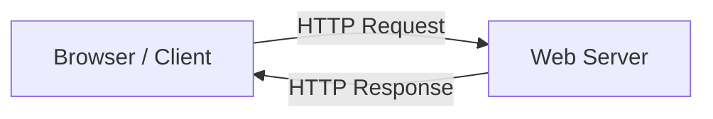
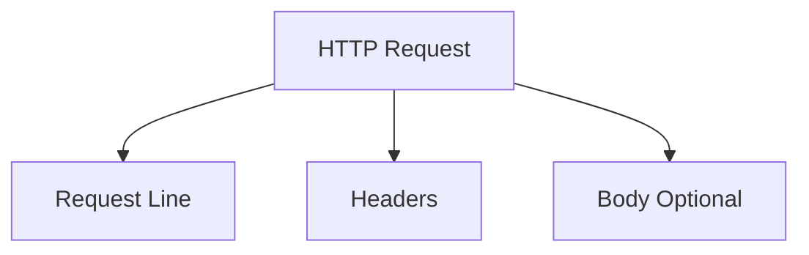
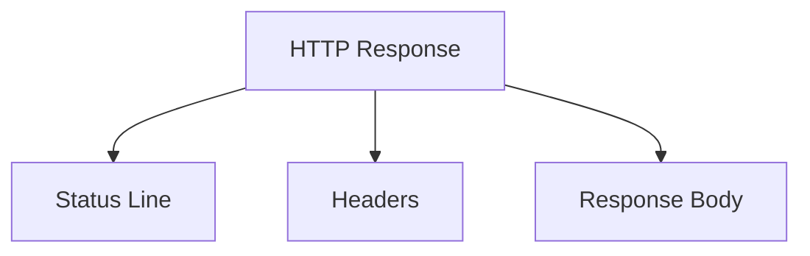
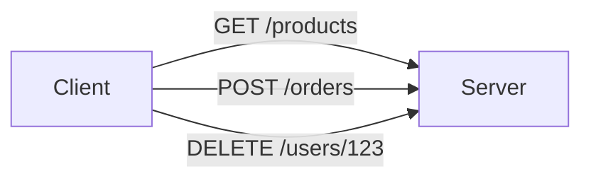
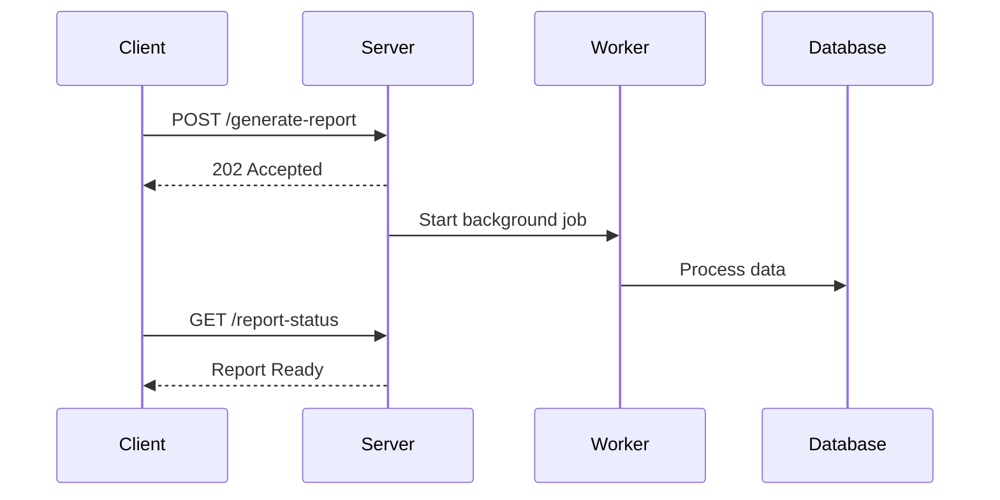
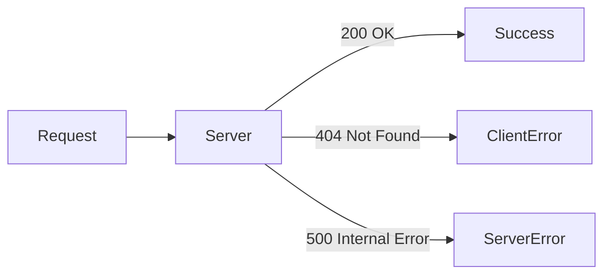
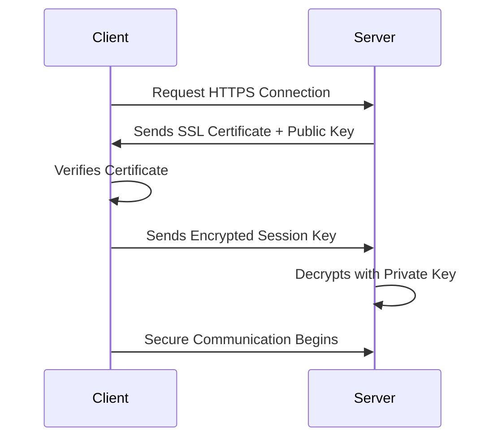
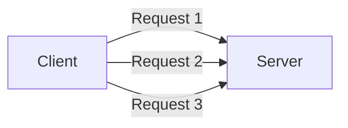

# Day 8 – HTTP Fundamentals

> Part of the Thynqit Labs – Foundational Engineering Bootcamp

---

## 📌 Overview

The HyperText Transfer Protocol (HTTP) is the foundation of communication on the web.

Whenever a browser loads a webpage, a mobile application calls an API, or a service communicates with another service, HTTP is typically used as the communication protocol.

HTTP defines:

- how requests are sent from clients to servers
- how servers respond to those requests
- how data is structured during transmission

Understanding HTTP is essential for engineers because it helps them:

- debug network issues
- understand API behavior
- design scalable systems
- interpret browser network traffic

---

## 🎯 Learning Objectives

By the end of this module, learners should be able to:

- Understand the purpose of the HTTP protocol
- Explain the structure of HTTP requests and responses
- Identify common HTTP methods
- Interpret HTTP status codes
- Understand the purpose of HTTP headers
- Explain the difference between HTTP and HTTPS
- Understand how encryption works in HTTPS

---

## 🧠 Core Concepts

---

## 1. What is HTTP?

HTTP stands for **HyperText Transfer Protocol**.

It is an **application-layer protocol** used for communication between clients and servers on the web.

Typical flow:



The client sends a request, and the server sends back a response.

HTTP is **stateless**, meaning each request is treated independently.

---

## 2. HTTP Request Structure

An HTTP request consists of three main components:

```
Request Line
Headers
Body (optional)
```

Example request:

```
GET /products HTTP/1.1
Host: example.com
User-Agent: Chrome
Accept: application/json
```

Explanation:

| Component | Purpose |
|---|---|
| Request Line | Defines method and resource |
| Headers | Provide metadata |
| Body | Optional data sent to server |

Diagram:



---

## 3. HTTP Response Structure

A server responds using a structured response.

Example:

```
HTTP/1.1 200 OK
Content-Type: application/json
Content-Length: 145

{
 "product": "Laptop"
}
```

Components:

| Component | Purpose |
|---|---|
| Status Line | Status code and description |
| Headers | Metadata about response |
| Body | Actual returned data |

Diagram:



---

## 4. HTTP Methods

HTTP methods define the **action a client wants to perform**.

| Method | Purpose |
|---|---|
| GET | Retrieve data |
| POST | Create a resource |
| PUT | Replace resource |
| PATCH | Update resource partially |
| DELETE | Remove resource |

Example:

```
GET /products
POST /orders
DELETE /users/123
```

Diagram:



---

## 5. HTTP Status Codes

Servers respond with status codes indicating the result of a request.

Status codes are grouped into categories.

| Category | Meaning |
|---|---|
| 1xx | Informational |
| 2xx | Success |
| 3xx | Redirection |
| 4xx | Client error |
| 5xx | Server error |

Common examples with real scenarios:

### 200 – OK

Request succeeded.

Example:

User opens homepage.

```
GET /index.html
```

Server returns webpage successfully.

---

### 201 – Created

Resource created successfully.

Example:

User creates account.

```
POST /users
```

Server creates new user.

---

### 202 – Accepted

The request has been accepted for processing, but the processing has **not been completed yet**.

This status code is commonly used in **asynchronous systems** where the server starts a task that may take time to finish.

Example scenario:

A user uploads a large video file for processing.

```
POST /videos/upload
```

The server accepts the request and starts background processing such as:

- video transcoding
- thumbnail generation
- content analysis

Instead of making the client wait, the server responds:

```
HTTP/1.1 202 Accepted
```

The client can later check the status using another endpoint.

Example:

```
GET /videos/processing-status/12345
```

This pattern is commonly used in:

- background job processing
- large file uploads
- report generation
- AI or ML processing tasks



---

### 301 – Moved Permanently

Resource moved to a new URL.

Example:

Website migrated from HTTP → HTTPS.

Browser automatically redirects.

---

### 400 – Bad Request

Client sent invalid data.

Example:

Missing required fields in API request.

---

### 401 – Unauthorized

Authentication required.

Example:

User tries accessing API without login token.

---

### 403 – Forbidden

User authenticated but lacks permission.

Example:

Normal user attempting admin action.

---

### 404 – Not Found

Requested resource does not exist.

Example:

```
GET /products/9999
```

Product does not exist.

---

### 500 – Internal Server Error

Unexpected server failure.

Example:

Database query crashes backend service.

---

Diagram:



---

## 6. HTTP Headers

Headers provide **metadata about requests and responses**.

Examples:

| Header | Purpose |
|---|---|
| Content-Type | Format of data |
| Authorization | Authentication information |
| User-Agent | Client information |
| Accept | Expected response format |
| Cache-Control | Caching behavior |

Example request:

```
GET /products HTTP/1.1
Host: example.com
Accept: application/json
Authorization: Bearer token123
```

Headers allow clients and servers to negotiate behavior.

---

## 7. HTTP vs HTTPS

HTTP sends data in **plain text**.

HTTPS secures communication using **TLS encryption**.

Diagram:


HTTPS protects against:

- eavesdropping
- man-in-the-middle attacks
- data tampering

---

### HTTPS Encryption – Public and Private Key Exchange

HTTPS uses **asymmetric cryptography** during the TLS handshake.

Steps simplified:

1. Client connects to server
2. Server sends its **public key certificate**
3. Client verifies certificate
4. Client generates session key
5. Session key encrypted with server public key
6. Server decrypts using private key
7. Both sides now use symmetric encryption

Diagram:



This ensures that only the intended server can decrypt the session key.

---

## 8. Stateless Nature of HTTP

HTTP is **stateless**, meaning each request is independent.

Example:

```
Request 1 → Login
Request 2 → Fetch Profile
```

The server does not automatically remember previous requests.

Systems use mechanisms like:

- cookies
- sessions
- tokens

to maintain user state.

Diagram:



Each request is processed independently.

---

## 🌍 Real-World Relevance

Understanding HTTP helps engineers:

- debug API failures
- analyze browser network traffic
- troubleshoot production issues
- optimize web performance

Most backend systems expose functionality through HTTP-based APIs.

---

## 🧩 Practical Understanding

Scenario:

A mobile application fails to load product data.

Possible issues:

- API returned 404
- authentication token expired
- server returned 500 error
- network request failed

Using HTTP knowledge, engineers can inspect requests and identify the root cause.

---

## ⚠️ Common Mistakes

- Confusing HTTP methods (GET vs POST)
- Ignoring HTTP status codes
- Assuming HTTP is secure by default
- Not inspecting request headers during debugging

---

## 🔄 Reflection Questions

- What is the difference between HTTP and HTTPS?
- Why are status codes important?
- What happens when a browser receives a 404 response?
- Why is HTTP considered stateless?

---

## 📚 Next Steps

- Review `resources.md`
- Complete `assignments.md`
- Inspect HTTP requests in browser developer tools

---

## 🧭 Navigation

← Previous Lesson  
[Day 7](../day-07/README.md)

➡ Next: Resources  
[Resources](./resources.md)