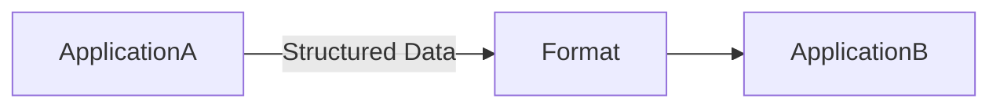

# Day 9 – Data Formats

> Part of the Thynqit Labs – Foundational Engineering Bootcamp

---

## 📌 Overview

Software systems constantly exchange data.

Examples include:

- browsers requesting data from servers
- mobile applications calling APIs
- backend services communicating with databases
- microservices exchanging messages

To exchange information between systems, we use **standardized data formats**.

A data format defines **how information is structured so different systems can understand it**.

In this module we explore common data formats used in modern systems:

- JSON
- XML
- CSV

Understanding these formats is essential for designing APIs, debugging responses, and integrating systems.

---

## 🎯 Learning Objectives

By the end of this module, learners should be able to:

- Understand what data formats are
- Explain why standardized formats are necessary
- Identify common data formats used in systems
- Read and interpret JSON and XML structures
- Understand when to use different formats
- Convert simple structures between formats

---

## 🧠 Core Concepts

---

## 1. What is a Data Format?

A data format defines **how data is structured and represented for communication between systems**.

Without standardized formats, systems built using different technologies would struggle to exchange information.

Example:

A server returning user information to a mobile application.

```
Name: Alice
Age: 28
Email: alice@example.com
```

To communicate this data reliably, it must be structured using a defined format.

Common formats include:

- JSON
- XML
- CSV

Diagram:



The format acts as a **common language between systems**.

---

## 2. JSON (JavaScript Object Notation)

### What is JSON?

JSON is a lightweight data format used to represent structured data.

It is widely used in:

- APIs
- web applications
- mobile applications
- configuration files

JSON uses a structure similar to JavaScript objects.

---

### Why is JSON Needed?

JSON became popular because it is:

- easy for humans to read
- lightweight
- easy for machines to parse
- widely supported across programming languages

Compared to older formats like XML, JSON is typically simpler and smaller.

---

### How JSON Works

JSON represents data using:

- objects
- arrays
- key-value pairs

Example JSON Object:

```json
{
  "name": "Alice",
  "age": 28,
  "email": "alice@example.com"
}
```

Here:

```
"name", "age", "email" → keys
"Alice", 28 → values
```

---

### JSON Array Example

Arrays represent collections of values.

Example:

```json
{
  "users": [
    {
      "name": "Alice",
      "age": 28
    },
    {
      "name": "Bob",
      "age": 31
    }
  ]
}
```

Arrays allow systems to send **multiple records in a single response**.

---

### When JSON is Used

JSON is the **most common format for APIs today**.

Examples:

- REST APIs
- mobile app communication
- microservices
- configuration files

Example API response:

```
GET /users
```

Server response:

```json
[
  {
    "id": 1,
    "name": "Alice"
  },
  {
    "id": 2,
    "name": "Bob"
  }
]
```

---

## 3. XML (Extensible Markup Language)

### What is XML?

XML is a markup-based format designed to store and transport data.

It uses **nested tags to represent structure**.

Example:

```xml
<user>
  <name>Alice</name>
  <age>28</age>
  <email>alice@example.com</email>
</user>
```

---

### Why XML Was Used

XML was widely used before JSON became dominant.

It provides:

- strict structure
- schema validation
- self-describing tags

Many enterprise systems still rely on XML.

Examples:

- SOAP APIs
- banking systems
- enterprise integrations
- configuration systems

---

### How JSON Object Appears in XML

JSON:

```json
{
  "name": "Alice",
  "age": 28
}
```

Equivalent XML representation:

```xml
<user>
  <name>Alice</name>
  <age>28</age>
</user>
```

---

### JSON Array vs XML Collection

JSON:

```json
{
  "users": [
    {"name": "Alice"},
    {"name": "Bob"}
  ]
}
```

XML equivalent:

```xml
<users>
  <user>
    <name>Alice</name>
  </user>
  <user>
    <name>Bob</name>
  </user>
</users>
```

---

### When XML is Used

XML is still common in:

- legacy enterprise systems
- SOAP web services
- document formats
- configuration files

Although many modern APIs prefer JSON, XML remains important in enterprise environments.

---

## 4. CSV (Comma-Separated Values)

### What is CSV?

CSV is a simple format used to represent tabular data.

Example:

```
name,age,email
Alice,28,alice@example.com
Bob,31,bob@example.com
```

Each line represents a record.

Each value is separated by a comma.

---

### Why CSV is Used

CSV is commonly used for:

- spreadsheets
- data exports
- analytics pipelines
- database imports

It is extremely lightweight and easy to generate.

---

### When CSV is Used

Typical use cases include:

- exporting reports
- transferring datasets
- bulk data processing

Example:

Downloading customer reports from a dashboard.

---

## 🌍 Real-World Relevance

Modern systems constantly exchange structured data.

Examples include:

- APIs returning JSON responses
- banking systems exchanging XML messages
- analytics pipelines processing CSV datasets

Understanding data formats helps engineers:

- debug API responses
- design data contracts
- integrate external services

---

## 🧩 Practical Understanding

Scenario:

A mobile app requests product data.

```
GET /products
```

Server response:

```json
{
  "products": [
    {"id": 1, "name": "Laptop"},
    {"id": 2, "name": "Phone"}
  ]
}
```

The mobile application parses the JSON response and displays the products to the user.

---

## ⚠️ Common Mistakes

- Confusing JSON objects with arrays
- Assuming all APIs return JSON
- Ignoring schema validation in structured formats
- Improperly formatting nested data

---

## 🔄 Reflection Questions

- Why are standardized data formats necessary?
- What advantages does JSON have over XML?
- When might XML still be preferred?
- Why is CSV suitable for analytics workflows?

---

## 📚 Next Steps

- Review `resources.md`
- Complete `assignments.md`
- Practice reading JSON responses from APIs

---

## 🧭 Navigation

← Previous Lesson  
[Day 8](../day-08/README.md)

➡ Next: Resources  
[Resources](./resources.md)