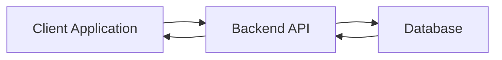
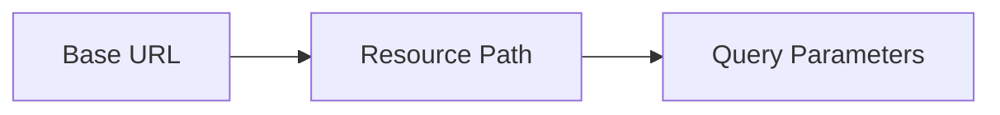
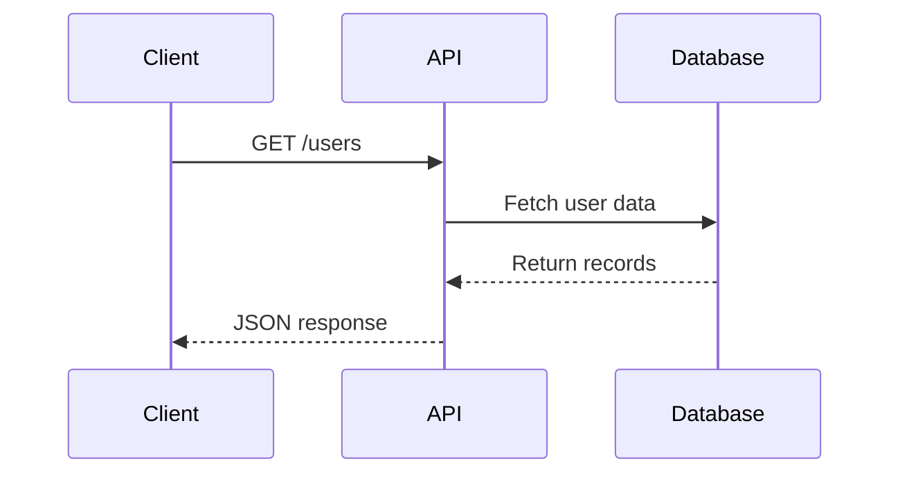

# Day 10 – APIs & REST Design

> Part of the Thynqit Labs – Foundational Engineering Bootcamp

---

## 📌 Overview

Modern software systems communicate through **Application Programming Interfaces (APIs)**.

APIs allow different systems to interact with each other in a standardized way.

Examples include:

- Mobile apps fetching data from backend servers
- Frontend applications communicating with APIs
- Microservices exchanging information
- External integrations between companies

APIs act as a **contract between systems**, defining how requests are made and how responses are returned.

This module explains:

- what APIs are
- different API architectures
- how REST APIs work
- how to design clean and scalable APIs

---

## 🎯 Learning Objectives

By the end of this module, learners should be able to:

- Explain what an API is
- Identify different types of APIs
- Understand REST architecture
- Identify components of a REST API request
- Interpret API responses
- Apply best practices for API design

---

# 🧠 Core Concepts

---

# 1. What is an API?

An **Application Programming Interface (API)** is a set of rules that allows software systems to communicate with each other.

Instead of accessing a database directly, systems interact through APIs.

Example:

A mobile app needs product data.

```
Mobile App → API → Database
```

The API retrieves the data and returns it to the app.

Diagram:



The API acts as a **controlled gateway to the system**.

---

# 2. Why APIs Are Needed

APIs enable systems to:

- share data securely
- maintain separation between frontend and backend
- scale systems independently
- enable integrations between services

Examples:

- Google Maps API used by ride-sharing apps
- Payment APIs used by e-commerce platforms
- Social login APIs

Without APIs, systems would be tightly coupled and difficult to maintain.

---

# 3. Types of APIs

There are multiple architectural styles for APIs.

---

## REST APIs

REST (Representational State Transfer) is the **most widely used API architecture today**.

Characteristics:

- uses HTTP protocol
- stateless communication
- resources identified via URLs
- typically returns JSON

Example:

```
GET /users
```

Response:

```json
[
  {
    "id": 1,
    "name": "Alice"
  }
]
```

---

## SOAP APIs

SOAP (Simple Object Access Protocol) is an older protocol commonly used in enterprise systems.

Characteristics:

- XML-based messaging
- strict standards
- heavy message structure

Example SOAP request:

```xml
<Envelope>
  <Body>
    <GetUser>
      <UserId>1</UserId>
    </GetUser>
  </Body>
</Envelope>
```

SOAP is still used in:

- banking
- enterprise integrations
- legacy systems

---

## GraphQL APIs

GraphQL allows clients to request exactly the data they need.

Example:

```
query {
  user(id:1){
    name
    email
  }
}
```

GraphQL is often used in:

- modern frontend-heavy applications
- large client-driven APIs

---

# 4. REST API Structure

A REST API request typically contains multiple components.

Example request:

```
GET https://api.example.com/v1/users/123?includeOrders=true
```

Diagram:



---

## Base URL

The base address of the API.

Example:

```
https://api.example.com
```

---

## URI / Resource Path

Identifies the resource.

Example:

```
/users
/orders
/products
```

---

## Path Parameters

Used to identify a specific resource.

Example:

```
/users/123
/orders/456
```

Here:

```
123 → user ID
456 → order ID
```

---

## Query Parameters

Used to filter or modify results.

Example:

```
/users?page=2
/products?category=electronics
```

---

## Request Headers

Headers provide metadata about the request.

Example:

```
Authorization: Bearer token
Content-Type: application/json
```

Headers may contain:

- authentication tokens
- content type
- caching information

---

## Request Body

Used in POST, PUT, PATCH requests.

Example:

```json
{
  "name": "Alice",
  "email": "alice@example.com"
}
```

---

## Response

The server returns a response containing:

- status code
- headers
- response body

Example:

```json
{
  "id": 123,
  "name": "Alice"
}
```

---

## Response Status Codes

Responses include HTTP status codes indicating the result.

Examples:

```
200 OK
201 Created
202 Accepted
400 Bad Request
401 Unauthorized
404 Not Found
500 Internal Server Error
```

These status codes were introduced in **Day 8 – HTTP Fundamentals**.

---

# 5. REST Request Flow

Example request lifecycle:



This demonstrates how APIs connect applications with backend systems.

---

# 6. Best Practices for REST API Design

Well-designed APIs are easy to understand and maintain.

---

## Use Clear Resource Naming

Use nouns instead of verbs.

Good:

```
GET /users
GET /orders
```

Bad:

```
GET /getUsers
GET /fetchOrders
```

---

## Use Consistent Naming Conventions

Recommended conventions:

```
/users
/user-orders
/order-items
```

Avoid inconsistent naming styles.

---

## Version Your APIs

API changes should not break existing clients.

Example:

```
/v1/users
/v2/users
```

This allows systems to evolve safely.

---

## Use Proper HTTP Methods

```
GET → retrieve data
POST → create resource
PUT → update resource
PATCH → partial update
DELETE → remove resource
```

---

## Use Meaningful Status Codes

Use appropriate HTTP responses.

Example:

```
201 Created → new resource created
404 Not Found → resource does not exist
400 Bad Request → invalid input
```

---

## Keep APIs Stateless

Each request should contain all required information.

Servers should not rely on previous requests.

---

## Return Consistent Response Structures

Example:

```json
{
  "success": true,
  "data": {...},
  "message": "User retrieved successfully"
}
```

Consistency improves developer experience.

---

# 🌍 Real-World Relevance

APIs power nearly every modern digital system.

Examples:

- payment gateways
- ride-sharing platforms
- social media integrations
- microservice architectures

Understanding APIs helps engineers:

- design scalable systems
- debug production issues
- integrate external services

---

# 🧩 Practical Understanding

Scenario:

An e-commerce frontend needs to display product information.

The frontend sends a request:

```
GET /products
```

The backend API retrieves product data and returns:

```json
[
  {
    "id": 1,
    "name": "Laptop"
  }
]
```

The frontend renders the products on the page.

---

# ⚠️ Common Mistakes

- mixing verbs and nouns in URLs
- exposing internal database structure
- inconsistent response formats
- ignoring API versioning
- returning incorrect HTTP status codes

---

# 🔄 Reflection Questions

- Why are APIs essential for modern software systems?
- Why is REST widely adopted?
- Why should APIs use nouns instead of verbs?
- Why is versioning important for APIs?

---

# 📚 Next Steps

- Review `resources.md`
- Complete `assignments.md`
- Explore real APIs using Postman or browser tools

---

## 🧭 Navigation

← Previous Lesson  
[Day 9](../day-09/README.md)

➡ Next: Resources  
[Resources](./resources.md)