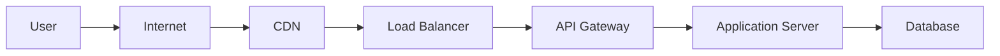
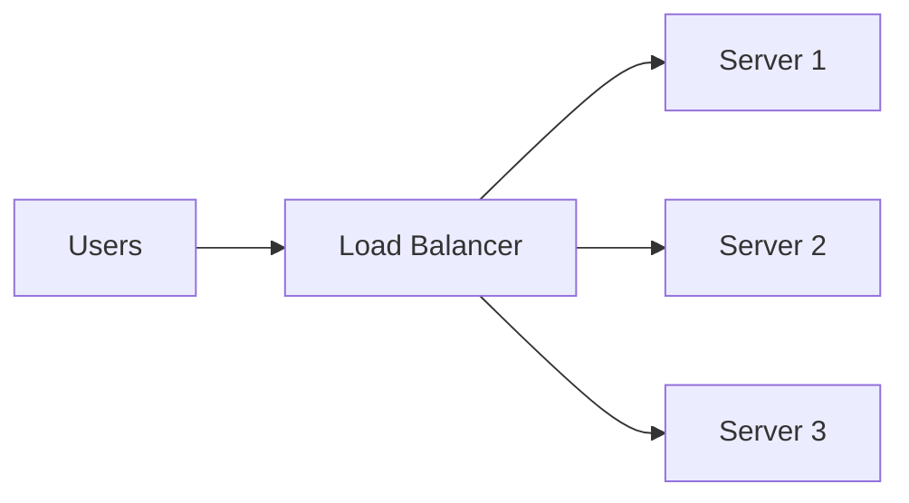

# Day 16 – Cloud Fundamentals

> Part of the Thynqit Labs – Foundational Engineering Bootcamp

---

## 📌 Overview

Modern applications are no longer deployed on a single machine.

They run on **cloud infrastructure** that provides:

- compute power
- storage
- networking
- scalability
- reliability

Cloud computing allows engineers to **build, deploy, and scale applications without managing physical hardware**.

This module introduces the foundational concepts required to understand how modern systems run in production.

---

## 🎯 Learning Objectives

By the end of this module, learners should be able to:

- explain what cloud computing is and why it exists
- understand IaaS, PaaS, and SaaS models
- identify core cloud components (compute, storage, networking)
- understand scaling and high availability
- explain load balancing, API gateways, CDN, and firewalls
- understand IAM and access control in cloud systems
- recognize differences between AWS, Azure, and GCP services

---

## 🧠 Core Concepts

---

## 1. What is Cloud Computing?

Cloud computing is the delivery of computing resources over the internet.

Instead of:

```
Buying servers → Installing → Maintaining
```

You:

```
Rent infrastructure on-demand
```

---

## 2. Evolution of Infrastructure

| Stage | Description |
|------|------------|
| On-Premise | Physical servers managed manually |
| Virtualization | Multiple VMs on same hardware |
| Cloud | On-demand, scalable infrastructure |

---

## 3. Key Characteristics of Cloud

- On-demand provisioning  
- Scalability  
- High availability  
- Pay-as-you-go  
- Global access  

---

## 4. Cloud Service Models

| Model | Responsibility | Example |
|------|--------------|--------|
| IaaS | You manage servers | AWS EC2 |
| PaaS | Deploy code only | Heroku |
| SaaS | Use software | Gmail |

---

## 5. Deployment Models

| Type | Description |
|------|------------|
| Public Cloud | Shared infrastructure |
| Private Cloud | Dedicated environment |
| Hybrid Cloud | Combination of both |

---

## 6. Core Cloud Components

---

### Compute

- where applications run  
- virtual machines / containers  

---

### Storage

- where data is stored  
- object storage, databases  

---

### Networking

- connects systems  
- enables communication  

---

## 7. Real-World Cloud Architecture



---

## 8. Load Balancing

Distributes traffic across multiple servers.

### Why?

- prevents overload
- improves availability



---

## 9. API Gateway

Acts as an entry point for APIs.

Responsibilities:

- routing requests  
- authentication  
- rate limiting  

---

## 10. Content Delivery Network (CDN)

- caches content closer to users  
- reduces latency  

Example:

- images served from nearest location

---

## 11. Firewalls

Control incoming and outgoing traffic.

Types:

- network firewall  
- application firewall (WAF)

---

## 12. Virtual Private Network (VPN)

- secure connection to private network  
- used in enterprise environments  

---

## 13. Identity & Access Management (IAM)

Controls:

- who can access resources  
- what actions they can perform  

Example:

- developer → read access  
- admin → full access  

---

## 14. Scaling

---

### Vertical Scaling

```
Increase CPU / RAM of server
```

---

### Horizontal Scaling

```
Add more servers
```


---

## 15. High Availability

Systems are designed to:

- avoid single point of failure  
- recover from failures  

---

## 16. Regions & Availability Zones

- Regions → geographic locations  
- Availability Zones → isolated data centers  

---

## 17. AWS vs Azure vs GCP (Key Services Comparison)

| Concept | AWS | Azure | GCP |
|--------|-----|------|-----|
| Virtual Machines | EC2 | Virtual Machines | Compute Engine |
| Object Storage | S3 | Blob Storage | Cloud Storage |
| Managed SQL DB | RDS | Azure SQL | Cloud SQL |
| NoSQL DB | DynamoDB | Cosmos DB | Firestore |
| Load Balancer | ELB | Azure Load Balancer | Cloud Load Balancing |
| CDN | CloudFront | Azure CDN | Cloud CDN |
| IAM | AWS IAM | Azure AD | Cloud IAM |

---

## 18. Common Misconceptions

- cloud is not “serverless magic”
- infrastructure still needs design
- cloud does not remove responsibility
- poor architecture → poor performance

---

## 🌍 Real-World Relevance

In production systems:

- applications run on distributed infrastructure
- traffic is routed through multiple layers
- failures are expected and handled

Cloud enables:

- scalability
- reliability
- global reach

---

## 🧩 Practical Understanding

Scenario:

You are deploying an **e-commerce platform**.

- where will your API run?
- where will your database be?
- how will users access your system globally?

---

## 🔄 Reflection Questions

- Why is cloud preferred over on-premise systems?
- What is the difference between IaaS and PaaS?
- Why is load balancing important?
- How does CDN improve performance?
- Why is IAM critical in cloud systems?

---

## 📚 Next Steps

- Review `resources.md`
- Complete `assignments.md`
- Explore real cloud platforms conceptually

---

## 🧭 Navigation

← Previous: Week 4 Overview  
[Week 4](../README.md)

➡ Next:
[Resources](./resources.md)