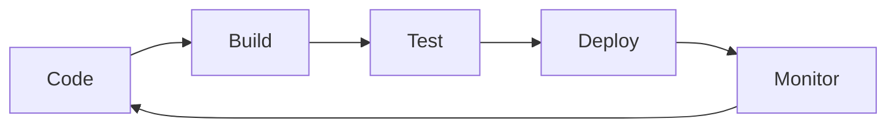
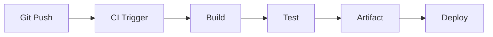
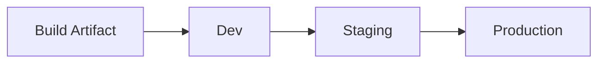
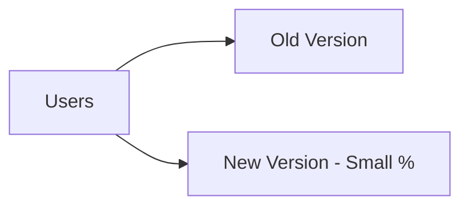
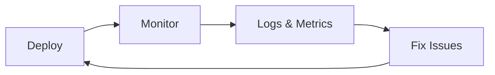
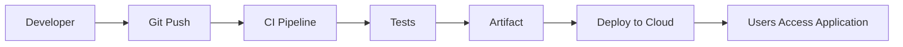

# Day 17 – DevOps & CI/CD

> Part of the Thynqit Labs – Foundational Engineering Bootcamp

---

## 📌 Overview

Modern software development is not complete when code is written.

It must be:

- built
- tested
- deployed
- monitored

DevOps and CI/CD enable teams to **deliver software reliably, frequently, and at scale**.

This module explains how code moves from a developer’s machine to production systems.

---

## 🎯 Learning Objectives

By the end of this module, learners should be able to:

- explain DevOps principles and mindset
- understand CI and CD concepts clearly
- describe CI/CD pipelines and stages
- understand artifacts and environments
- explain deployment strategies
- understand how Git integrates with CI/CD
- identify common mistakes in software delivery

---

## 🧠 Core Concepts

---

## 1. What is DevOps?

DevOps is a combination of:

- **Development (Dev)**
- **Operations (Ops)**

It focuses on:

- collaboration
- automation
- continuous delivery

---

## 2. Software Delivery Lifecycle



This cycle repeats continuously.

---

## 3. What is Continuous Integration (CI)?

- developers frequently commit code
- automated builds are triggered
- automated tests run

Goal:

- detect issues early
- reduce integration problems

---

## 4. What is Continuous Delivery vs Deployment

| Type | Description |
|------|------------|
| Continuous Delivery | Code is always ready to deploy |
| Continuous Deployment | Code is automatically deployed |

---

## 5. CI/CD Pipeline



---

## 6. Git Integration

- push triggers pipeline
- pull requests trigger validation
- branches control deployment flows

---

## 7. Build Stage

Build includes:

- compiling code
- installing dependencies
- generating artifacts

Examples:

- JAR file
- frontend bundle
- Docker image

---

## 8. What is an Artifact?

Artifact = output of build process

Examples:

- compiled code
- packaged application
- container image

Artifacts are:

- versioned
- stored
- deployed across environments

---

## 9. Testing Stage

Automated tests include:

- unit tests
- integration tests
- API tests

Prevents broken code from reaching production.

---

## 10. Environments

| Environment | Purpose |
|------------|--------|
| Dev | developer testing |
| Staging | pre-production validation |
| Production | live users |

---

### Environment Flow



---

## 11. Deployment Strategies

---

### 🔹 Rolling Deployment


- gradual update
- minimal downtime

---

### 🔹 Blue-Green Deployment


- two environments
- instant switch

---

### 🔹 Canary Deployment



- test with small users
- reduce risk

---

## 12. Infrastructure as Code (IaC)

Infrastructure is defined using code.

Benefits:

- reproducible environments
- version control
- automation

Examples:

- Terraform
- CloudFormation

---

## 13. DevOps Tools (Awareness)

| Category | Tools |
|----------|------|
| CI/CD | GitHub Actions, Jenkins |
| Build | Maven, Gradle |
| Containers | Docker |
| Orchestration | Kubernetes |

---

## 14. Monitoring & Feedback Loop



---

## 15. Real-World Flow



---

## 16. Basic CI/CD YAML Example

### Example (GitHub Actions)

```yaml
name: CI Pipeline

on:
  push:
    branches: [main]

jobs:
  build:
    runs-on: ubuntu-latest

    steps:
      - name: Checkout Code
        uses: actions/checkout@v3

      - name: Install Dependencies
        run: npm install

      - name: Run Tests
        run: npm test

      - name: Build Project
        run: npm run build
```

---

## 17. Common Mistakes

- skipping automated tests
- manual deployments
- large batch releases
- no rollback strategy
- ignoring monitoring

---

## 🌍 Real-World Relevance

In production:

- deployments happen multiple times a day
- automation ensures reliability
- failures are detected quickly
- systems continuously improve

---

## 🧩 Practical Understanding

Scenario:

You push code to GitHub.

- what happens next?
- how does it reach production?
- where are tests executed?
- where is artifact stored?

---

## 🔄 Reflection Questions

- Why is CI important?
- What is difference between delivery and deployment?
- Why are artifacts needed?
- Why multiple environments exist?
- What deployment strategy is safest?

---

## 📚 Next Steps

- Review `resources.md`
- Complete `assignments.md`
- Explore CI/CD tools conceptually

---

## 🧭 Navigation

← Previous: Day 16  
[Day 16](../day-16/README.md)

➡ Next: 
[Resources](./resources.md)