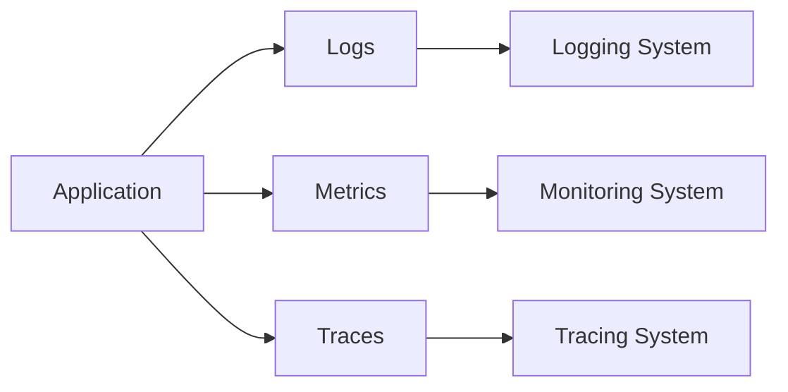
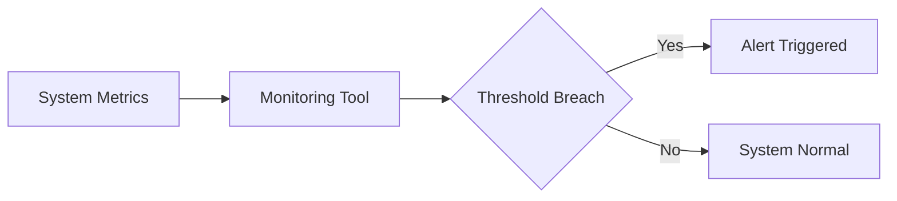
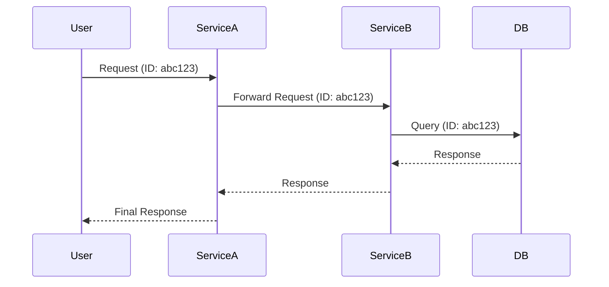

# Day 18 – Logging & Monitoring

> Part of the Thynqit Labs – Foundational Engineering Bootcamp

---

## 📌 Overview

Building and deploying software is only half the job.

Modern engineers must also understand:

- what happens in production  
- how systems behave under load  
- how to detect failures  
- how to debug real issues  

This module introduces **logging, monitoring, and observability** — the foundation of operating reliable systems at scale.

---

## 🎯 Learning Objectives

By the end of this module, learners should be able to:

- Explain logging and monitoring concepts
- Differentiate logs, metrics, and traces
- Understand observability in modern systems
- Interpret structured logs
- Explain log levels and their usage
- Understand centralized logging systems
- Explain monitoring and alerting concepts
- Understand correlation IDs and distributed tracing
- Identify how engineers debug production issues

---

## 🧠 Core Concepts

---

### 1. What is Logging?

Logging is the process of recording events that occur within a system.

Logs help answer:

- What happened?
- When did it happen?
- Why did it fail?

---

### Example Logs

```plaintext
INFO 2026-03-28 10:01:23 User login successful userId=123

WARN 2026-03-28 10:05:11 Payment retry triggered orderId=567

ERROR 2026-03-28 10:07:45 Database connection failed
```

---

### 2. Log Levels

| Level | Purpose |
|------|--------|
| DEBUG | Detailed debugging information |
| INFO | Normal system operation |
| WARN | Potential issue |
| ERROR | Failure occurred |
| FATAL | System crash |

---

### 3. What is Monitoring?

Monitoring tracks system health using measurable data.

It answers:

- Is the system working?
- How fast is it?
- Are errors increasing?

---

### 4. Logs vs Metrics vs Traces

| Type | Description |
|------|------------|
| Logs | Detailed event records |
| Metrics | Numerical data (CPU, latency) |
| Traces | Request journey across services |

---

### Observability Stack



---

### 5. Observability

Observability is the ability to understand a system’s internal state using:

- logs  
- metrics  
- traces  

It is critical in distributed systems.

---

### 6. Centralized Logging

Problem:

- Logs scattered across servers

Solution:

- Aggregate logs into a centralized system

Benefits:

- easier debugging  
- better visibility  
- searchable logs  

---

### 7. Monitoring & Alerting

Monitoring systems trigger alerts when thresholds are exceeded.

Examples:

- CPU > 90%  
- API failure rate > 5%  
- latency spike  

---

### Monitoring Flow



---

### 8. Correlation ID & Distributed Tracing

In distributed systems:

- a single request passes through multiple services  

Correlation ID:

- unique ID attached to each request  
- used to track request across services  

---

### Example

```plaintext
Request ID: abc123

Service A → Service B → Service C
```

---

### Request Flow with Logging



---

### 9. Real-World Debugging Flow

Scenario:

User reports: **“Payment failed”**

Steps:

1. Check logs for error messages  
2. Identify correlation ID  
3. Trace request across services  
4. Check metrics for anomalies  
5. Identify root cause  

---

### 10. Golden Signals (SRE)

Key metrics to monitor:

- Latency  
- Traffic  
- Errors  
- Saturation  

These indicate system health.

---

### 11. Logging Best Practices

- Use structured logs (JSON)
- Avoid sensitive data
- Include timestamps
- Use correlation IDs
- Write meaningful messages

---

### 12. Monitoring Best Practices

- Define thresholds carefully
- Avoid alert fatigue
- Monitor business metrics
- Track trends, not just spikes

---

### 13. Tool Awareness (High-Level)

| Category | Tools |
|----------|------|
| Logging | ELK Stack (Elasticsearch, Logstash, Kibana), Splunk |
| Monitoring | Prometheus, Grafana, Datadog |
| Tracing | Jaeger, Zipkin |

These tools help implement observability at scale.

---

## 🌍 Real-World Relevance

Without logging and monitoring:

- failures go unnoticed  
- debugging becomes difficult  
- production incidents escalate  

With proper observability:

- issues are detected early  
- systems become reliable  
- engineers gain visibility  

---

## 🧩 Practical Understanding

Scenario:

A user reports slow API response.

- Is it a database issue?  
- Network latency?  
- CPU spike?  

How would you investigate?

---

## ⚠️ Common Mistakes

- Logging too little or too much  
- Logging sensitive data  
- No centralized logging  
- Ignoring alerts  
- No correlation IDs  

---

## 🔄 Reflection Questions

- Why are logs insufficient without metrics?
- How does tracing help in microservices?
- Why are correlation IDs critical?
- What happens if monitoring is missing?

---

## 📚 Next Steps

- Review `resources.md`
- Complete `assignments.md`
- Explore logs in real applications (browser / backend)

---

## 🧭 Navigation

← Back to Previous Day  
[Day 17](../day-17/README.md)

➡ Next: Resources  
[Resources](./resources.md)