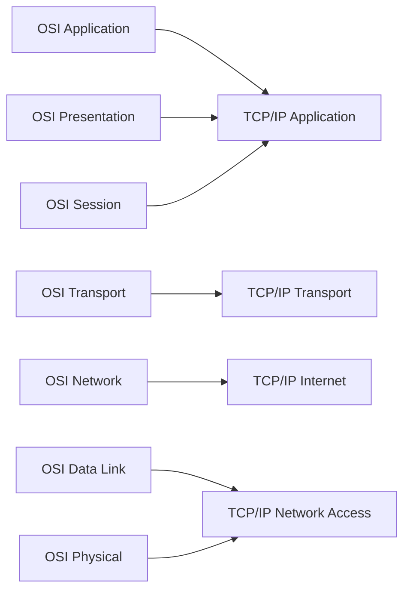
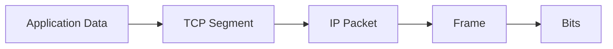
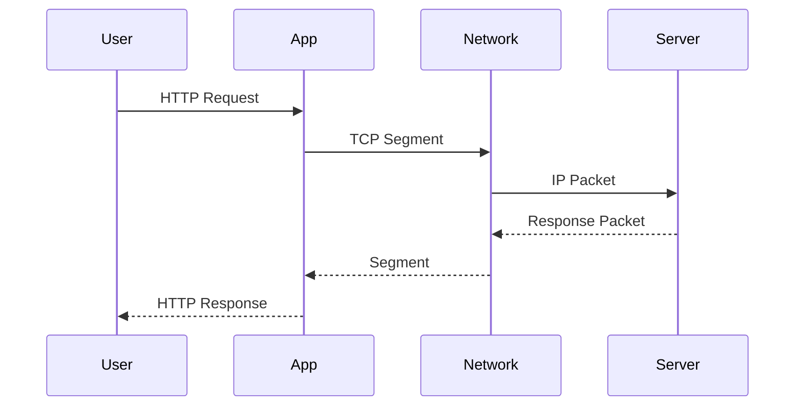

# Day 19 – Networking Fundamentals

> Part of the Thynqit Labs – Foundational Engineering Bootcamp

---

## 📌 Overview

Modern software systems communicate over networks.

Understanding **how data actually travels across systems** is critical for:

- backend engineering  
- cloud systems  
- debugging production issues  
- API communication  

This module focuses on **networking fundamentals from an engineering perspective**, including:

- OSI model  
- TCP/IP model  
- protocol layers  
- packet flow across networks  

---

## 🎯 Learning Objectives

By the end of this module, learners should be able to:

- Explain OSI and TCP/IP models
- Differentiate between the two models
- Understand each layer and its responsibility
- Identify protocols at each layer
- Explain how data travels across the internet
- Understand ports and protocol mapping
- Explain IP addressing and network classes
- Use basic networking CLI tools
- Understand LAN and local networking basics

---

## 🧠 Core Concepts

---

### 1. Why Networking Models Exist

Networking is complex. Models help:

- break communication into layers  
- standardize interactions  
- simplify debugging  

---

### 2. OSI Model (7 Layers)

| Layer | Name | Purpose |
|------|------|--------|
| 7 | Application | User-facing protocols (HTTP, FTP) |
| 6 | Presentation | Data formatting, encryption |
| 5 | Session | Connection management |
| 4 | Transport | Reliable data transfer (TCP/UDP) |
| 3 | Network | Routing using IP |
| 2 | Data Link | Local delivery using MAC |
| 1 | Physical | Transmission of bits |

---

### 3. TCP/IP Model (4 Layers)

| Layer | Description |
|------|------------|
| Application | Combines OSI layers 5–7 |
| Transport | Same as OSI transport |
| Internet | Equivalent to OSI network |
| Network Access | Combines OSI layers 1–2 |

---

### OSI vs TCP/IP Mapping



---

### 4. OSI vs TCP/IP Comparison

| Feature | OSI | TCP/IP |
|--------|-----|--------|
| Layers | 7 | 4 |
| Type | Conceptual | Practical |
| Usage | Teaching | Real-world implementation |

---

### 5. Protocols by Layer

| Layer | Protocols |
|------|----------|
| Application | HTTP, HTTPS, FTP, DNS |
| Transport | TCP, UDP |
| Network | IP, ICMP |
| Data Link | Ethernet |
| Physical | Cables, signals |

---

### 6. How Data Travels (Encapsulation)

When a request is sent:

```plaintext
Data → Segment → Packet → Frame → Bits
```

---

### Encapsulation Flow



---

### Reverse (De-encapsulation)

```plaintext
Bits → Frame → Packet → Segment → Data
```

---

### 7. End-to-End Request Flow



---

### 8. Ports & Protocols

| Port | Protocol | Purpose |
|-----|----------|--------|
| 80 | HTTP | Web traffic |
| 443 | HTTPS | Secure web |
| 22 | SSH | Remote access |
| 21 | FTP | File transfer |
| 25 | SMTP | Email |
| 53 | DNS | Domain resolution |
| 3306 | MySQL | Database |
| 5432 | PostgreSQL | Database |

---

### 9. TCP vs UDP

| Feature | TCP | UDP |
|--------|-----|-----|
| Reliability | High | Low |
| Speed | Slower | Faster |
| Use Case | APIs, web | streaming, gaming |

---

### 10. IP Addressing & Classes

| Class | Range | Usage |
|------|------|------|
| A | 1–126 | Large networks |
| B | 128–191 | Medium |
| C | 192–223 | Small |

---

### Private IP Ranges

- 10.0.0.0 – 10.255.255.255  
- 172.16.0.0 – 172.31.255.255  
- 192.168.0.0 – 192.168.255.255  

---

### 11. LAN & Local Networking

LAN (Local Area Network):

- connects devices in a limited area  
- uses switches and routers  

Key concepts:

- MAC address → physical identity  
- IP address → logical identity  

---

### 12. Real-World Packet Journey

```plaintext
Laptop → Router → ISP → Internet → Server → Database
```

At each step:

- data is encapsulated  
- routed using IP  
- delivered via protocols  

---

### 13. CLI Networking Tools

---

#### ping

Check connectivity:

```
ping google.com
```

---

#### traceroute

Track path of request:

```
traceroute google.com
```

---

#### nslookup

Resolve domain to IP:

```
nslookup google.com
```

---

## 🌍 Real-World Relevance

Without networking knowledge:

- debugging API failures becomes difficult  
- cloud systems become confusing  
- performance issues are hard to diagnose  

With networking understanding:

- engineers can trace requests  
- identify failures  
- understand system communication  

---

## 🧩 Practical Understanding

Scenario:

An API request is failing.

- Is it DNS?
- Is it network routing?
- Is it server issue?

How would you debug?

---

## ⚠️ Common Mistakes

- ignoring network layer issues  
- misunderstanding ports  
- assuming APIs always fail at application level  
- not understanding request flow  

---

## 🔄 Reflection Questions

- Why are layered models important?
- What happens at each layer during a request?
- Why is TCP reliable?
- How does encapsulation work?
- Why are ports necessary?

---

## 📚 Next Steps

- Review `resources.md`
- Complete `assignments.md`
- Practice CLI networking tools

---

## 🧭 Navigation

← Back to Previous Day  
[Day 18](../day-18/README.md)

➡ Next: Resources  
[Resources](./resources.md)