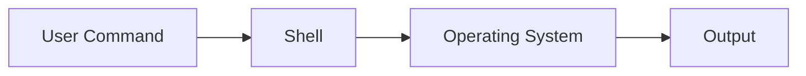
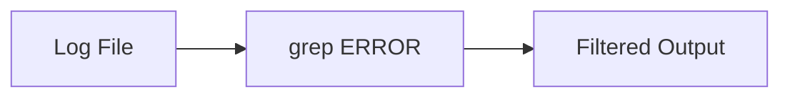

# Day 20 – Linux CLI for Engineers

> Part of the Thynqit Labs – Foundational Engineering Bootcamp

---

## 📌 Overview

Modern software engineering does not happen only inside IDEs.

Engineers frequently interact with:

- servers
- cloud environments
- logs
- CI/CD pipelines
- deployment systems

Most of these environments rely heavily on the **Command Line Interface (CLI)**.

This module introduces essential Linux CLI commands and basic shell scripting required for engineers to:

- navigate systems
- debug issues
- inspect logs
- automate tasks
- interact with cloud infrastructure

Understanding CLI is critical because **production systems rarely provide graphical interfaces**.

---

## 🎯 Learning Objectives

By the end of this module, learners should be able to:

- Navigate file systems using CLI
- Perform file and directory operations
- Read and analyze logs using CLI tools
- Search and filter data efficiently
- Understand file permissions
- Inspect processes and system resources
- Perform basic network troubleshooting
- Use pipes and redirection effectively
- Understand environment variables
- Write basic shell scripts for automation

---

## 🧠 Core Concepts

---

### 1. What is CLI?

CLI (Command Line Interface) allows users to interact with the operating system using text-based commands.



Unlike GUI, CLI is:

- faster  
- scriptable  
- available in remote/cloud environments  

---

### 2. File System Navigation

```bash
pwd
ls
ls -la
cd <directory>
clear
```

Why it matters:
- navigating servers  
- accessing logs  
- managing project directories  

---

### 3. File & Directory Operations

```bash
mkdir project
touch file.txt
cp file.txt backup.txt
mv file.txt newfile.txt
rm file.txt
rm -rf folder/
```

Used for:
- managing build artifacts  
- handling deployment files  
- cleaning environments  

---

### 4. Viewing & Monitoring Files (Logs)

```bash
cat file.txt
less file.txt
head file.txt
tail file.txt
tail -f app.log
```

`tail -f` is critical for:

- real-time log monitoring  
- debugging production systems  

---

### 5. Search & Filtering

```bash
grep "ERROR" app.log
find . -name "*.js"
```

Example:

```bash
cat app.log | grep ERROR
```



Used for:
- debugging failures  
- analyzing logs quickly  

---

### 6. Permissions & Ownership

```bash
chmod 755 file.sh
chown user:group file.txt
```

Permissions:

| Type | Meaning |
|------|--------|
| r | read |
| w | write |
| x | execute |

Why it matters:
- security  
- execution control  
- production access management  

---

### 7. Networking Commands

```bash
ping google.com
curl https://example.com
wget https://example.com/file.zip
netstat -an
```

Used for:
- API testing  
- connectivity checks  
- debugging network issues  

---

### 8. Process Management

```bash
ps aux
top
kill <process-id>
```

Used for:
- identifying running processes  
- stopping stuck applications  
- monitoring CPU usage  

---

### 9. System Monitoring

```bash
df -h
du -h
free -h
```

Used for:
- disk usage tracking  
- memory monitoring  
- system health checks  

---

### 10. Compression & Archiving

```bash
tar -cvf archive.tar folder/
tar -xvf archive.tar
zip file.zip file.txt
unzip file.zip
```

Used in:
- deployments  
- backups  
- artifact packaging  

---

### 11. Pipes & Redirection

```bash
|
>
>>
```

Examples:

```bash
cat logs.txt | grep ERROR
ls > files.txt
```


Why it matters:
- chaining commands  
- powerful data processing  
- automation workflows  

---

### 12. Environment Variables

```bash
echo $PATH
export ENV=production
```

Used for:
- configuration  
- secrets (with care)  
- environment-specific behavior  

---

### 13. Basic Shell Scripting

Shell scripting helps automate repetitive tasks.

---

#### Script Structure

```bash
#!/bin/bash

echo "Hello World"
```

---

#### Variables

```bash
NAME="Engineer"
echo $NAME
```

---

#### Conditionals

```bash
if [ -f "file.txt" ]; then
  echo "File exists"
else
  echo "File not found"
fi
```

---

#### Loops

```bash
for file in *.log
do
  echo $file
done
```

---

#### Arguments

```bash
echo "First argument: $1"
```

---

### 14. Automation with Scripts


Examples:

- log analysis  
- backups  
- health checks  
- CI/CD steps  

---

## 🌍 Real-World Relevance

In production environments:

- Engineers debug issues using logs via CLI  
- Cloud servers often have no GUI  
- CI/CD pipelines execute shell commands  
- Automation relies heavily on scripting  
- Monitoring and troubleshooting happen via terminal  

CLI is not optional — it is a **core engineering skill**.

---

## 🧩 Practical Understanding

Scenario:

Your production system is down.

You SSH into a server and need to:

- check logs  
- find errors  
- inspect running processes  
- restart services  

How would you use:

- `tail -f`  
- `grep`  
- `ps`  
- `kill`  

Think through the workflow.

---

## ⚠️ Common Mistakes

- Using `rm -rf` without caution  
- Not understanding permissions  
- Ignoring log outputs  
- Hardcoding paths in scripts  
- Not handling script errors  
- Overusing GUI instead of learning CLI  

---

## 🔄 Reflection Questions

- Why is CLI essential in cloud environments?  
- How do pipes make CLI powerful?  
- Why is log analysis critical for debugging?  
- How does scripting improve productivity?  
- What risks exist when using powerful commands incorrectly?  

---

## 📚 Next Steps

- Review `resources.md`  
- Complete `assignments.md`  
- Practice commands on local machine or VM  
- Write small scripts to automate tasks  

---

## 🧭 Navigation

← Previous Day  
[Day 19](../day-19/README.md)

➡ Next: Resources  
[Resources](./resources.md)