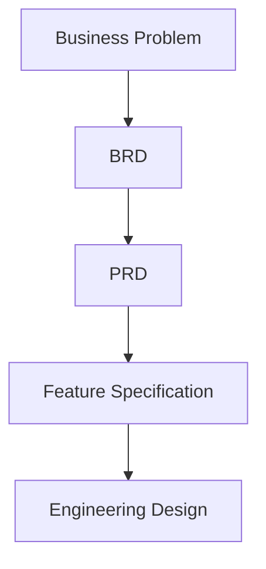
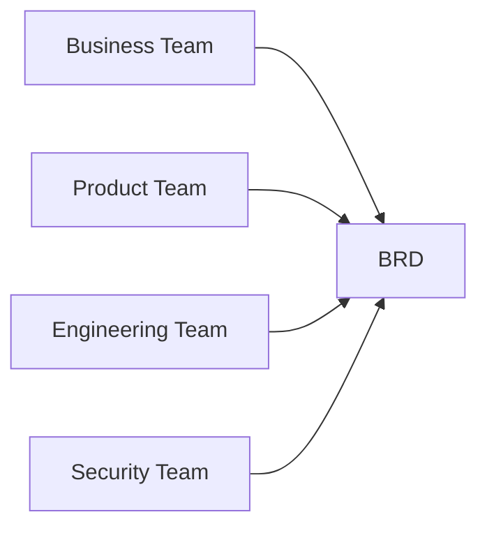

# Day 21 – Business Requirement Document (BRD)

> Part of the Thynqit Labs – Foundational Engineering Bootcamp

---

## 📌 Overview

Before systems are designed or code is written, organizations must first define:

- what problem they are solving
- why the problem matters
- who is affected
- what business outcome is expected

This is where a **Business Requirement Document (BRD)** becomes important.

A BRD helps align:

- business teams
- product teams
- engineering teams
- stakeholders

around a shared understanding of the problem and expected outcomes.

This module introduces BRDs from an engineering perspective using a simplified **Target.com inspired e-commerce platform** as the running case study.

---

## 🎯 Learning Objectives

By the end of this module, learners should be able to:

- Understand what a BRD is
- Explain why BRDs are important
- Differentiate BRD vs PRD vs Feature Specification
- Identify key sections of a BRD
- Define scope clearly
- Understand stakeholder expectations
- Write business-focused requirements
- Understand functional vs non-functional requirements at a high level

---

## 🧠 Core Concepts

---

### 1. What is a BRD?

A Business Requirement Document (BRD) defines:

- the business problem
- business goals
- expected outcomes
- scope of the initiative

A BRD focuses on:

```plaintext
WHY the system should exist
```

—not technical implementation details.

---

### 2. Why BRDs Matter

Without clear business requirements:

- teams misunderstand priorities
- engineering builds incorrect solutions
- scope grows uncontrollably
- delivery timelines are affected

BRDs help teams align before implementation begins.

---

### 3. BRD vs PRD vs Feature Specification

| Document | Primary Focus |
|----------|--------------|
| BRD | Business problem and goals |
| PRD | Product behavior and functionality |
| Feature Specification | Engineering implementation details |

---

### Requirement Flow



---

### 4. BRD Lifecycle

A BRD typically evolves through:

```plaintext
Business Discussion
    ↓
Problem Identification
    ↓
Stakeholder Alignment
    ↓
BRD Creation
    ↓
Product & Engineering Planning
```

---

### 5. Key Sections of a BRD

Most BRDs include:

| Section | Purpose |
|--------|--------|
| Executive Summary | High-level overview |
| Business Problem | Problem being solved |
| Objectives | Expected business outcomes |
| Stakeholders | Teams and owners involved |
| Scope | Included and excluded areas |
| Success Metrics | Measurement criteria |
| Constraints | Budget, timelines, regulations |
| Risks | Potential business risks |

---

### 6. Stakeholder Alignment

Different stakeholders view systems differently.

| Stakeholder | Primary Concern |
|------------|----------------|
| Business Team | Revenue and growth |
| Product Team | User experience |
| Engineering Team | Feasibility and scalability |
| Security Team | Compliance and protection |

---

### Stakeholder Alignment Flow



---

### 7. Scope Definition

One of the most important parts of a BRD is defining:

- what is included
- what is excluded

---

#### Example

##### In Scope

- Product catalog
- Cart management
- Checkout flow

##### Out of Scope

- International shipping
- Loyalty rewards system

Clear scope prevents uncontrolled feature expansion.

---

### 8. Functional vs Non-Functional Requirements

---

#### Functional Requirements

Define what the system should do.

Examples:

- users can search products
- users can place orders

---

#### Non-Functional Requirements

Define system qualities and constraints.

Examples:

- system should support 10,000 concurrent users
- checkout response time should be under 2 seconds

These concepts become much more important during system design.

---

### 9. Success Metrics

Business initiatives require measurable outcomes.

Examples:

- improve online conversion rate by 15%
- reduce checkout abandonment
- improve delivery tracking experience

Success metrics connect engineering work to business value.

---

### 10. Risks & Constraints

Every initiative has limitations.

Examples:

- limited budget
- strict delivery timelines
- regulatory compliance requirements

Understanding constraints influences engineering decisions later.

---

### 11. Common BRD Mistakes

Common problems include:

- vague requirements
- mixing technical implementation into BRD
- missing scope boundaries
- unrealistic expectations
- unclear success metrics

Good BRDs prioritize clarity and alignment.

---

## 🌍 Real-World Relevance

In real engineering organizations:

- product teams use BRDs to align initiatives
- engineering teams estimate implementation effort
- leadership teams evaluate business impact
- stakeholders define priorities and timelines

BRDs create a shared understanding before execution begins.

---

## 🧩 Running Case Study

Throughout Week 5 and Week 6, learners will progressively design a simplified e-commerce platform inspired by Target.com.

The platform will evolve through:

```plaintext
Business Idea
   ↓
BRD
   ↓
PRD
   ↓
Feature Specifications
   ↓
API & Database Design
   ↓
System Architecture
```

This mirrors real-world engineering and product workflows.

---

## ⚠️ Common Misconception

A BRD is not:

- a technical architecture document
- an API specification
- a database schema
- a sprint task list

It is a business-focused document that guides product and engineering planning.

---

## 🔄 Reflection Questions

- Why is business clarity important before engineering begins?
- What problems occur when scope is unclear?
- Why should technical implementation details be avoided in BRDs?
- How do success metrics influence engineering priorities?

---

## 📚 Next Steps

- Review `resources.md`
- Explore the running example in `example.md`
- Complete `assignments.md`

---

## 🧭 Navigation

← Previous Module  
[Week 5](../README.md)

➡ Next: Resources  
[Resources](./resources.md)