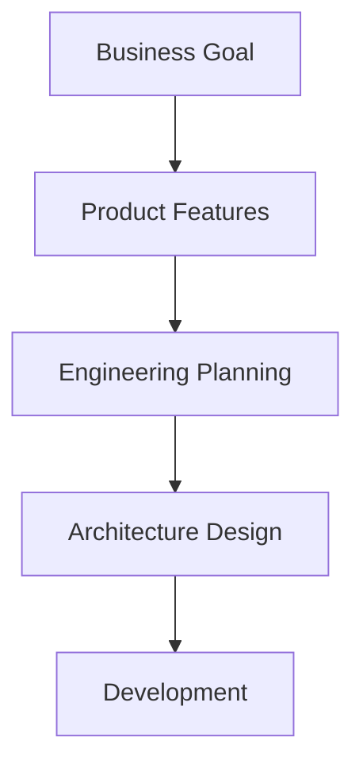
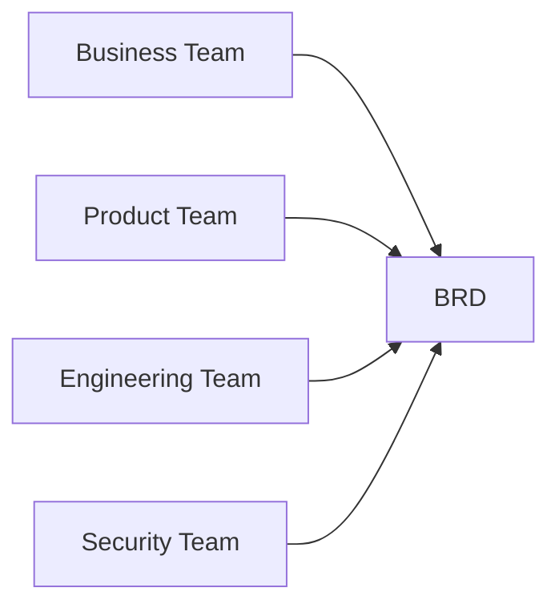

# Example – Day 21: Business Requirement Document (BRD)

> Part of the Thynqit Labs – Foundational Engineering Bootcamp

---

# 📌 Overview

This document demonstrates a simplified example of a **Business Requirement Document (BRD)** for a Target.com inspired e-commerce platform.

The purpose of this example is to help learners understand:

- how business problems are documented
- how business goals influence engineering decisions
- how requirements evolve before system design begins

This is a learning-oriented example and intentionally simplified for educational purposes.

---

# Document Information

| Field            | Value                      |
| ---------------- | -------------------------- |
| Project Name     | Thynqit Commerce Platform  |
| Document Version | v1.0                       |
| Prepared By      | Product & Engineering Team |
| Prepared Date    | 2026-05-20                 |

---

# 1. Executive Summary

The organization plans to modernize its online commerce platform to improve digital shopping experience, increase online sales, and support growing customer traffic.

The platform will allow customers to:

- browse products
- manage shopping carts
- place orders
- track deliveries

The initiative aims to improve user experience while preparing the platform for future scalability.

---

# 2. Business Problem Statement

The existing platform faces several business challenges:

- high cart abandonment during checkout
- slow mobile shopping experience
- inconsistent order tracking visibility
- inability to handle peak traffic during seasonal sales

These issues negatively impact:

- revenue
- customer satisfaction
- operational efficiency

---

# 3. Business Objectives

| Objective ID | Objective                                |
| ------------ | ---------------------------------------- |
| OBJ-001      | Improve online conversion rate           |
| OBJ-002      | Reduce cart abandonment                  |
| OBJ-003      | Improve mobile shopping experience       |
| OBJ-004      | Support high traffic during sales events |
| OBJ-005      | Improve delivery tracking visibility     |

---

# 4. Stakeholders

| Stakeholder           | Role                | Responsibility                       |
| --------------------- | ------------------- | ------------------------------------ |
| Business Team         | Business Owner      | Defines business goals               |
| Product Team          | Product Managers    | Defines product behavior             |
| Engineering Team      | Engineering Leads   | Evaluates implementation feasibility |
| Security Team         | Security Architects | Reviews compliance and security      |
| Customer Support Team | Support Operations  | Handles customer escalations         |

---

# 5. Scope Definition

---

## In Scope

- Product catalog browsing
- Product search
- Shopping cart management
- User authentication
- Checkout and payments
- Order tracking
- Mobile-friendly experience

---

## Out of Scope

- International shipping
- Marketplace seller onboarding
- Subscription-based commerce
- Loyalty rewards program

---

# 6. Functional Requirements

| Requirement ID | Description                                           |
| -------------- | ----------------------------------------------------- |
| FR-001         | Users should be able to browse products               |
| FR-002         | Users should be able to search products by category   |
| FR-003         | Users should be able to add items to cart             |
| FR-004         | Users should be able to complete checkout securely    |
| FR-005         | Users should be able to track order status            |
| FR-006         | Users should receive order confirmation notifications |

---

# 7. Non-Functional Requirements

| Requirement ID | Description                                                      |
| -------------- | ---------------------------------------------------------------- |
| NFR-001        | System should support 100,000 concurrent users during peak sales |
| NFR-002        | Checkout response time should remain under 2 seconds             |
| NFR-003        | Platform should maintain 99.9% uptime                            |
| NFR-004        | Sensitive customer data must be encrypted                        |
| NFR-005        | Mobile experience should be optimized for low-bandwidth networks |

---

## 🧠 Engineering Note

The scalability and performance requirements defined here will directly influence:

- infrastructure planning
- caching strategy
- database scaling
- load balancing decisions

during Week 6 system design exercises.

---

# 8. User Types

| User Type     | Description                    |
| ------------- | ------------------------------ |
| Customer      | Purchases products             |
| Admin         | Manages products and inventory |
| Support Agent | Assists customers with issues  |

---

# 9. Success Metrics

| Metric                        | Target         |
| ----------------------------- | -------------- |
| Cart Abandonment Rate         | Reduce by 20%  |
| Checkout Success Rate         | Improve to 98% |
| Mobile Conversion Rate        | Improve by 15% |
| Average Order Processing Time | Reduce by 30%  |

---

# 10. Risks

| Risk ID  | Description                                                  | Impact |
| -------- | ------------------------------------------------------------ | ------ |
| RISK-001 | High traffic during sales events may overload infrastructure | High   |
| RISK-002 | Payment gateway downtime may impact order processing         | High   |
| RISK-003 | Inventory synchronization delays may affect customer trust   | Medium |

---

## 🧠 Engineering Note

These risks will later influence:

- retry mechanisms
- failover architecture
- monitoring systems
- distributed system design

during architecture planning.

---

# 11. Assumptions

- Customers have internet connectivity
- Third-party payment providers are available
- Inventory systems provide near real-time updates
- Mobile users represent majority traffic during peak sales

---

# 12. Constraints

| Constraint Type | Description                                       |
| --------------- | ------------------------------------------------- |
| Timeline        | MVP launch required within 6 months               |
| Budget          | Infrastructure budget is limited during MVP phase |
| Compliance      | Customer data protection regulations apply        |

---

# 13. Dependencies

| Dependency           | Purpose              |
| -------------------- | -------------------- |
| Payment Gateway      | Payment processing   |
| Logistics Provider   | Shipment tracking    |
| Notification Service | Email and SMS alerts |
| Inventory System     | Stock validation     |

---

# 14. High-Level Requirement Flow



---

# 15. Stakeholder Alignment Flow



---

# 16. Future Considerations

Potential future enhancements may include:

- recommendation systems
- AI-powered product search
- international commerce support
- loyalty rewards platform
- event-driven architecture

---

## 🧠 Engineering Note

Future business goals often influence architecture decisions early.

For example:

- global expansion may require multi-region deployments
- recommendation systems may require analytics pipelines
- large-scale traffic may require microservices architecture

---

# 17. Key Takeaways

This BRD demonstrates how organizations:

- define business problems
- align stakeholders
- define scope
- identify risks
- prepare for engineering planning

Before system architecture or development begins, teams must first achieve business clarity.

---

# 📚 Related Learning Flow

This example will evolve throughout Week 5 and Week 6:

```plaintext
BRD
   ↓
PRD
   ↓
Feature Specification
   ↓
API Specification
   ↓
DB Schema
   ↓
High-Level Design
   ↓
Low-Level Design
```

This mirrors how real-world systems evolve from business ideas into production systems.

---

# 🧭 Navigation

← Back to Resources
[Resources](./resources.md)

➡ Next: Assignments
[Assignments](./assignments.md)
