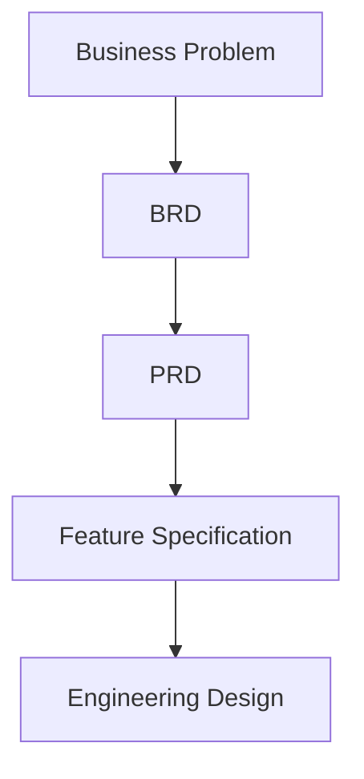

# Day 22 – Product Requirement Document (PRD)

> Part of the Thynqit Labs – Foundational Engineering Bootcamp

---

# 📌 Overview

Once business requirements are clearly defined, the next step is converting business goals into product behavior and user experiences.

This is where a **Product Requirement Document (PRD)** becomes important.

A PRD defines:

- what the product should do
- how users interact with the product
- what features are required
- what product behavior is expected

Unlike a Business Requirement Document (BRD), which focuses on business goals and organizational outcomes, a PRD focuses on:

```plaintext
WHAT the product should deliver to users
```

This document helps align:

- product teams
- engineering teams
- design teams
- QA teams
- business stakeholders

around product functionality and expected user experience.

Throughout this module, learners will continue working on the **Target.com inspired e-commerce platform** introduced in Day 21.

---

# 🎯 Learning Objectives

By the end of this module, learners should be able to:

- Understand what a PRD is
- Differentiate PRD vs BRD vs Feature Specification
- Define product functionality clearly
- Understand user journeys and workflows
- Define product scope and feature expectations
- Identify user personas and product goals
- Understand product-level functional and non-functional requirements
- Connect business goals to product capabilities

---

# 🧠 Core Concepts

---

## 1. What is a PRD?

A Product Requirement Document (PRD) defines:

- product behavior
- user interactions
- workflows
- feature expectations
- product functionality

A PRD focuses on:

```plaintext
WHAT the product should do
```

while avoiding low-level implementation details.

---

## 2. Why PRDs Matter

Without a clear PRD:

- engineering teams may build incorrect features
- product expectations become unclear
- user experience becomes inconsistent
- scope and priorities become difficult to manage

PRDs help teams align on product behavior before implementation begins.

---

## 3. BRD vs PRD vs Feature Specification

| Document | Primary Focus |
|------|------|
| BRD | Business goals and organizational problems |
| PRD | Product behavior and user experience |
| Feature Specification | Detailed feature-level engineering behavior |

---

## Requirement Evolution Flow



---

## 4. Product Thinking

Product thinking focuses on:

- solving user problems
- improving user experience
- balancing business goals with usability
- defining valuable product capabilities

Good products solve real user problems effectively.

---

## 5. Key Sections of a PRD

Most PRDs include:

| Section | Purpose |
|------|------|
| Product Overview | Product summary and purpose |
| Product Goals | Desired outcomes |
| User Personas | Target users |
| Features | Product capabilities |
| User Journeys | User workflows |
| Functional Requirements | Product behaviors |
| Non-Functional Requirements | Product quality expectations |
| Dependencies | External systems/services |
| Risks | Product risks |
| Success Metrics | Product KPIs |

---

## 6. User Personas

User personas help teams understand:

- who the product is built for
- user expectations
- pain points
- behavior patterns

---

### Example Persona

| Attribute | Example |
|------|------|
| Name | Sarah Johnson |
| Role | Online Shopper |
| Goal | Fast and reliable checkout |
| Pain Point | Slow mobile checkout experience |

---

## 7. User Journeys

User journeys describe how users interact with a product.

---

### Example Journey

```plaintext
User visits platform
    ↓
Searches products
    ↓
Adds items to cart
    ↓
Completes checkout
    ↓
Receives confirmation
    ↓
Tracks order
```

User journeys help teams identify:

- product flows
- user expectations
- friction points

---

## 8. Functional Requirements

Functional requirements define:

```plaintext
What the product should do
```

---

### Examples

- Users should be able to search products
- Users should be able to add products to cart
- Users should receive order confirmation notifications

---

## 9. Non-Functional Requirements

Non-functional requirements define:

```plaintext
How well the product should perform
```

---

### Examples

- Mobile pages should load under 3 seconds
- Checkout APIs should maintain high availability
- User data must be encrypted

These requirements heavily influence engineering and architecture decisions later.

---

## 🧠 Engineering Note

Product expectations often influence:

- API design
- database design
- infrastructure planning
- scalability strategy

during system architecture discussions.

---

## 10. Product Scope

PRDs help define:

- what product capabilities are included
- what functionality is excluded

---

### Example

#### In Scope

- Product search
- Cart management
- Checkout flow
- Order tracking

---

#### Out of Scope

- International commerce
- Marketplace seller onboarding
- Subscription services

Clear scope helps teams avoid uncontrolled feature expansion.

---

## 11. Dependencies

Products often depend on:

- payment providers
- inventory systems
- notification services
- logistics integrations

Dependencies influence engineering complexity and delivery timelines.

---

## 12. Product Risks

Examples:

- poor mobile experience
- checkout failures
- payment provider downtime
- scaling challenges during sales events

Understanding risks early helps teams prepare better engineering strategies.

---

## 13. Success Metrics

Product initiatives should define measurable outcomes.

---

### Examples

| Metric | Target |
|------|------|
| Cart Abandonment Rate | Reduce by 20% |
| Checkout Success Rate | Improve to 98% |
| Mobile Conversion Rate | Improve by 15% |

Product metrics connect engineering work to user and business outcomes.

---

# 🌍 Real-World Relevance

In modern organizations:

- product managers define PRDs
- engineering teams estimate implementation complexity
- designers define user experiences
- QA teams validate expected product behavior

PRDs become the shared product blueprint before development begins.

---

# 🧩 Running Case Study

Throughout Week 5 and Week 6, learners will continue working on a simplified e-commerce platform inspired by Target.com.

The platform will progressively evolve through:

```plaintext
Business Requirements
    ↓
Product Requirements
    ↓
Feature Specifications
    ↓
API Design
    ↓
Database Design
    ↓
Architecture Design
```

This mirrors how real-world engineering and product teams operate.

---

# ⚠️ Common Misconceptions

A PRD is not:

- a database schema
- an API specification
- a deployment document
- low-level engineering design

It is a product-focused document defining expected product behavior and user experience.

---

# 🔄 Reflection Questions

- Why is product clarity important before implementation?
- How do user journeys influence engineering decisions?
- Why should product scope be clearly defined?
- How do non-functional requirements affect architecture design?
- Why are dependencies important in product planning?

---

# 📚 Next Steps

- Review `resources.md`
- Explore the running product example in `example.md`
- Complete `assignments.md`

---

# 🧭 Navigation

← Previous Day  
[Day 21](../day-21/README.md)

➡ Next: Resources  
[Resources](./resources.md)