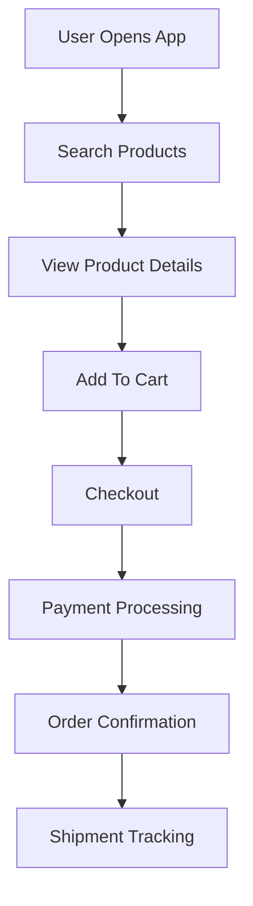

# Example – Day 22: Product Requirement Document (PRD)

> Part of the Thynqit Labs – Foundational Engineering Bootcamp

---

# 📌 Overview

This document demonstrates a simplified example of a **Product Requirement Document (PRD)** for a Target.com inspired e-commerce platform.

The purpose of this example is to help learners understand:

- how product requirements are documented
- how user journeys influence product behavior
- how product features evolve from business requirements
- how engineering teams prepare for implementation planning

This PRD continues the same use case introduced in Day 21 BRD.

---

# Document Information

| Field | Value |
|------|------|
| Product Name | Thynqit Commerce Platform |
| Document Version | v1.0 |
| Prepared By | Product Team |
| Prepared Date | 2026-05-21 |

---

# 1. Product Overview

The platform provides a digital commerce experience that allows customers to:

- browse products
- search product catalogs
- manage shopping carts
- complete secure checkout
- track deliveries

The primary focus of the product is:

- improving mobile shopping experience
- reducing checkout friction
- supporting scalable online commerce

---

# 2. Product Goals

| Goal ID | Goal |
|------|------|
| PG-001 | Improve checkout completion rate |
| PG-002 | Reduce mobile cart abandonment |
| PG-003 | Improve order tracking visibility |
| PG-004 | Support high-traffic seasonal sales |
| PG-005 | Improve customer satisfaction |

---

# 3. User Personas

---

## Persona 1 – Mobile Shopper

| Attribute | Value |
|------|------|
| Name | Sarah Johnson |
| Role | Customer |
| Goal | Quick mobile checkout |
| Pain Point | Slow and complicated checkout flows |

---

## Persona 2 – Operations Admin

| Attribute | Value |
|------|------|
| Name | Michael Lee |
| Role | Admin |
| Goal | Monitor orders and inventory |
| Pain Point | Delayed inventory synchronization |

---

## Persona 3 – Support Agent

| Attribute | Value |
|------|------|
| Name | Emily Carter |
| Role | Customer Support |
| Goal | Resolve customer delivery issues quickly |
| Pain Point | Lack of centralized order visibility |

---

# 4. Product Features

| Feature ID | Feature Name | Description |
|------|------|------|
| FEAT-001 | Product Catalog | Browse and filter products |
| FEAT-002 | Product Search | Search products by keyword and category |
| FEAT-003 | Cart Management | Add, update, and remove cart items |
| FEAT-004 | Checkout | Secure order placement |
| FEAT-005 | Order Tracking | Track shipment and order status |
| FEAT-006 | Notifications | Send order and delivery updates |

---

# 5. User Journey

---

## Customer Purchase Journey

```plaintext
User visits platform
    ↓
Searches products
    ↓
Views product details
    ↓
Adds items to cart
    ↓
Completes checkout
    ↓
Receives confirmation
    ↓
Tracks shipment
```

---

## 🧠 Engineering Note

This user journey will later influence:

- API design
- database schema relationships
- caching strategies
- scalability planning
- service communication patterns

during system design exercises.

---

# 6. Functional Requirements

| Requirement ID | Description |
|------|------|
| FR-001 | Users should be able to register and login |
| FR-002 | Users should be able to search products |
| FR-003 | Users should be able to filter products by category |
| FR-004 | Users should be able to manage shopping carts |
| FR-005 | Users should be able to place orders securely |
| FR-006 | Users should receive order confirmation notifications |
| FR-007 | Users should be able to track shipment status |

---

# 7. Non-Functional Requirements

| Requirement ID | Description |
|------|------|
| NFR-001 | Product pages should load under 3 seconds |
| NFR-002 | Checkout APIs should maintain 99.9% uptime |
| NFR-003 | Platform should support 100,000 concurrent users |
| NFR-004 | Customer data must be encrypted |
| NFR-005 | Mobile experience should work efficiently on low-bandwidth networks |

---

## 🧠 Engineering Note

Non-functional requirements often become the primary drivers for:

- infrastructure architecture
- database scaling
- CDN usage
- caching strategy
- monitoring systems

during production system planning.

---

# 8. Product Scope

---

## In Scope

- User authentication
- Product catalog browsing
- Shopping cart management
- Checkout flow
- Order tracking
- Mobile-responsive experience

---

## Out of Scope

- International shipping
- Loyalty rewards system
- Marketplace seller onboarding
- Subscription commerce

---

# 9. Dependencies

| Dependency | Purpose |
|------|------|
| Payment Gateway | Payment processing |
| Inventory System | Stock validation |
| Notification Service | Email and SMS alerts |
| Logistics Provider | Shipment tracking |

---

# 10. Product Risks

| Risk ID | Description | Impact |
|------|------|------|
| RISK-001 | Slow checkout experience may reduce conversion | High |
| RISK-002 | Inventory mismatch may impact customer trust | Medium |
| RISK-003 | Traffic spikes during sales events may impact availability | High |

---

## 🧠 Engineering Note

These product risks will later influence:

- auto-scaling strategies
- failover planning
- retry mechanisms
- observability systems
- distributed architecture design

in Week 6 system design modules.

---

# 11. Success Metrics

| Metric | Target |
|------|------|
| Cart Abandonment Rate | Reduce by 20% |
| Checkout Success Rate | Improve to 98% |
| Mobile Conversion Rate | Improve by 15% |
| Order Tracking Usage | Increase by 25% |

---

# 12. Product Workflow Diagram



---

# 13. Stakeholder Alignment

| Team | Responsibility |
|------|------|
| Product Team | Define product behavior |
| Engineering Team | Evaluate implementation feasibility |
| Design Team | Improve user experience |
| Security Team | Ensure secure user transactions |
| QA Team | Validate product behavior |

---

# 14. Future Product Considerations

Potential future enhancements include:

- AI-powered product recommendations
- voice-based product search
- international commerce support
- real-time delivery tracking
- personalized shopping experience

---

## 🧠 Engineering Note

Future product goals often influence:

- microservices adoption
- event-driven architecture
- analytics platform requirements
- recommendation engine design
- global infrastructure planning

---

# 15. Key Takeaways

This PRD demonstrates how organizations:

- define product behavior
- map user journeys
- define feature expectations
- align engineering and product teams
- prepare for implementation planning

PRDs help teams convert business goals into structured product experiences.

---

# 📚 Related Learning Flow

This example will continue evolving throughout Week 5 and Week 6:

```plaintext
BRD
   ↓
PRD
   ↓
Feature Specification
   ↓
API Specification
   ↓
DB Schema
   ↓
High-Level Design
   ↓
Low-Level Design
```

This mirrors how real-world products evolve from requirements into scalable systems.

---

# 🧭 Navigation

← Back to Resources  
[Resources](./resources.md)

➡ Next: Assignments  
[Assignments](./assignments.md)