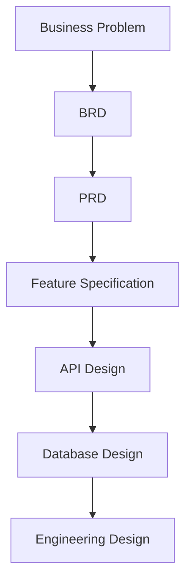

# Day 23 – Feature Specification

> Part of the Thynqit Labs – Foundational Engineering Bootcamp

---

# 📌 Overview

Once product requirements are clearly defined, engineering teams must break large product capabilities into smaller, implementation-ready features.

This is where a **Feature Specification** becomes important.

A Feature Specification document defines:

- how a specific feature should behave
- user interactions
- workflows
- validations
- edge cases
- dependencies
- engineering considerations

Unlike:

- BRD → focuses on business goals
- PRD → focuses on product behavior

a Feature Specification focuses on:

```plaintext
HOW an individual feature should operate
```

This document helps align:

- product teams
- engineering teams
- QA teams
- UX teams

before implementation begins.

Throughout this module, learners will continue working on the **Target.com inspired e-commerce platform** introduced in previous modules.

---

# 🎯 Learning Objectives

By the end of this module, learners should be able to:

- Understand what a Feature Specification is
- Differentiate BRD vs PRD vs Feature Specification
- Break large product workflows into smaller features
- Define feature-level behavior clearly
- Document validations and edge cases
- Understand dependencies between systems
- Define engineering and product expectations for individual features
- Prepare features for API and database design

---

# 🧠 Core Concepts

---

## 1. What is a Feature Specification?

A Feature Specification defines:

- detailed feature behavior
- workflows
- validations
- user interactions
- expected system responses
- edge case handling

A Feature Specification focuses on:

```plaintext
HOW a specific feature should behave
```

without diving into low-level implementation code.

---

## 2. Why Feature Specifications Matter

Without detailed feature specifications:

- engineering assumptions increase
- edge cases are missed
- QA expectations become unclear
- user experience becomes inconsistent
- implementation quality suffers

Feature Specifications help teams reduce ambiguity before development begins.

---

## 3. BRD vs PRD vs Feature Specification

| Document | Primary Focus |
|------|------|
| BRD | Business goals and organizational outcomes |
| PRD | Product behavior and user experience |
| Feature Specification | Detailed feature behavior and workflows |

---

## Requirement Evolution Flow



---

## 4. Feature Decomposition

Large products are broken into smaller manageable features.

---

### Example

```plaintext
Checkout System
    ↓
Cart Validation
    ↓
Address Selection
    ↓
Payment Processing
    ↓
Order Confirmation
```

This approach improves:

- engineering planning
- testing
- scalability
- maintainability

---

## 5. Key Sections of a Feature Specification

Most Feature Specifications include:

| Section | Purpose |
|------|------|
| Feature Overview | Feature summary |
| User Roles | Users interacting with feature |
| User Flow | Workflow definition |
| Functional Requirements | Feature behavior |
| Validation Rules | Input validation |
| Error Handling | Failure scenarios |
| Edge Cases | Uncommon situations |
| Dependencies | Related systems |
| Security Considerations | Access and protection rules |
| Success Metrics | Feature success indicators |

---

## 6. User Flows

User flows describe how users interact with a feature.

---

### Example Checkout Flow

```plaintext
User opens cart
    ↓
Reviews products
    ↓
Selects address
    ↓
Chooses payment method
    ↓
Places order
    ↓
Receives confirmation
```

User flows help teams identify:

- workflow complexity
- API requirements
- validation points
- failure scenarios

---

## 7. Validation Rules

Validation rules help ensure:

- data quality
- system consistency
- secure operations

---

### Examples

| Field | Validation |
|------|------|
| Email Address | Must follow valid email format |
| Quantity | Must be greater than zero |
| Payment Method | Required before order placement |

---

## 8. Error Handling

Feature Specifications should define expected behavior during failures.

---

### Examples

| Scenario | Expected Behavior |
|------|------|
| Payment Failure | Show retry option |
| Product Out of Stock | Prevent order placement |
| Invalid Address | Show validation error |

Clear error handling improves user experience and system reliability.

---

## 9. Edge Cases

Edge cases are uncommon scenarios that may still occur in production systems.

---

### Examples

| Edge Case | Expected Handling |
|------|------|
| Duplicate payment request | Prevent duplicate order creation |
| Network interruption during checkout | Allow retry |
| Product becomes unavailable during checkout | Inform user immediately |

Ignoring edge cases often causes production issues later.

---

## 10. Dependencies

Features often depend on:

- external APIs
- payment providers
- inventory systems
- notification systems

Dependencies influence:

- engineering complexity
- delivery timelines
- architecture decisions

---

## 11. Security Considerations

Features handling sensitive operations should define:

- authentication requirements
- authorization rules
- encryption expectations
- audit logging requirements

---

### Example

| Area | Requirement |
|------|------|
| Authentication | User login required |
| Authorization | Users can access only their own orders |
| Encryption | Payment data must be encrypted |

---

## 🧠 Engineering Note

Feature-level security decisions often influence:

- API design
- database structure
- token validation
- audit logging systems

during architecture planning.

---

## 12. Feature-Level Non-Functional Requirements

Feature Specifications may also define:

- latency expectations
- reliability requirements
- scaling expectations
- availability targets

---

### Examples

| Requirement | Target |
|------|------|
| Checkout API latency | Under 500ms |
| Order confirmation delivery | Under 30 seconds |
| Payment reliability | 99.9% success rate |

---

## 13. Success Metrics

Features should define measurable outcomes.

---

### Examples

| Metric | Target |
|------|------|
| Checkout Completion Rate | Improve by 15% |
| Payment Failure Rate | Under 1% |
| Cart Validation Errors | Reduce by 20% |

---

# 🌍 Real-World Relevance

In modern engineering organizations:

- product teams define feature behavior
- engineering teams estimate implementation complexity
- QA teams design test strategies
- architects evaluate system impact

Feature Specifications become critical implementation planning documents.

---

# 🧩 Running Case Study

Throughout Week 5 and Week 6, learners continue working on a simplified e-commerce platform inspired by Target.com.

The platform evolves through:

```plaintext
Business Requirements
    ↓
Product Requirements
    ↓
Feature Specifications
    ↓
API Design
    ↓
Database Design
    ↓
Architecture Design
```

This mirrors how real-world engineering systems evolve before implementation.

---

# ⚠️ Common Misconceptions

A Feature Specification is not:

- a sprint task list
- source code
- infrastructure documentation
- deployment configuration

It is a feature-focused planning document describing detailed expected behavior.

---

# 🔄 Reflection Questions

- Why should edge cases be documented early?
- How do validation rules improve system quality?
- Why are dependencies important in feature planning?
- How do feature requirements influence API design?
- Why does error handling matter for user experience?

---

# 📚 Next Steps

- Review `resources.md`
- Explore the running feature example in `example.md`
- Complete `assignments.md`

---

# 🧭 Navigation

← Previous Day  
[Day 22](../day-22/README.md)

➡ Next: Resources  
[Resources](./resources.md)