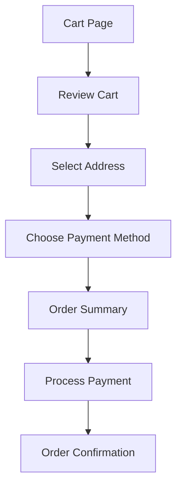

# Example – Day 23: Feature Specification

> Part of the Thynqit Labs – Foundational Engineering Bootcamp

---

# 📌 Overview

This document demonstrates a simplified example of a **Feature Specification** for the Checkout feature of a Target.com inspired e-commerce platform.

The purpose of this example is to help learners understand:

- how features are broken into detailed workflows
- how validations and edge cases are documented
- how engineering teams prepare features for implementation
- how product behavior evolves into APIs and system design

This example continues the same use case introduced in:

- Day 21 – BRD
- Day 22 – PRD

---

# Document Information

| Field | Value |
|------|------|
| Feature Name | Checkout System |
| Product Name | Thynqit Commerce Platform |
| Document Version | v1.0 |
| Prepared By | Product & Engineering Team |
| Prepared Date | 2026-05-22 |

---

# 1. Feature Overview

The Checkout feature enables customers to:

- review cart items
- select delivery address
- choose payment method
- complete secure payment
- place orders successfully

The primary objective of this feature is to:

- reduce cart abandonment
- simplify checkout experience
- improve mobile usability
- support reliable order placement

---

# 2. Business Context

The organization identified that customers frequently abandon carts because:

- checkout process is slow
- payment workflows are complicated
- delivery information is unclear
- mobile experience is inconsistent

Improving checkout experience is expected to:

- improve conversion rates
- increase customer satisfaction
- improve order completion reliability

---

# 3. User Roles

| User Role | Description |
|------|------|
| Customer | Places orders through checkout |
| Admin | Monitors order and payment issues |
| Support Agent | Assists users with failed orders |

---

# 4. Feature Goals

| Goal ID | Goal |
|------|------|
| FG-001 | Reduce checkout completion time |
| FG-002 | Improve payment success rate |
| FG-003 | Improve mobile checkout usability |
| FG-004 | Support high traffic during sales events |

---

# 5. User Flow

---

## Checkout Workflow

```plaintext
User opens cart
    ↓
Reviews products
    ↓
Selects delivery address
    ↓
Chooses payment method
    ↓
Reviews order summary
    ↓
Places order
    ↓
Receives confirmation
```

---

## Checkout Workflow Diagram



---

## 🧠 Engineering Note

This workflow will later influence:

- API sequence design
- database transaction handling
- retry mechanisms
- distributed service communication
- scalability planning

during architecture discussions.

---

# 6. Functional Requirements

| Requirement ID | Description |
|------|------|
| FR-001 | Users should be able to review cart items |
| FR-002 | Users should be able to modify product quantities |
| FR-003 | Users should be able to select saved delivery addresses |
| FR-004 | Users should be able to add new addresses |
| FR-005 | Users should be able to choose payment methods |
| FR-006 | Users should be able to place orders securely |
| FR-007 | Users should receive order confirmation notifications |

---

# 7. Non-Functional Requirements

| Requirement ID | Description |
|------|------|
| NFR-001 | Checkout APIs should respond within 500ms |
| NFR-002 | Checkout service should maintain 99.9% uptime |
| NFR-003 | Payment processing should support retry mechanisms |
| NFR-004 | Sensitive payment data must be encrypted |
| NFR-005 | Checkout workflow should support peak sale traffic |

---

## 🧠 Engineering Note

These non-functional requirements will directly influence:

- load balancing
- caching strategy
- retry logic
- database scaling
- failover architecture

during Week 6 system design exercises.

---

# 8. Validation Rules

| Field | Validation Rule |
|------|------|
| Delivery Address | Mandatory before payment |
| Payment Method | Required before order placement |
| Product Quantity | Must be greater than zero |
| Coupon Code | Must be valid and active |

---

# 9. Error Handling

| Scenario | Expected Behavior |
|------|------|
| Payment Failure | Show retry option |
| Product Out of Stock | Prevent checkout |
| Invalid Address | Display validation message |
| Session Timeout | Redirect user to login |

---

# 10. Edge Cases

| Edge Case | Expected Handling |
|------|------|
| Product becomes unavailable during checkout | Inform user immediately |
| Duplicate payment request | Prevent duplicate order creation |
| Network interruption during payment | Allow retry without cart loss |
| Payment success but order creation fails | Trigger recovery workflow |

---

## 🧠 Engineering Note

Edge cases often become major production incidents if ignored during planning.

Proper edge-case planning improves:

- reliability
- fault tolerance
- customer trust
- recovery handling

---

# 11. Dependencies

| Dependency | Purpose |
|------|------|
| Payment Gateway | Payment processing |
| Inventory Service | Product availability validation |
| Notification Service | Confirmation notifications |
| Authentication Service | User identity validation |

---

# 12. Security Considerations

| Area | Requirement |
|------|------|
| Authentication | Users must be logged in |
| Authorization | Users can access only their own carts |
| Encryption | Payment information must be encrypted |
| Audit Logging | Payment activities should be logged |

---

# 13. API Considerations

| API | Purpose |
|------|------|
| POST /cart/validate | Validate cart contents |
| POST /checkout | Create checkout session |
| POST /payments | Process payment |
| POST /orders | Create order |

---

## 🧠 Engineering Note

Feature specifications often become direct inputs for:

- API contracts
- database schemas
- service decomposition
- microservices planning

later in engineering workflows.

---

# 14. Database Considerations

| Entity | Purpose |
|------|------|
| Cart | Stores cart items |
| Address | Stores delivery information |
| Payment | Stores transaction details |
| Order | Stores completed orders |

---

# 15. Success Metrics

| Metric | Target |
|------|------|
| Checkout Completion Rate | Improve by 15% |
| Payment Failure Rate | Under 1% |
| Cart Abandonment Rate | Reduce by 20% |
| Mobile Checkout Time | Under 2 minutes |

---

# 16. Product Risks

| Risk ID | Description | Impact |
|------|------|------|
| RISK-001 | Payment provider downtime | High |
| RISK-002 | High checkout latency during sales events | High |
| RISK-003 | Inventory synchronization delays | Medium |

---

# 17. Future Enhancements

Potential future improvements include:

- one-click checkout
- digital wallet integrations
- AI-powered fraud detection
- personalized checkout recommendations
- international payment support

---

## 🧠 Engineering Note

Future product enhancements often influence:

- service decomposition
- event-driven architecture
- analytics infrastructure
- fraud detection systems
- payment scalability design

---

# 18. Key Takeaways

This example demonstrates how organizations:

- break large products into smaller features
- define workflows clearly
- prepare APIs and database design
- identify edge cases and risks
- align engineering and product teams

Feature Specifications help reduce ambiguity before implementation begins.

---

# 📚 Related Learning Flow

This example continues the same learning journey:

```plaintext
BRD
   ↓
PRD
   ↓
Feature Specification
   ↓
API Specification
   ↓
Database Design
   ↓
High-Level Design
   ↓
Low-Level Design
```

This mirrors real-world engineering workflows.

---

# 🧭 Navigation

← Back to Resources  
[Resources](./resources.md)

➡ Next: Assignments  
[Assignments](./assignments.md)