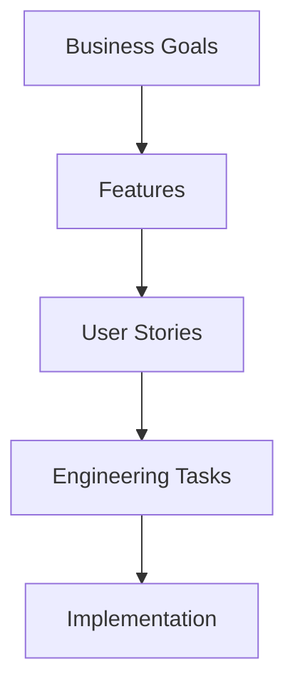
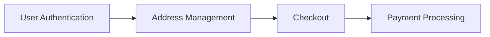
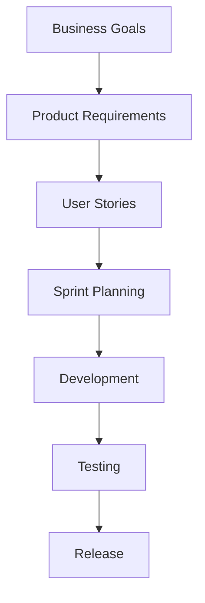

# Day 24 – User Stories & Scope Breakdown

> Part of the Thynqit Labs – Foundational Engineering Bootcamp

---

# 📌 Overview

Once business requirements, product requirements, and feature specifications are defined, engineering teams must break work into smaller, manageable units that can be planned, estimated, implemented, and tested.

This is where:

- User Stories
- Acceptance Criteria
- Scope Breakdown
- Task Decomposition

become important.

Modern engineering teams rarely build systems as one large implementation effort.

Instead, systems are broken into:

```plaintext
Epics
    ↓
Features
    ↓
User Stories
    ↓
Engineering Tasks
```

This approach helps teams:

- plan releases
- estimate effort
- prioritize work
- reduce implementation complexity
- manage dependencies
- support agile delivery

Throughout this module, learners will continue using the same Target.com inspired e-commerce platform introduced in previous modules.

---

# 🎯 Learning Objectives

By the end of this module, learners should be able to:

- Understand what User Stories are
- Write clear user stories
- Define acceptance criteria
- Break large features into smaller work items
- Understand scope decomposition
- Identify dependencies between stories
- Understand how agile teams structure delivery planning
- Connect user stories to engineering implementation

---

# 🧠 Core Concepts

---

## 1. What is a User Story?

A User Story is a short, simple description of functionality written from the user's perspective.

User Stories help teams focus on:

- user value
- product behavior
- implementation goals

---

## Standard User Story Format

```plaintext
As a [user type],
I want [capability],
So that [business/user value].
```

---

## Example

```plaintext
As a customer,
I want to save delivery addresses,
So that I can complete checkout faster.
```

---

## 2. Why User Stories Matter

Without structured user stories:

- implementation scope becomes unclear
- teams miss requirements
- estimation becomes difficult
- engineering priorities become inconsistent

User Stories help teams organize implementation work clearly.

---

## 3. Epics vs Features vs User Stories

| Level | Description |
|------|------|
| Epic | Large business capability |
| Feature | Product functionality |
| User Story | Small implementation-focused behavior |

---

## Example Hierarchy

```plaintext
Epic: Checkout System
    ↓
Feature: Address Management
    ↓
User Story: Save delivery address
```

---

## Scope Breakdown Flow



---

## 4. Acceptance Criteria

Acceptance Criteria define:

```plaintext
How teams know a user story is complete
```

Acceptance Criteria help:

- engineers
- QA teams
- product teams

align on expected behavior.

---

## Example

### User Story

```plaintext
As a customer,
I want to reset my password,
So that I can regain account access.
```

---

### Acceptance Criteria

- User should receive password reset email
- Reset link should expire after 15 minutes
- User should be able to set a new password
- Invalid reset links should show error message

---

## 5. INVEST Principles

Good User Stories often follow the INVEST model.

| Principle | Meaning |
|------|------|
| Independent | Can be implemented separately |
| Negotiable | Flexible implementation |
| Valuable | Delivers user value |
| Estimable | Effort can be estimated |
| Small | Manageable size |
| Testable | Can be validated |

---

## 6. Story Decomposition

Large features should be broken into smaller stories.

---

### Example

```plaintext
Feature: Checkout
    ↓
Story 1: Save addresses
Story 2: Apply coupons
Story 3: Process payment
Story 4: Generate order confirmation
```

Smaller stories improve:

- estimation
- testing
- implementation speed
- release planning

---

## 7. Functional vs Technical Tasks

User Stories describe:

```plaintext
User-facing behavior
```

Engineering Tasks describe:

```plaintext
Implementation work
```

---

## Example

### User Story

```plaintext
As a user,
I want to receive order confirmation,
So that I know my order was placed successfully.
```

---

### Engineering Tasks

- Build notification API
- Create email template
- Configure SMS integration
- Add audit logging

---

## 8. Story Prioritization

Not all stories have equal priority.

Teams often prioritize stories based on:

- business value
- implementation complexity
- dependencies
- customer impact

---

## Common Prioritization Approaches

| Method | Purpose |
|------|------|
| MVP Prioritization | Minimum viable delivery |
| MoSCoW | Must/Should/Could/Won’t |
| Business Value | Revenue/customer impact |
| Risk-Based | Reduce technical risk early |

---

## 9. Scope Management

Scope management helps teams avoid:

- uncontrolled feature expansion
- missed deadlines
- engineering overload

---

## Example

### In Scope

- Product search
- Cart management
- Checkout

---

### Out of Scope

- International shipping
- Loyalty programs
- Marketplace sellers

Clear scope boundaries improve delivery predictability.

---

## 10. Dependencies Between Stories

Stories may depend on:

- APIs
- databases
- authentication systems
- external integrations

Understanding dependencies helps teams:

- sequence implementation correctly
- avoid blockers
- reduce deployment risks

---

## Example Dependency Flow



---

## 🧠 Engineering Note

Poor dependency planning often causes:

- release delays
- integration failures
- incomplete testing
- production instability

---

## 11. Estimation Basics

Engineering teams often estimate stories using:

- story points
- complexity estimation
- implementation effort
- risk level

---

## Example

| Story | Complexity |
|------|------|
| Product Search | Medium |
| Payment Integration | High |
| Save Address | Low |

Estimation helps teams plan delivery capacity realistically.

---

## 12. Definition of Done (DoD)

A User Story is not complete simply because code was written.

Modern engineering teams define:

```plaintext
Definition of Done
```

---

## Example DoD

- Code implemented
- Unit tests written
- APIs tested
- Security validation completed
- Documentation updated
- QA approved

---

## 13. Agile Workflow Connection

User Stories are central to agile delivery models.

They help teams:

- organize sprints
- plan releases
- track progress
- manage priorities

---

## Agile Planning Flow



---

# 🌍 Real-World Relevance

In modern organizations:

- product managers define stories
- engineers estimate implementation effort
- architects identify dependencies
- QA teams validate acceptance criteria
- scrum teams plan sprint execution

User Stories become the bridge between product planning and engineering implementation.

---

# 🧩 Running Case Study

Throughout Week 5 and Week 6, learners continue using the same Target.com inspired e-commerce platform.

The platform evolves through:

```plaintext
Business Requirements
    ↓
Product Requirements
    ↓
Feature Specifications
    ↓
User Stories
    ↓
API Design
    ↓
Database Design
    ↓
Architecture Design
```

This mirrors how modern agile engineering organizations operate.

---

# ⚠️ Common Misconceptions

User Stories are not:

- technical implementation details
- source code tasks
- architecture documents
- deployment instructions

They are implementation-planning artifacts focused on user value and product behavior.

---

# 🔄 Reflection Questions

- Why should large features be broken into smaller stories?
- How do acceptance criteria improve implementation quality?
- Why are dependencies important in sprint planning?
- How does poor scope management affect engineering delivery?
- Why should engineering teams understand business priorities?

---

# 📚 Next Steps

- Review `resources.md`
- Explore the running example in `example.md`
- Complete `assignments.md`

---

# 🧭 Navigation

← Previous Day  
[Day 23](../day-23/README.md)

➡ Next: Resources  
[Resources](./resources.md)