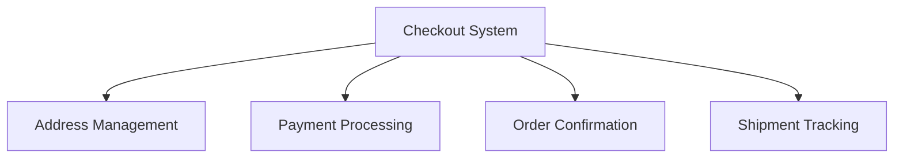
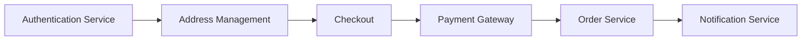
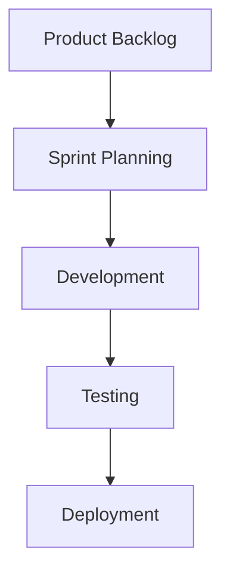

# Example – Day 24: User Stories & Scope Breakdown

> Part of the Thynqit Labs – Foundational Engineering Bootcamp

---

# 📌 Overview

This document demonstrates a simplified example of:

- User Stories
- Acceptance Criteria
- Scope Breakdown
- Story Decomposition

for a Target.com inspired e-commerce platform.

The purpose of this example is to help learners understand:

- how large product features are broken into manageable work items
- how agile teams structure implementation planning
- how engineering teams identify dependencies and implementation scope
- how product requirements evolve into development-ready tasks

This example continues the same use case introduced in:

- Day 21 – BRD
- Day 22 – PRD
- Day 23 – Feature Specification

---

# Document Information

| Field | Value |
|------|------|
| Product Name | Thynqit Commerce Platform |
| Module | Checkout System |
| Document Version | v1.0 |
| Prepared By | Product & Engineering Team |
| Prepared Date | 2026-05-23 |

---

# 1. Epic Overview

---

## Epic Name

```plaintext
Checkout System
```

---

## Epic Goal

Enable customers to complete secure product purchases with minimal friction and high reliability.

---

## Business Value

- improve conversion rate
- reduce cart abandonment
- improve customer satisfaction
- support scalable online commerce

---

# 2. Feature Breakdown

```plaintext
Checkout System
    ↓
Address Management
    ↓
Payment Processing
    ↓
Order Confirmation
    ↓
Shipment Tracking
```

---

## Feature Decomposition Diagram



---

# 3. User Stories

---

## Story 1 – Save Delivery Address

### User Story

```plaintext
As a customer,
I want to save delivery addresses,
So that I can complete checkout faster.
```

---

### Acceptance Criteria

- User should be able to add a new address
- User should be able to edit existing addresses
- User should be able to delete saved addresses
- Address validation should occur before saving
- Invalid postal codes should show error messages

---

### Priority

```plaintext
High
```

---

### Complexity

```plaintext
Medium
```

---

### Dependencies

- User Authentication
- Address Validation Service

---

## 🧠 Engineering Note

This story may later require:

- address APIs
- database indexing
- caching strategies
- third-party address validation integrations

---

# 4. Story 2 – Process Payment

### User Story

```plaintext
As a customer,
I want to securely complete payment,
So that I can place my order successfully.
```

---

### Acceptance Criteria

- User should be able to select payment method
- Payment processing should support retries
- Failed payments should display meaningful errors
- Duplicate payment requests should be prevented
- Successful payments should generate order confirmation

---

### Priority

```plaintext
Critical
```

---

### Complexity

```plaintext
High
```

---

### Dependencies

- Payment Gateway
- Order Service
- Notification Service

---

## 🧠 Engineering Note

This feature may later influence:

- distributed transaction handling
- retry mechanisms
- idempotency implementation
- audit logging
- security architecture

---

# 5. Story 3 – Order Confirmation

### User Story

```plaintext
As a customer,
I want to receive order confirmation notifications,
So that I know my order was placed successfully.
```

---

### Acceptance Criteria

- Confirmation email should be sent after successful order placement
- SMS notification should be optional
- Notification failures should be retried
- Confirmation should include order summary

---

### Priority

```plaintext
Medium
```

---

### Complexity

```plaintext
Low
```

---

### Dependencies

- Notification Service
- Email Provider
- SMS Gateway

---

# 6. Scope Breakdown

---

## In Scope

- Address management
- Payment workflows
- Order confirmation
- Mobile-friendly checkout
- Payment retry handling

---

## Out of Scope

- Cryptocurrency payments
- International shipping
- Gift card system
- Subscription checkout

---

# 7. Dependency Flow



---

## 🧠 Engineering Note

Dependency planning is important because:

- some stories cannot start before others
- API contracts may block implementation
- infrastructure readiness affects delivery timelines
- integration failures may delay releases

---

# 8. Prioritization Example

| Story | Priority | Reason |
|------|------|------|
| Process Payment | Critical | Core revenue workflow |
| Save Address | High | Improves checkout experience |
| Order Confirmation | Medium | Post-purchase workflow |

---

# 9. Definition of Done (DoD)

A story is considered complete only when:

- implementation is complete
- APIs are tested
- unit tests pass
- edge cases are validated
- security checks are completed
- documentation is updated
- QA approval is completed

---

# 10. Example Engineering Tasks

---

## Story – Process Payment

### Engineering Tasks

- Build payment API
- Integrate payment gateway
- Implement retry mechanism
- Add idempotency validation
- Store transaction logs
- Create monitoring alerts
- Add audit logging

---

## 🧠 Engineering Note

A User Story defines:

```plaintext
WHAT users need
```

Engineering tasks define:

```plaintext
HOW implementation happens
```

---

# 11. Risk Analysis

| Risk ID | Description | Impact |
|------|------|------|
| RISK-001 | Payment gateway downtime | High |
| RISK-002 | Duplicate payment processing | High |
| RISK-003 | Address validation failures | Medium |

---

# 12. Estimation Example

| Story | Estimated Complexity |
|------|------|
| Save Address | Medium |
| Process Payment | High |
| Order Confirmation | Low |

---

# 13. Agile Sprint Planning Example



---

# 14. Future Enhancements

Potential future stories may include:

- one-click checkout
- digital wallet integration
- AI-powered fraud detection
- personalized checkout experience
- multi-currency support

---

## 🧠 Engineering Note

Future feature expansion may later influence:

- microservices architecture
- event-driven systems
- analytics pipelines
- scalability planning
- distributed caching

---

# 15. Key Takeaways

This example demonstrates how organizations:

- break large systems into manageable stories
- define acceptance criteria
- plan dependencies
- estimate implementation complexity
- prepare engineering delivery workflows

User Stories help transform product requirements into executable engineering work.

---

# 📚 Related Learning Flow

This example continues the same engineering workflow:

```plaintext
BRD
   ↓
PRD
   ↓
Feature Specification
   ↓
User Stories
   ↓
API Specification
   ↓
Database Design
   ↓
Architecture Design
```

This mirrors real-world agile engineering practices.

---

# 🧭 Navigation

← Back to Resources  
[Resources](./resources.md)

➡ Next: Assignments  
[Assignments](./assignments.md)