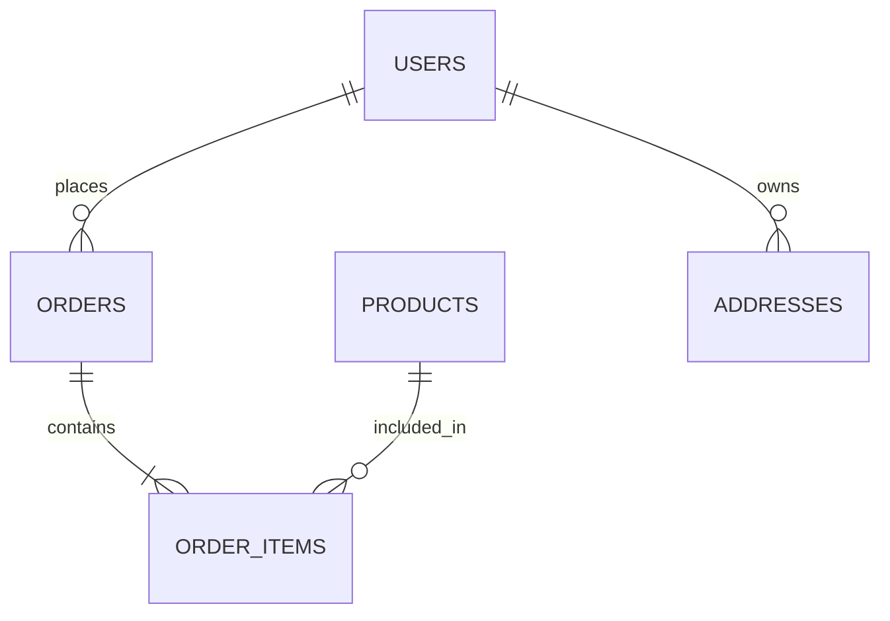
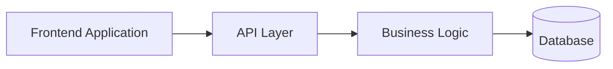

# Day 25 – API Specification & Database Schema

> Part of the Thynqit Labs – Foundational Engineering Bootcamp

---

# 📌 Overview

Once requirements, features, and user stories are clearly defined, engineering teams must design:

- APIs
- data models
- database schemas

before implementation begins.

This is one of the most critical stages of engineering planning because APIs and database design directly influence:

- scalability
- maintainability
- performance
- security
- developer experience

Modern systems are built through communication between services, clients, databases, and external systems.

APIs define:

```plaintext
How systems communicate
```

Database schemas define:

```plaintext
How systems store and organize data
```

Throughout this module, learners will continue working on the same Target.com inspired e-commerce platform introduced in previous modules.

---

# 🎯 Learning Objectives

By the end of this module, learners should be able to:

- Understand what API Specifications are
- Understand REST API design principles
- Understand API request/response modeling
- Understand database schema design fundamentals
- Differentiate SQL vs NoSQL schema design
- Understand entity relationships
- Define scalable APIs and database structures
- Connect requirements with APIs and data models

---

# 🧠 Core Concepts

---

# PART 1 – API SPECIFICATION

---

## 1. What is an API?

An API (Application Programming Interface) allows systems to communicate with each other.

Examples:

- frontend ↔ backend
- backend ↔ database
- service ↔ service
- system ↔ third-party platform

---

## Example

```plaintext
Mobile App
    ↓
Checkout API
    ↓
Payment Service
```

---

## 2. Why APIs Matter

Well-designed APIs improve:

- maintainability
- scalability
- integration simplicity
- frontend/backend collaboration
- developer productivity

Poor APIs often cause:

- tight coupling
- inconsistent behavior
- integration failures
- scalability problems

---

## 3. REST API Basics

Modern web systems commonly use REST APIs.

REST APIs use:

- HTTP methods
- URLs/endpoints
- request payloads
- response payloads
- status codes

---

## Common HTTP Methods

| Method | Purpose |
|------|------|
| GET | Retrieve data |
| POST | Create data |
| PUT | Update data |
| PATCH | Partial update |
| DELETE | Remove data |

---

## Example

```plaintext
GET /products
POST /orders
GET /orders/{id}
DELETE /cart/items/{id}
```

---

## 4. API Request & Response Structure

---

### Example Request

```json
POST /orders

{
  "userId": "123",
  "items": [
    {
      "productId": "P100",
      "quantity": 2
    }
  ]
}
```

---

### Example Response

```json
{
  "orderId": "ORD-1001",
  "status": "CONFIRMED"
}
```

---

## 5. API Status Codes

| Status Code | Meaning |
|------|------|
| 200 | Success |
| 201 | Created |
| 400 | Bad Request |
| 401 | Unauthorized |
| 404 | Not Found |
| 500 | Internal Server Error |

---

## 6. API Design Best Practices

Good APIs should be:

- predictable
- versioned
- secure
- scalable
- easy to consume

---

## Examples

### Good Endpoint Naming

```plaintext
GET /products
POST /orders
GET /users/{id}
```

---

### Poor Endpoint Naming

```plaintext
GET /getProductsNow
POST /saveOrderData
```

---

## 7. API Security

APIs often require:

- authentication
- authorization
- rate limiting
- encryption
- input validation

---

## Example

| Area | Example |
|------|------|
| Authentication | JWT Tokens |
| Authorization | RBAC |
| Security | HTTPS |
| Abuse Prevention | Rate limiting |

---

## 8. API Versioning

APIs evolve over time.

Versioning helps avoid breaking existing clients.

---

## Example

```plaintext
/v1/orders
/v2/orders
```

---

## 🧠 Engineering Note

Good API design improves:

- frontend development speed
- microservices communication
- third-party integrations
- long-term maintainability

---

# PART 2 – DATABASE SCHEMA DESIGN

---

## 9. What is a Database Schema?

A database schema defines:

- entities
- relationships
- fields
- constraints
- data organization

Schemas help systems:

- store data consistently
- retrieve data efficiently
- maintain data integrity

---

## 10. SQL vs NoSQL Databases

| SQL | NoSQL |
|------|------|
| Structured schema | Flexible schema |
| Relational data | Document/key-value/graph |
| ACID transactions | High scalability |
| Strong consistency | Flexible scaling |

---

## Examples

| SQL Databases | NoSQL Databases |
|------|------|
| PostgreSQL | MongoDB |
| MySQL | DynamoDB |
| SQL Server | Cassandra |

---

## 11. Database Entities

Entities represent real-world objects.

---

## Example Entities

```plaintext
Users
Products
Orders
Payments
Addresses
```

---

## 12. Relationships Between Entities

Relational databases often use relationships.

---

## Relationship Types

| Relationship | Example |
|------|------|
| One-to-One | User ↔ Profile |
| One-to-Many | User ↔ Orders |
| Many-to-Many | Products ↔ Categories |

---

## Example Relationship Diagram



---

## 13. Database Normalization

Normalization helps reduce:

- duplicate data
- inconsistent data
- update anomalies

---

## Common Normalization Goals

- avoid duplicate information
- separate reusable entities
- maintain consistency

---

## 14. NoSQL Schema Thinking

NoSQL databases often prioritize:

- scalability
- denormalization
- flexible structures
- high-performance reads

---

## Example MongoDB Document

```json
{
  "orderId": "ORD-1001",
  "user": {
    "userId": "U100",
    "name": "John Doe"
  },
  "items": [
    {
      "productId": "P100",
      "quantity": 2
    }
  ]
}
```

---

## 15. Indexing Basics

Indexes improve query performance.

---

## Example

| Indexed Field | Purpose |
|------|------|
| email | Faster login lookups |
| orderId | Faster order retrieval |
| productId | Faster catalog search |

---

## 16. Schema Design Considerations

Good schema design considers:

- scalability
- query patterns
- update frequency
- reporting needs
- storage efficiency

---

## 🧠 Engineering Note

Poor database design often causes:

- slow APIs
- scaling bottlenecks
- inconsistent data
- operational complexity

---

# PART 3 – API & DATABASE CONNECTION

---

## 17. How APIs and Databases Work Together



APIs expose data and functionality while databases store system state.

---

## 18. Request Lifecycle Example

```plaintext
User places order
    ↓
Checkout API receives request
    ↓
Business logic validates request
    ↓
Database stores order
    ↓
API returns response
```

---

## 19. Functional vs Technical Design

| Area | Focus |
|------|------|
| Product Requirements | User behavior |
| APIs | System communication |
| Database Schema | Data storage |
| Architecture | System structure |

---

# 🌍 Real-World Relevance

In modern engineering organizations:

- backend engineers design APIs
- architects review scalability
- database engineers optimize schemas
- frontend teams integrate APIs
- QA teams validate API behavior

API and schema design form the foundation of production systems.

---

# 🧩 Running Case Study

Throughout Week 5 and Week 6, learners continue using the same Target.com inspired e-commerce platform.

The platform evolves through:

```plaintext
Business Requirements
    ↓
Product Requirements
    ↓
Feature Specifications
    ↓
User Stories
    ↓
API Specification
    ↓
Database Schema
    ↓
Architecture Design
```

This mirrors real-world engineering planning workflows.

---

# ⚠️ Common Misconceptions

API Specifications are not:

- source code
- deployment scripts
- frontend UI logic

Database Schemas are not:

- production infrastructure
- business requirements
- API contracts

They are engineering design artifacts.

---

# 🔄 Reflection Questions

- Why should APIs remain consistent and predictable?
- How does schema design influence scalability?
- Why do NoSQL systems often use denormalization?
- How do APIs and databases interact together?
- Why is indexing important for performance?

---

# 📚 Next Steps

- Review `resources.md`
- Explore the running example in `example.md`
- Complete `assignments.md`

---

# 🧭 Navigation

← Previous Day  
[Day 24](../day-24/README.md)

➡ Next: Resources  
[Resources](./resources.md)