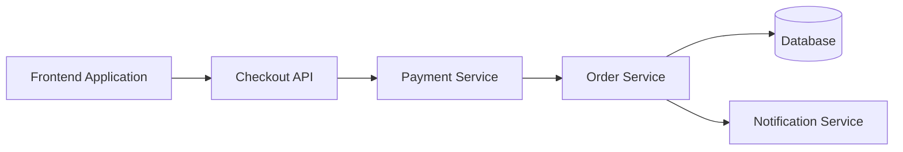
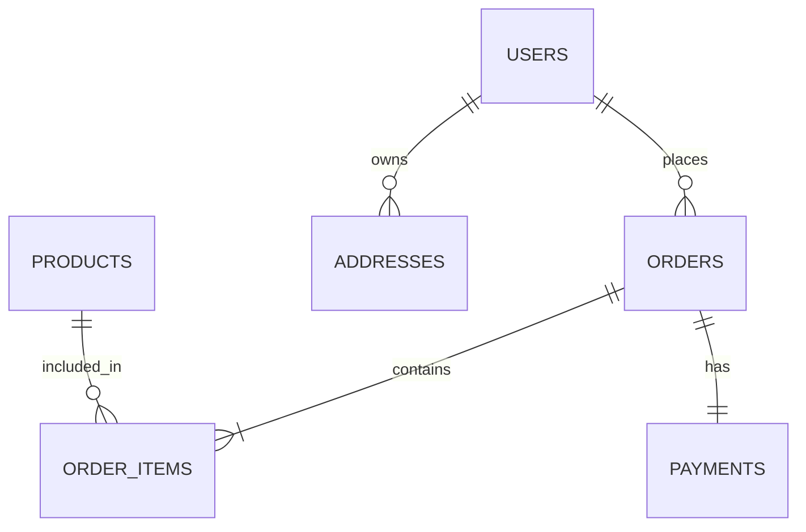
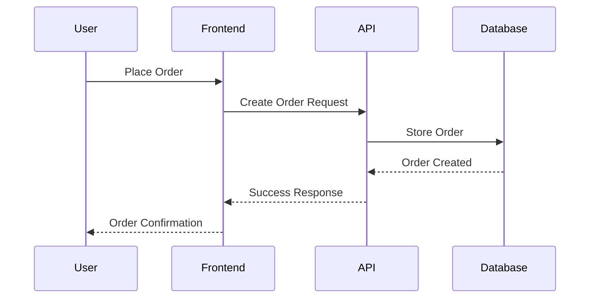
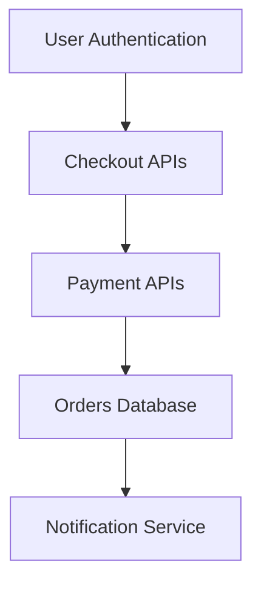

# Example – Day 25: API Specification & Database Schema

> Part of the Thynqit Labs – Foundational Engineering Bootcamp

---

# 📌 Overview

This document demonstrates a simplified example of:

- API Specification
- SQL Database Schema
- NoSQL Database Design
- Entity Relationships

for a Target.com inspired e-commerce platform.

The purpose of this example is to help learners understand:

- how APIs are structured
- how systems communicate
- how relational and NoSQL databases are modeled
- how product workflows influence APIs and data design
- how engineering teams prepare systems before implementation begins

This example continues the same use case introduced in:

- Day 21 – BRD
- Day 22 – PRD
- Day 23 – Feature Specification
- Day 24 – User Stories

---

# Document Information

| Field | Value |
|------|------|
| Product Name | Thynqit Commerce Platform |
| Module | Checkout & Order Management |
| Document Version | v1.0 |
| Prepared By | Engineering Team |
| Prepared Date | 2026-05-24 |

---

# PART 1 – API SPECIFICATION

---

# 1. API Overview

The Checkout & Order APIs enable:

- cart validation
- order placement
- payment processing
- shipment tracking

These APIs support:

- web applications
- mobile applications
- internal services
- third-party integrations

---

# 2. API Workflow

```plaintext
User places order
    ↓
Checkout API validates request
    ↓
Payment API processes payment
    ↓
Order API stores order
    ↓
Notification Service sends confirmation
```

---

## API Flow Diagram



---

# 3. API Endpoint Examples

---

## Create Order

### Endpoint

```plaintext
POST /api/v1/orders
```

---

### Request

```json
{
  "userId": "U1001",
  "items": [
    {
      "productId": "P100",
      "quantity": 2
    }
  ],
  "paymentMethod": "CARD"
}
```

---

### Success Response

```json
{
  "orderId": "ORD-1001",
  "status": "CONFIRMED",
  "message": "Order created successfully"
}
```

---

### Error Response

```json
{
  "error": "PAYMENT_FAILED",
  "message": "Payment processing failed"
}
```

---

### Status Codes

| Status Code | Meaning |
|------|------|
| 201 | Order Created |
| 400 | Invalid Request |
| 401 | Unauthorized |
| 500 | Internal Server Error |

---

# 4. Get Order Details

### Endpoint

```plaintext
GET /api/v1/orders/{orderId}
```

---

### Success Response

```json
{
  "orderId": "ORD-1001",
  "status": "SHIPPED",
  "trackingId": "TRK-12345"
}
```

---

# 5. Authentication & Security

| Area | Approach |
|------|------|
| Authentication | JWT Tokens |
| Authorization | Role-Based Access Control |
| Encryption | HTTPS |
| Abuse Prevention | Rate limiting |
| Validation | Request validation middleware |

---

## 🧠 Engineering Note

Checkout and payment APIs often require:

- strong authentication
- idempotency handling
- audit logging
- fraud detection
- retry protection

in production systems.

---

# 6. API Versioning

```plaintext
/api/v1/orders
/api/v2/orders
```

Versioning helps systems evolve safely without breaking clients.

---

# PART 2 – SQL DATABASE SCHEMA

---

# 7. Core Entities

---

## Main Entities

```plaintext
Users
Products
Orders
Order_Items
Payments
Addresses
```

---

# 8. Entity Relationship Diagram



---

# 9. SQL Schema Example

---

## USERS Table

```sql
CREATE TABLE users (
    user_id VARCHAR(50) PRIMARY KEY,
    full_name VARCHAR(100),
    email VARCHAR(100) UNIQUE,
    phone_number VARCHAR(20),
    created_at TIMESTAMP
);
```

---

## PRODUCTS Table

```sql
CREATE TABLE products (
    product_id VARCHAR(50) PRIMARY KEY,
    product_name VARCHAR(255),
    price DECIMAL(10,2),
    stock_quantity INT
);
```

---

## ORDERS Table

```sql
CREATE TABLE orders (
    order_id VARCHAR(50) PRIMARY KEY,
    user_id VARCHAR(50),
    total_amount DECIMAL(10,2),
    order_status VARCHAR(50),
    created_at TIMESTAMP,
    FOREIGN KEY (user_id) REFERENCES users(user_id)
);
```

---

## ORDER_ITEMS Table

```sql
CREATE TABLE order_items (
    order_item_id VARCHAR(50) PRIMARY KEY,
    order_id VARCHAR(50),
    product_id VARCHAR(50),
    quantity INT,
    FOREIGN KEY (order_id) REFERENCES orders(order_id),
    FOREIGN KEY (product_id) REFERENCES products(product_id)
);
```

---

# 10. Indexing Example

| Table | Indexed Field | Purpose |
|------|------|------|
| users | email | Faster login lookup |
| orders | user_id | Faster order history retrieval |
| products | product_name | Faster product search |

---

## 🧠 Engineering Note

Poor indexing often causes:

- slow APIs
- database bottlenecks
- scalability issues
- expensive queries

in production systems.

---

# PART 3 – NOSQL DATABASE DESIGN

---

# 11. MongoDB Order Document Example

```json
{
  "orderId": "ORD-1001",
  "user": {
    "userId": "U1001",
    "name": "John Doe"
  },
  "items": [
    {
      "productId": "P100",
      "name": "Wireless Headphones",
      "quantity": 2,
      "price": 120
    }
  ],
  "payment": {
    "method": "CARD",
    "status": "SUCCESS"
  },
  "status": "CONFIRMED"
}
```

---

# 12. SQL vs NoSQL Design Thinking

| SQL Design | NoSQL Design |
|------|------|
| Normalized structure | Denormalized structure |
| Multiple related tables | Embedded documents |
| Strong consistency | Flexible scalability |
| Joins between tables | Nested data structures |

---

# 13. Schema Design Tradeoffs

| Area | SQL | NoSQL |
|------|------|------|
| Complex Relationships | Strong | Limited |
| Horizontal Scalability | Moderate | Strong |
| Flexible Structure | Limited | Strong |
| Transactions | Strong ACID | Often eventual consistency |

---

## 🧠 Engineering Note

Database selection often depends on:

- query patterns
- scalability requirements
- consistency needs
- traffic volume
- operational complexity

---

# PART 4 – API & DATABASE CONNECTION

---

# 14. Request Lifecycle



---

# 15. Feature to API Mapping

| Feature | APIs |
|------|------|
| Product Search | GET /products |
| Cart Management | POST /cart |
| Checkout | POST /orders |
| Order Tracking | GET /orders/{id} |

---

# 16. Feature to Database Mapping

| Feature | Database Entities |
|------|------|
| User Accounts | users |
| Product Catalog | products |
| Checkout | orders, order_items |
| Payments | payments |

---

# 17. API & Schema Dependencies



---

# 18. Scalability Considerations

| Area | Example Strategy |
|------|------|
| APIs | Load balancing |
| Database Reads | Read replicas |
| Product Search | Caching |
| Notifications | Async processing |

---

# 19. Security Considerations

| Area | Requirement |
|------|------|
| APIs | JWT authentication |
| Database | Encrypted sensitive data |
| Payments | PCI compliance awareness |
| Logging | Audit logs enabled |

---

# 20. Future Enhancements

Potential future improvements include:

- recommendation systems
- event-driven architecture
- distributed caching
- microservices migration
- real-time analytics

---

## 🧠 Engineering Note

Future product growth often influences:

- API decomposition
- database partitioning
- service scalability
- event streaming architecture

---

# 21. Key Takeaways

This example demonstrates how organizations:

- define scalable APIs
- model relational databases
- design NoSQL documents
- connect product workflows with engineering systems
- prepare scalable backend architecture

API specifications and database schemas become foundational engineering artifacts before implementation begins.

---

# 📚 Related Learning Flow

This example continues the same engineering workflow:

```plaintext
BRD
   ↓
PRD
   ↓
Feature Specification
   ↓
User Stories
   ↓
API Specification
   ↓
Database Schema
   ↓
Architecture Design
```

This mirrors real-world engineering planning workflows.

---

# 🧭 Navigation

← Back to Resources  
[Resources](./resources.md)

➡ Next: Assignments  
[Assignments](./assignments.md)