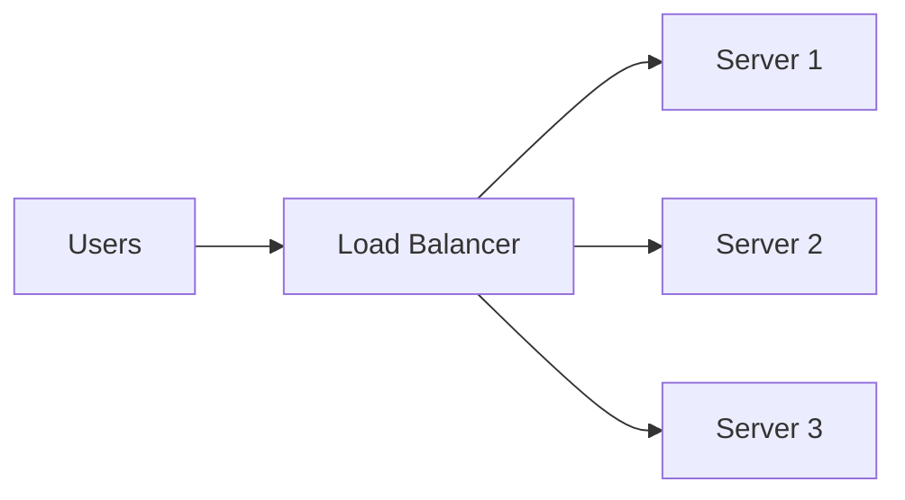
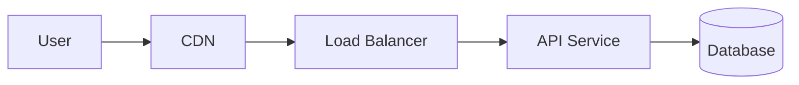
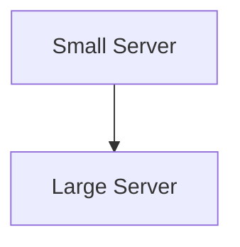
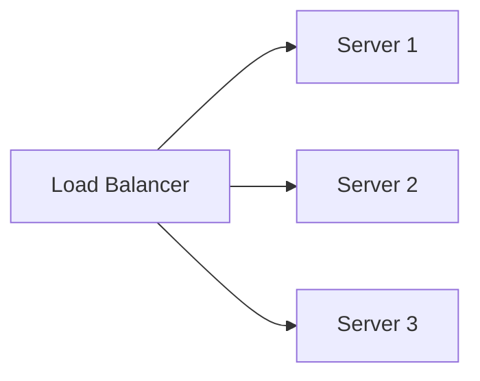

# Day 26 – System Design Basics

> Part of the Thynqit Labs – Foundational Engineering Bootcamp

---

# 📌 Overview

Once business requirements, APIs, and database schemas are defined, engineering teams must design how systems will actually work in production.

This process is called:

```plaintext
System Design
```

System design focuses on:

- structuring applications
- designing communication between components
- handling scalability
- ensuring reliability
- planning for failures
- balancing engineering trade-offs

Modern systems are built using multiple interconnected components such as:

- frontend applications
- APIs
- databases
- caches
- load balancers
- queues
- storage systems
- monitoring systems

This module introduces foundational system design thinking used by modern engineering teams.

Throughout Week 6, learners will continue using the same Target.com inspired e-commerce platform introduced in Week 5.

The platform will evolve from:

```plaintext
Engineering Documentation
```

into:

```plaintext
Production System Architecture
```

---

# 🎯 Learning Objectives

By the end of this module, learners should be able to:

- Understand what system design is
- Understand high-level system architecture
- Understand core building blocks of modern systems
- Understand request-response lifecycle
- Understand functional vs non-functional requirements in architecture
- Understand scalability basics
- Understand reliability basics
- Understand architecture trade-offs
- Understand high-level vs low-level design

---

# 🧠 Core Concepts

---

# PART 1 – WHAT IS SYSTEM DESIGN?

---

## 1. What is System Design?

System design is the process of transforming requirements into scalable engineering systems.

It involves deciding:

- how components communicate
- how data flows
- how systems scale
- how failures are handled
- how reliability is maintained

---

## Example

A simple checkout workflow may involve:

```plaintext
Frontend
    ↓
Checkout API
    ↓
Payment Service
    ↓
Orders Database
```

Even simple systems involve multiple interacting components.

---

## 2. Why System Design Matters

Good system design improves:

- scalability
- reliability
- maintainability
- performance
- security
- engineering productivity

Poor system design often causes:

- slow systems
- operational failures
- scaling bottlenecks
- difficult debugging
- unreliable deployments

---

## 🧠 Engineering Note

Many production engineering issues originate from:

- poor architectural planning
- weak scalability thinking
- tightly coupled systems
- failure handling gaps

System design helps teams identify problems before implementation begins.

---

# PART 2 – FUNCTIONAL VS NON-FUNCTIONAL REQUIREMENTS

---

## 3. Functional Requirements

Functional requirements define:

```plaintext
What the system should do
```

---

## Examples

- Users should be able to place orders
- Users should receive notifications
- Users should be able to search products

---

## 4. Non-Functional Requirements

Non-functional requirements define:

```plaintext
How well the system should operate
```

---

## Examples

| Requirement | Example |
|------|------|
| Scalability | Support 1 million users |
| Performance | APIs respond under 300ms |
| Availability | 99.9% uptime |
| Security | Encrypt sensitive data |
| Reliability | Retry failed operations |

---

## 🧠 Engineering Note

Non-functional requirements heavily influence:

- infrastructure architecture
- database design
- caching strategies
- load balancing
- monitoring systems

in real-world production systems.

---

# PART 3 – CORE BUILDING BLOCKS OF MODERN SYSTEMS

---

## 5. Frontend Applications

Frontend systems provide user interfaces.

Examples:

- web applications
- mobile apps
- admin dashboards

---

## 6. APIs & Backend Services

Backend systems process business logic.

Examples:

- authentication APIs
- checkout services
- payment services

---

## 7. Databases

Databases store system state.

Examples:

- users
- orders
- payments
- inventory

---

## 8. Cache

Caches improve performance by reducing repeated database queries.

---

## Example

```plaintext
User requests product page
    ↓
Cache returns product data
    ↓
Database query avoided
```

---

## 9. Load Balancers

Load balancers distribute traffic across servers.

---

## Example



---

## 10. CDN (Content Delivery Network)

CDNs cache static content closer to users.

Examples:

- images
- videos
- CSS
- JavaScript

CDNs improve:

- performance
- latency
- global content delivery

---

## CDN Flow


---

## 11. Queues & Asynchronous Processing

Queues help systems process background tasks asynchronously.

Examples:

- email notifications
- payment retries
- analytics processing

---

## Queue Workflow


---

## 12. Storage Systems

Storage systems manage:

- images
- videos
- documents
- backups

Examples:

- AWS S3
- Azure Blob Storage
- Google Cloud Storage

---

# PART 4 – REQUEST LIFECYCLE

---

## 13. How Requests Flow Through Systems

Modern systems process requests through multiple layers.

---

## Example Request Lifecycle

```plaintext
User opens application
    ↓
CDN serves static content
    ↓
Load balancer distributes request
    ↓
API processes business logic
    ↓
Database retrieves data
    ↓
Response returned to user
```

---

## Request Flow Diagram



---

# PART 5 – HIGH-LEVEL VS LOW-LEVEL DESIGN

---

## 14. High-Level Design (HLD)

HLD focuses on:

- system components
- communication flows
- infrastructure layout
- scalability patterns

---

## Example HLD Components

```plaintext
Frontend
API Gateway
Backend Services
Database
Cache
Message Queue
```

---

## 15. Low-Level Design (LLD)

LLD focuses on:

- classes
- methods
- APIs
- database fields
- internal workflows

---

## Comparison

| HLD | LLD |
|------|------|
| Big-picture architecture | Internal implementation |
| System-level thinking | Component-level thinking |
| Scalability focus | Logic focus |

---

# PART 6 – SCALABILITY BASICS

---

## 16. Vertical Scaling

Increase resources on a single server.

Examples:

- more CPU
- more RAM
- larger machine

---

## Vertical Scaling Diagram



---

## 17. Horizontal Scaling

Add more servers to distribute traffic.

---

## Horizontal Scaling Diagram



---

## 🧠 Engineering Note

Modern internet-scale systems typically rely heavily on:

- horizontal scaling
- distributed systems
- stateless services

---

# PART 7 – RELIABILITY BASICS

---

## 18. What is Reliability?

Reliability means systems continue operating despite failures.

---

## Common Reliability Concepts

| Concept | Purpose |
|------|------|
| Retry Mechanisms | Recover from temporary failures |
| Redundancy | Duplicate critical systems |
| Failover | Switch to backup systems |
| Monitoring | Detect issues quickly |
| Backups | Recover lost data |

---

## Example Failover Flow


---

# PART 8 – ARCHITECTURE TRADE-OFFS

---

## 19. Every Architecture Has Trade-Offs

There is rarely a perfect architecture.

Improving one area often introduces complexity elsewhere.

---

## Examples

| Decision | Benefit | Trade-Off |
|------|------|------|
| Caching | Faster performance | Cache invalidation complexity |
| Microservices | Independent scaling | Distributed system complexity |
| Replication | Higher availability | Synchronization challenges |

---

## 🧠 Engineering Note

Strong engineers do not memorize architectures.

They evaluate:

- business requirements
- engineering constraints
- scalability needs
- operational maturity
- cost considerations

before making decisions.

---

# PART 9 – INTRODUCTION TO ARCHITECTURE EVOLUTION

---

## 20. How Systems Evolve

Most systems evolve gradually over time.

---

## Example Evolution

```plaintext
Simple Application
    ↓
Monolith
    ↓
Modular Monolith
    ↓
Microservices
    ↓
Distributed Systems
```

---

## 🧠 Engineering Note

Architecture should evolve only when business and engineering complexity justify it.

Premature complexity often slows engineering teams down.

---

# 🌍 Real-World Relevance

Modern engineering organizations continuously evaluate:

- scalability
- performance
- reliability
- maintainability
- operational cost

while designing production systems.

System design thinking is foundational for:

- backend engineering
- cloud engineering
- DevOps
- distributed systems
- platform engineering

---

# ⚠️ Common Misconceptions

System design is not:

- memorizing diagrams
- using trendy technologies
- building microservices everywhere
- overengineering simple systems

Good system design balances:

- simplicity
- scalability
- reliability
- maintainability

based on actual system needs.

---

# 🔄 Reflection Questions

- Why do non-functional requirements heavily influence architecture?
- Why are load balancers important in scalable systems?
- How do caches improve performance?
- Why do distributed systems increase complexity?
- Why should architecture evolve gradually?

---

# 📚 Next Steps

- Review `resources.md`
- Explore the architecture examples in `example.md`
- Complete `assignments.md`

---

# 🧭 Navigation

← Week 5  
[Week 5](../../week-05/README.md)

➡ Next: Resources  
[Resources](./resources.md)