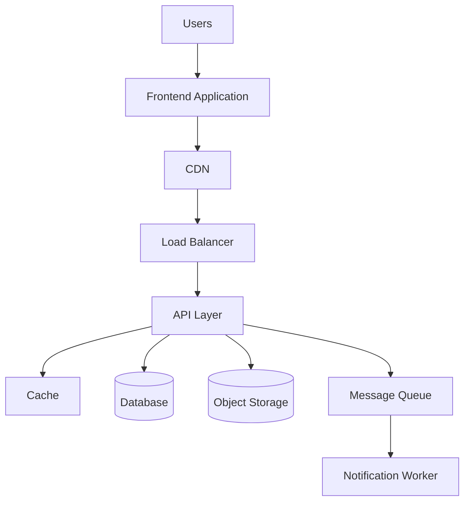
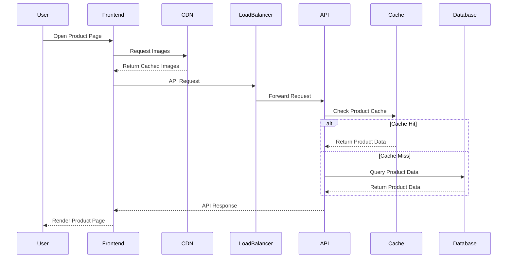
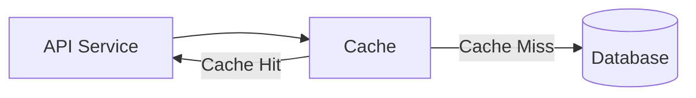
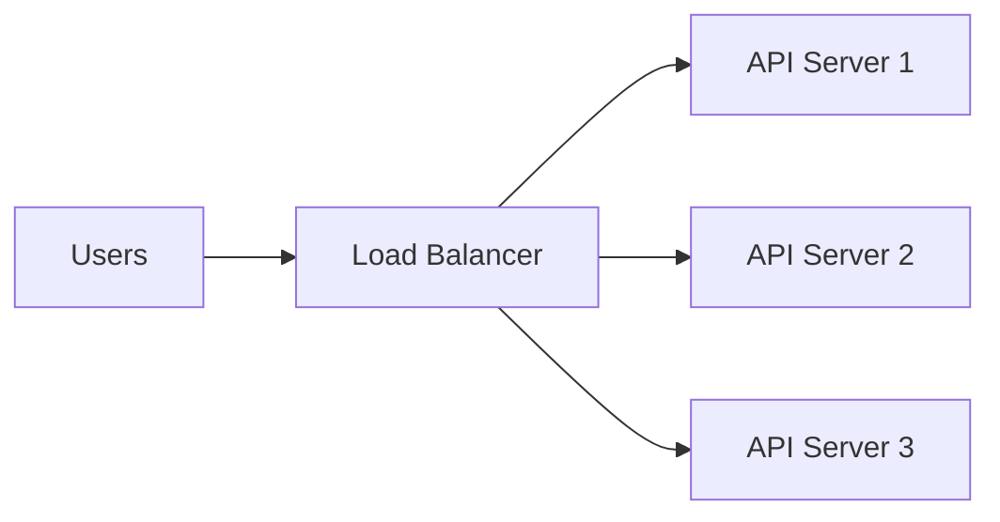

# Example – Day 26: System Design Basics

> Part of the Thynqit Labs – Foundational Engineering Bootcamp

---

# 📌 Overview

This document demonstrates a simplified example of a foundational system design for a Target.com inspired e-commerce platform.

The purpose of this example is to help learners understand:

- how modern systems are structured
- how requests flow through systems
- how infrastructure components interact
- how scalability and reliability influence architecture
- how engineering systems evolve over time

This example focuses on:

```plaintext
Foundational System Design Thinking
```

and intentionally avoids deep monolith or microservices discussions, which will be explored later in Week 6.

---

# Document Information

| Field | Value |
|------|------|
| Platform | Thynqit Commerce Platform |
| Architecture Type | Foundational High-Level Design |
| Document Version | v1.0 |
| Prepared By | Engineering Team |
| Prepared Date | 2026-05-25 |

---

# 1. Business Context

The organization plans to support:

- web users
- mobile users
- product catalog browsing
- checkout workflows
- high traffic during sales events

The platform must provide:

- fast page loading
- scalable APIs
- reliable checkout
- responsive user experience
- secure transactions

---

# 2. Core Functional Requirements

| Requirement ID | Description |
|------|------|
| FR-001 | Users should be able to browse products |
| FR-002 | Users should be able to search products |
| FR-003 | Users should be able to place orders |
| FR-004 | Users should receive notifications |
| FR-005 | Users should be able to track shipments |

---

# 3. Core Non-Functional Requirements

| Requirement ID | Description |
|------|------|
| NFR-001 | Platform should support 1 million daily users |
| NFR-002 | APIs should respond under 300ms |
| NFR-003 | Platform should maintain 99.9% uptime |
| NFR-004 | Sensitive user data must be encrypted |
| NFR-005 | Product images should load quickly globally |

---

## 🧠 Engineering Note

Non-functional requirements heavily influence:

- caching strategy
- CDN usage
- load balancing
- database scaling
- infrastructure design

in production systems.

---

# 4. High-Level System Components

The platform includes the following core components:

| Component | Purpose |
|------|------|
| Frontend Application | User interface |
| CDN | Static content delivery |
| Load Balancer | Traffic distribution |
| API Layer | Business logic processing |
| Cache | Faster data retrieval |
| Database | Persistent data storage |
| Object Storage | Image and media storage |
| Queue System | Background task processing |

---

# 5. High-Level Architecture Diagram



---

# 6. Request Lifecycle Example

---

## Product Page Request

```plaintext
User opens product page
    ↓
Frontend requests product information
    ↓
CDN serves static images
    ↓
Load balancer routes API request
    ↓
API checks cache
    ↓
If cache miss:
    ↓
Database query executes
    ↓
Response returned to user
```

---

## Request Lifecycle Diagram



---

# 7. Cache Usage Example

Caches help improve performance and reduce database load.

---

## Example

```plaintext
Popular products are stored in cache
to reduce repeated database queries.
```

---

## Cache Flow Diagram



---

## 🧠 Engineering Note

Caching improves:

- response times
- scalability
- infrastructure efficiency

but introduces challenges such as:

- cache invalidation
- stale data management
- synchronization complexity

---

# 8. Load Balancing Example

Load balancers distribute incoming traffic across multiple backend servers.

---

## Example Diagram



---

## Benefits

- improved scalability
- high availability
- fault tolerance
- better traffic distribution

---

# 9. CDN Example

A CDN caches static content closer to users globally.

---

## Example Static Assets

- product images
- videos
- CSS
- JavaScript

---

## CDN Flow


---

## 🧠 Engineering Note

CDNs help reduce:

- latency
- server load
- bandwidth costs

especially for image-heavy applications.

---

# 10. Queue & Background Processing Example

Some operations should run asynchronously.

Examples:

- email notifications
- SMS alerts
- analytics processing
- payment retries

---

## Queue Workflow Diagram


---

# 11. Reliability Considerations

The platform should remain operational even during failures.

---

## Example Reliability Strategies

| Strategy | Purpose |
|------|------|
| Database Replication | Backup database availability |
| Retry Mechanisms | Recover temporary failures |
| Monitoring | Detect issues quickly |
| Load Balancing | Avoid single server overload |
| Backups | Recover lost data |

---

## Failover Example


---

# 12. Scalability Considerations

The platform expects heavy seasonal traffic spikes.

---

## Example Challenges

- Black Friday traffic
- flash sales
- viral product launches

---

## Example Scaling Approaches

| Approach | Example |
|------|------|
| Horizontal Scaling | More API servers |
| CDN Scaling | Global content caching |
| Database Replicas | Faster reads |
| Queue Processing | Async workloads |

---

# 13. Trade-Off Analysis

Every engineering decision introduces trade-offs.

---

## Examples

| Decision | Benefit | Trade-Off |
|------|------|------|
| Cache | Faster responses | Cache invalidation complexity |
| CDN | Lower latency | Content synchronization |
| Replication | Higher availability | Data consistency complexity |
| Queues | Async scalability | Operational monitoring complexity |

---

## 🧠 Engineering Note

Strong engineers evaluate:

- system requirements
- operational complexity
- scalability needs
- business constraints
- engineering maturity

before making architectural decisions.

---

# 14. Future Architecture Evolution

Most systems evolve gradually.

---

## Example Evolution

```plaintext
Simple Application
    ↓
Monolith
    ↓
Modular Monolith
    ↓
Microservices
    ↓
Distributed Systems
```

---

## 🧠 Engineering Note

Architecture should evolve only when justified by:

- traffic growth
- engineering team growth
- deployment complexity
- scalability needs

Premature complexity often slows teams down.

---

# 15. Key Takeaways

This example demonstrates how modern systems:

- process requests
- distribute traffic
- improve performance
- scale infrastructure
- handle failures
- evolve over time

System design focuses on balancing:

- scalability
- reliability
- maintainability
- simplicity
- operational complexity

before implementation begins.

---

# 📚 Related Learning Flow

This example continues the same engineering journey:

```plaintext
Business Requirements
   ↓
Product Requirements
   ↓
Feature Specifications
   ↓
APIs & Databases
   ↓
System Design
   ↓
Monolith Architecture
   ↓
Microservices Architecture
```

This mirrors how real-world systems evolve.

---

# 🧭 Navigation

← Back to Resources  
[Resources](./resources.md)

➡ Next: Assignments  
[Assignments](./assignments.md)