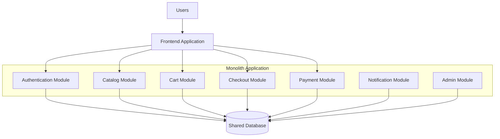
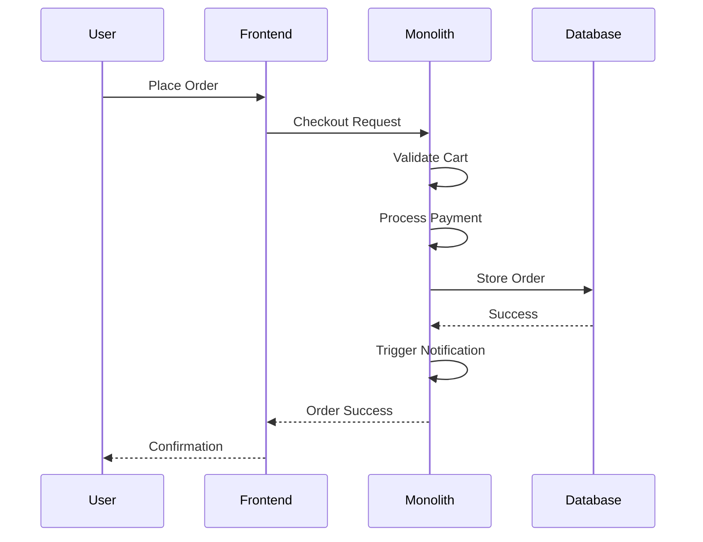
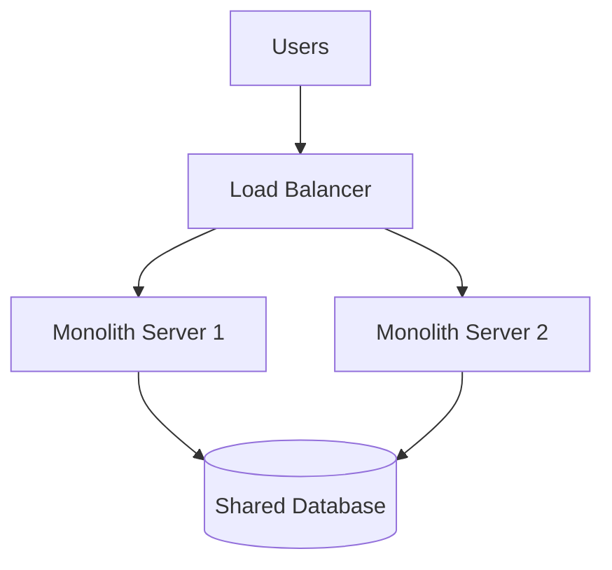
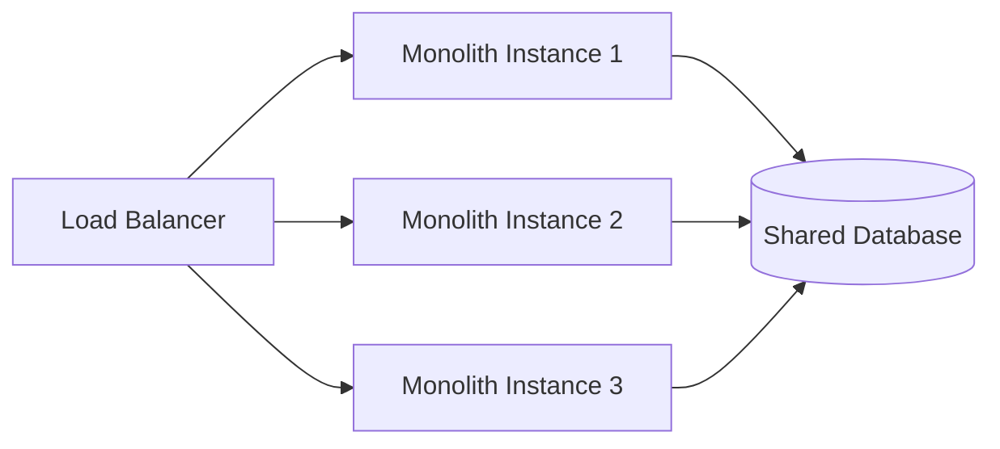
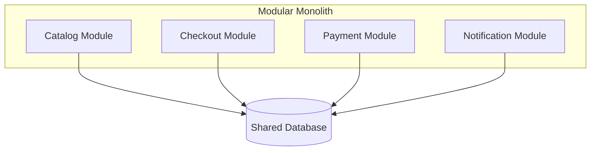
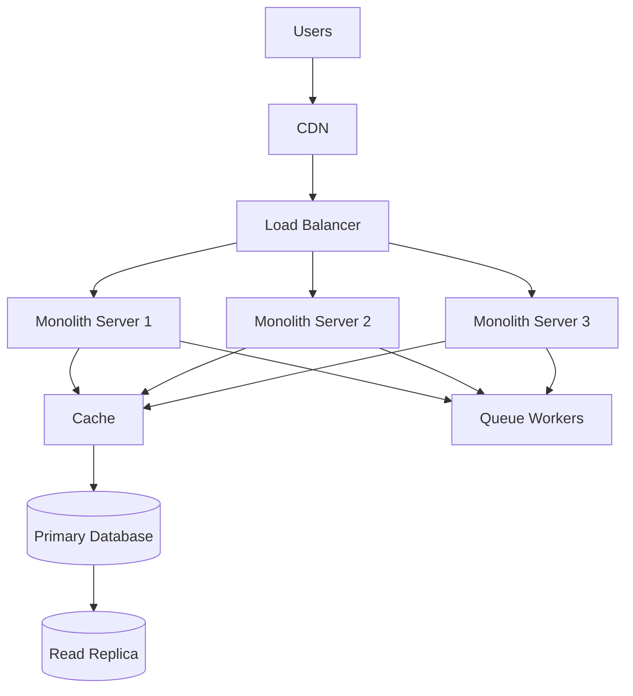

# Day 27 – Monolith Architecture

> Part of the Thynqit Labs – Foundational Engineering Bootcamp

---

# 📌 Overview

Many successful engineering systems begin as:

```plaintext
Monolithic Applications
```

Before companies adopt distributed systems and microservices, they often start with simpler architectures that prioritize:

- faster development
- easier deployments
- lower operational complexity
- rapid product iteration

Monoliths remain widely used across:

- startups
- internal enterprise platforms
- SaaS products
- MVP applications
- moderate-scale production systems

A monolithic architecture packages all application modules into a single deployable unit.

This module explores:

- how monoliths work
- why companies start with monoliths
- advantages and trade-offs
- scaling challenges
- modular monolith concepts
- evolution toward distributed systems

Throughout this module, learners continue using the same Target.com inspired e-commerce platform introduced in previous weeks.

---

# 🎯 Learning Objectives

By the end of this module, learners should be able to:

- Understand monolithic architecture
- Understand modular monolith concepts
- Identify advantages of monoliths
- Understand monolith scalability limitations
- Understand deployment workflows
- Understand shared database architectures
- Understand operational simplicity trade-offs
- Understand when monoliths are appropriate

---

# 🧠 Core Concepts

---

# PART 1 – WHAT IS A MONOLITH?

---

## 1. Monolithic Architecture Definition

A monolithic application is built and deployed as:

```plaintext
One Unified Application
```

All major business modules exist inside the same codebase and deployment unit.

---

## Example Modules

```plaintext
Authentication
Catalog
Cart
Checkout
Payments
Notifications
Admin Dashboard
```

All packaged together.

---

# 2. Monolith Architecture Diagram



---

# 3. How Monoliths Work

All modules:

- share the same runtime
- share the same deployment
- often share the same database
- communicate through internal function calls

This creates:

- simpler development workflows
- lower infrastructure complexity
- easier debugging initially

---

# 4. Request Lifecycle in a Monolith

---

## Example Checkout Flow

```plaintext
User places order
    ↓
Frontend sends request
    ↓
Monolith receives request
    ↓
Checkout module validates order
    ↓
Payment module processes payment
    ↓
Database stores order
    ↓
Notification module sends confirmation
```

---

## Request Lifecycle Diagram



---

# PART 2 – WHY COMPANIES START WITH MONOLITHS

---

# 5. Faster Initial Development

Monoliths are easier to build initially because:

- all code exists in one place
- teams work inside one project
- local development is simpler
- deployments are straightforward

---

# 6. Simpler Operational Management

Monoliths usually require fewer infrastructure components.

---

## Typical Infrastructure

```plaintext
Frontend
    ↓
Load Balancer
    ↓
Monolith Servers
    ↓
Database
```

---

## Infrastructure Diagram



---

# 7. Easier Debugging

Since modules run together:

- logs are centralized
- debugging is simpler
- distributed tracing is unnecessary initially
- local testing becomes easier

---

# 🧠 Engineering Note

Many successful companies initially launched using monoliths because:

- engineering speed matters early
- infrastructure simplicity matters
- premature distributed systems increase complexity

---

# PART 3 – ADVANTAGES OF MONOLITHS

---

# 8. Monolith Advantages

| Advantage | Description |
|------|------|
| Faster MVP Development | Easier for startups |
| Easier Deployment | Single deployable unit |
| Lower Operational Complexity | Fewer infrastructure systems |
| Easier Testing | Single runtime |
| Simpler Debugging | Centralized execution |
| Lower Initial Cost | Simpler infrastructure |

---

# 9. Team Productivity Benefits

Small engineering teams often move faster with monoliths because:

- code discovery is easier
- shared libraries simplify reuse
- communication overhead stays low
- deployment coordination is simpler

---

# PART 4 – CHALLENGES OF MONOLITHS

---

# 10. Growing Codebase Complexity

As systems grow:

- codebases become larger
- dependencies increase
- onboarding becomes harder
- deployments become slower

---

# 11. Scaling Limitations

Monoliths usually scale as:

```plaintext
Entire Application Replication
```

Even if only one module receives heavy traffic.

---

## Example

If:

```plaintext
Catalog receives heavy traffic
```

the entire monolith still scales.

---

## Scaling Diagram



---

# 12. Deployment Risks

Since everything deploys together:

- small bugs may affect the entire system
- deployments become risky
- release cycles slow down

---

# 13. Shared Database Challenges

Most monoliths use:

```plaintext
Shared Database Architecture
```

This creates:

- tight coupling
- schema dependency risks
- migration coordination challenges

---

# 🧠 Engineering Note

Database design quality becomes extremely important in monolith systems because all modules depend on the same data layer.

---

# PART 5 – MODULAR MONOLITHS

---

# 14. What is a Modular Monolith?

A modular monolith organizes internal modules cleanly while remaining:

```plaintext
One Deployable Application
```

---

## Example Structure

```plaintext
/checkout
/catalog
/payments
/notifications
/authentication
```

Each module has:

- boundaries
- ownership
- internal contracts

---

# 15. Modular Monolith Diagram



---

# 16. Why Modular Monoliths Matter

Modular monoliths improve:

- maintainability
- separation of concerns
- future migration flexibility
- engineering ownership clarity

without introducing full distributed complexity.

---

# PART 6 – MONOLITH SCALING STRATEGIES

---

# 17. Common Scaling Techniques

Monoliths can scale using:

| Strategy | Example |
|------|------|
| Horizontal Scaling | Multiple app servers |
| Database Replicas | Read scaling |
| Caching | Faster reads |
| CDN | Static asset optimization |
| Background Jobs | Async processing |

---

# Example Architecture with Scaling



---

# PART 7 – WHEN MONOLITHS ARE A GOOD CHOICE

---

# 18. Ideal Use Cases

Monoliths are often suitable for:

- startups
- MVPs
- early-stage SaaS products
- small engineering teams
- moderate-scale applications
- rapidly evolving products

---

# 19. When Monoliths Become Difficult

Monoliths become challenging when:

- teams scale heavily
- deployments become frequent
- traffic patterns differ drastically
- code ownership becomes unclear
- release coordination becomes painful

---

# PART 8 – EVOLUTION TOWARD MICROSERVICES

---

# 20. Typical Evolution Journey

Most successful systems evolve gradually.

---

## Common Architecture Evolution

```plaintext
Simple Application
    ↓
Monolith
    ↓
Modular Monolith
    ↓
Microservices
```

---

# 🧠 Engineering Note

Moving to microservices too early often creates:

- operational complexity
- debugging difficulty
- infrastructure overhead
- slower engineering velocity

Architecture maturity should match business maturity.

---

# 🌍 Real-World Relevance

Many companies operated successfully on monoliths for years.

Examples:

| Company | Early Architecture |
|------|------|
| Shopify | Monolith origins |
| GitHub | Large Rails monolith |
| Basecamp | Monolith architecture |
| Etsy | Monolith evolution |

Modern startups still frequently begin with monoliths today.

---

# ⚠️ Common Misconceptions

Monoliths are not automatically:

- outdated
- bad architecture
- unscalable
- poorly engineered

Well-designed monoliths can scale significantly with proper engineering practices.

---

# 🔄 Reflection Questions

- Why do startups often begin with monoliths?
- Why are monoliths operationally simpler?
- Why do shared databases create tight coupling?
- How do modular monoliths improve maintainability?
- Why should architecture evolve gradually?

---

# 📚 Next Steps

- Review `resources.md`
- Explore the monolith architecture example in `example.md`
- Complete `assignments.md`

---

# 🧭 Navigation

← Previous Day  
[Day 26](../day-26/README.md)

➡ Next: Resources  
[Resources](./resources.md)