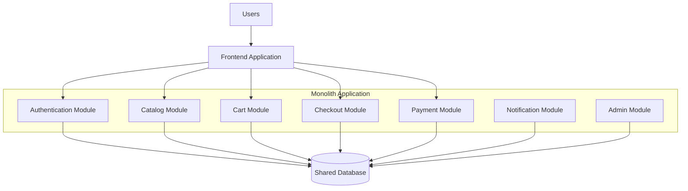
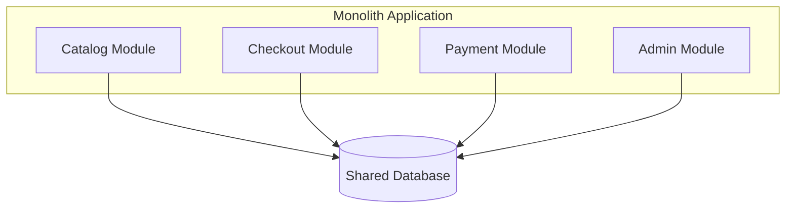
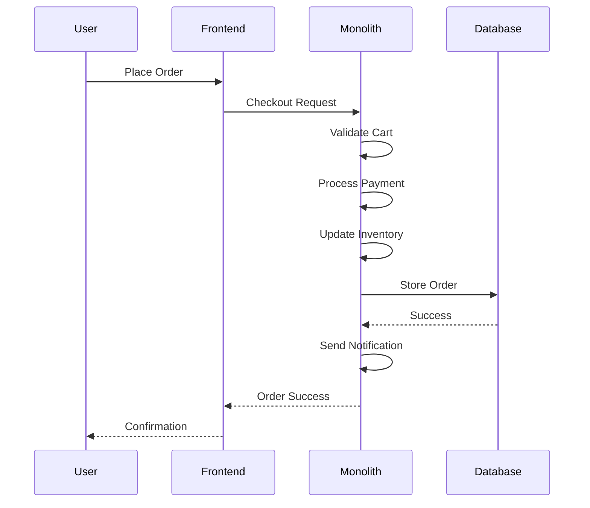
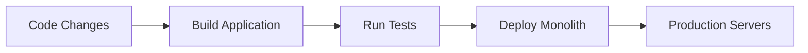
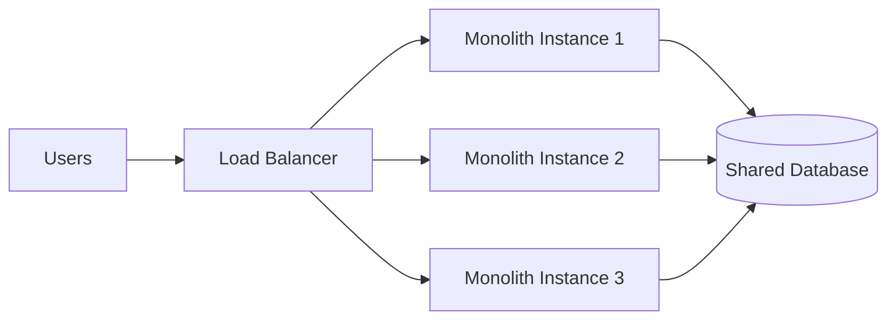
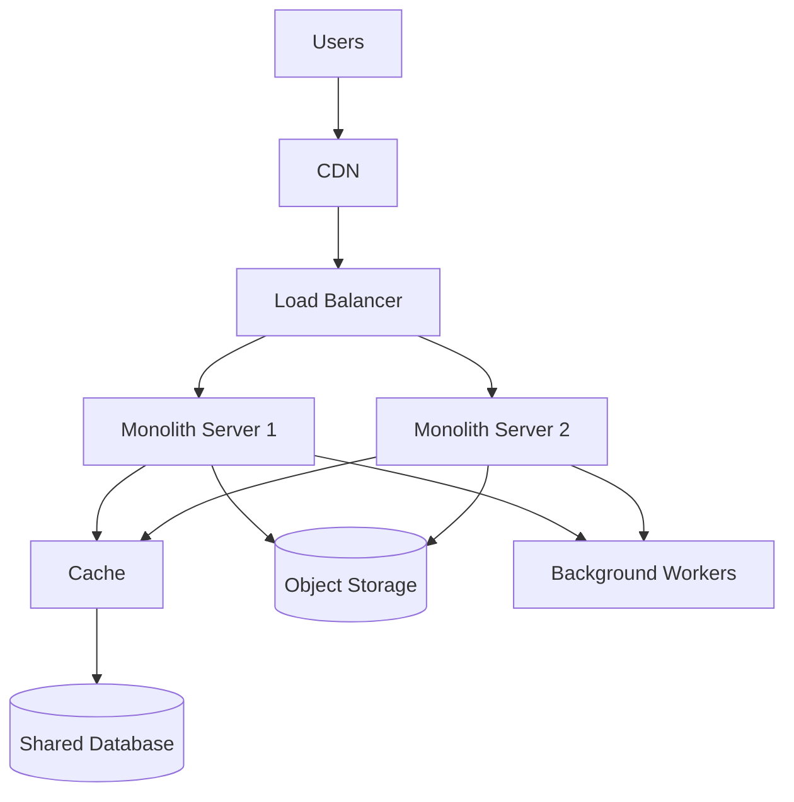
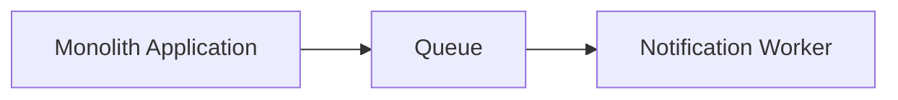
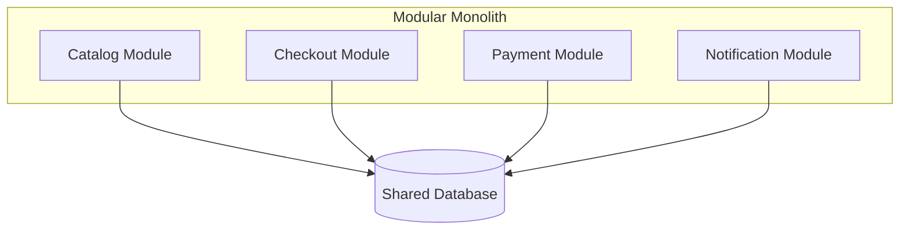

# Example – Day 27: Monolith Architecture

> Part of the Thynqit Labs – Foundational Engineering Bootcamp

---

# 📌 Overview

This document demonstrates a simplified example of a monolithic architecture for a Target.com inspired e-commerce platform.

The purpose of this example is to help learners understand:

- how monolithic systems are structured
- how modules interact inside a single application
- how shared databases work
- how monoliths scale
- how engineering teams organize large monolithic applications

This example builds on the foundational system design concepts introduced in:

- Day 26 – System Design Basics

This example intentionally focuses only on:

```plaintext
Monolithic Architecture
```

Microservices architecture will be explored separately in Day 28.

---

# Document Information

| Field | Value |
|------|------|
| Platform | Thynqit Commerce Platform |
| Architecture Type | Monolithic Architecture |
| Document Version | v1.0 |
| Prepared By | Engineering Team |
| Prepared Date | 2026-05-26 |

---

# 1. Business Context

The company is building:

- an online shopping platform
- mobile-friendly checkout
- order tracking workflows
- inventory management
- payment processing

The engineering team is currently:

- small in size
- rapidly iterating product features
- prioritizing faster delivery
- optimizing for simplicity

Because of this, the company selected:

```plaintext
Monolithic Architecture
```

for its initial production platform.

---

# 2. High-Level Monolith Architecture

The platform is designed as:

```plaintext
One Deployable Application
```

containing all major business modules.

---

## Monolith Architecture Diagram



---

# 3. Core Modules

The monolith contains multiple internal modules.

---

## Module Breakdown

| Module | Responsibility |
|------|------|
| Authentication | Login & user identity |
| Catalog | Product listing & search |
| Cart | Shopping cart management |
| Checkout | Order placement |
| Payments | Payment processing |
| Notifications | Emails & SMS |
| Admin | Product and order management |

---

# 4. Shared Database Design

All modules share the same relational database.

---

## Shared Database Diagram



---

## Example Database Tables

```plaintext
users
products
orders
payments
inventory
notifications
```

---

## 🧠 Engineering Note

Shared databases simplify:

- querying
- reporting
- transactions
- development speed

but can create:

- tight coupling
- migration coordination issues
- scaling bottlenecks

as systems grow.

---

# 5. Request Lifecycle Example

---

## Checkout Workflow

```plaintext
User places order
    ↓
Frontend sends checkout request
    ↓
Checkout module validates cart
    ↓
Payment module processes payment
    ↓
Inventory updated
    ↓
Order stored in database
    ↓
Notification module sends confirmation
```

---

## Checkout Sequence Diagram



---

# 6. Monolith Deployment Flow

The entire application deploys together.

---

## Deployment Workflow



---

## 🧠 Engineering Note

Monolith deployments are operationally simpler because:

- only one deployment artifact exists
- infrastructure complexity stays low
- service coordination is unnecessary

However:

```plaintext
A small bug can affect the entire application.
```

---

# 7. Scaling the Monolith

As traffic grows, the platform scales by adding more monolith instances.

---

## Horizontal Scaling Example



---

# 8. Monolith Infrastructure Components

Even monoliths often use modern infrastructure components.

---

## Infrastructure Diagram



---

# 9. Background Processing Example

Some workflows are processed asynchronously.

Examples:

- emails
- analytics
- inventory sync
- payment retries

---

## Queue Workflow



---

# 10. Monolith Advantages in This Example

---

## Why This Architecture Was Selected

| Reason | Benefit |
|------|------|
| Small Team | Faster coordination |
| Rapid Product Iteration | Faster feature delivery |
| Lower Infrastructure Complexity | Easier operations |
| Simpler Deployment | Faster releases |
| Shared Database | Easier transactions |

---

# 11. Challenges Emerging Over Time

As the platform grows:

- deployments become slower
- codebase becomes larger
- database traffic increases
- module dependencies increase
- release coordination becomes difficult

---

## Example Future Challenges

| Area | Challenge |
|------|------|
| Catalog | Heavy search traffic |
| Checkout | Peak traffic during sales |
| Payments | High reliability requirements |
| Notifications | Background processing growth |

---

# 12. Modular Monolith Evolution

To improve maintainability, the engineering team later introduces:

```plaintext
Modular Monolith Structure
```

---

## Example Folder Structure

```plaintext
/catalog
/checkout
/payments
/notifications
/authentication
/admin
```

Each module has:

- clearer boundaries
- internal ownership
- reduced coupling

while remaining:

```plaintext
One Deployable Application
```

---

## Modular Monolith Diagram



---

# 13. Reliability Considerations

The platform improves reliability using:

| Strategy | Purpose |
|------|------|
| Load Balancing | Traffic distribution |
| Cache | Faster responses |
| Database Replicas | Read scalability |
| Background Workers | Async processing |
| Monitoring | Failure detection |

---

# 14. Future Architecture Evolution

As traffic and engineering teams grow, the company may eventually evolve toward:

```plaintext
Microservices Architecture
```

---

## Example Evolution Journey

```plaintext
Simple App
    ↓
Monolith
    ↓
Modular Monolith
    ↓
Microservices
```

---

## 🧠 Engineering Note

This gradual evolution is common because:

- early simplicity matters
- operational maturity develops over time
- distributed systems introduce major complexity

---

# 15. Key Takeaways

This example demonstrates how monoliths:

- organize application modules
- simplify deployments
- centralize business logic
- share infrastructure components
- scale using replication and caching
- evolve gradually as systems grow

Monoliths remain highly effective for:

- startups
- MVPs
- moderate-scale systems
- rapidly evolving products

when engineered properly.

---

# 📚 Related Learning Flow

This example continues the same engineering journey:

```plaintext
Requirements
   ↓
APIs & Databases
   ↓
System Design Basics
   ↓
Monolith Architecture
   ↓
Microservices Architecture
```

This mirrors how many real-world systems evolve.

---

# 🧭 Navigation

← Back to Resources  
[Resources](./resources.md)

➡ Next: Assignments  
[Assignments](./assignments.md)