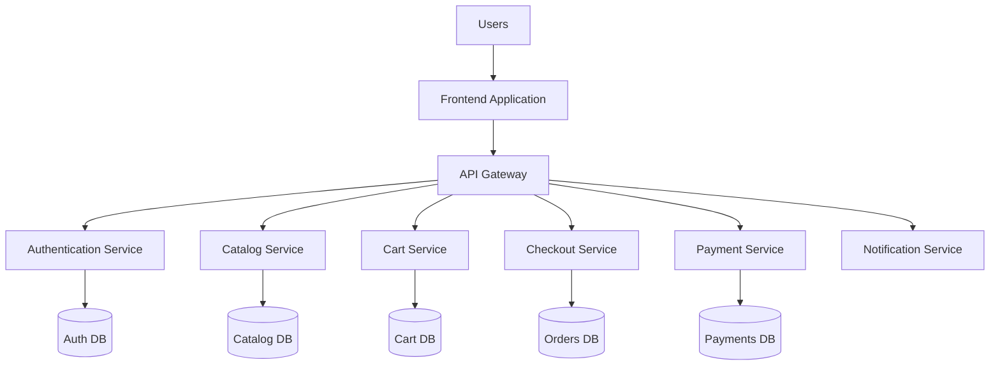
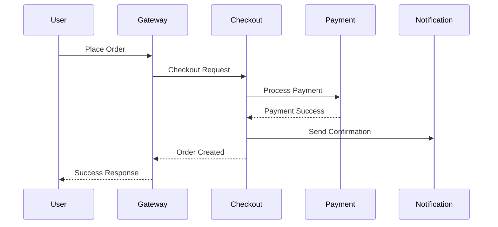
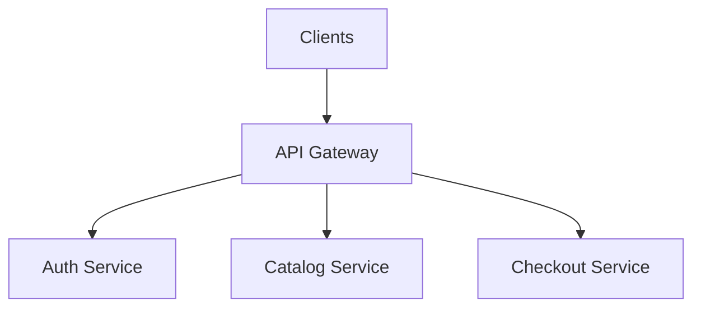
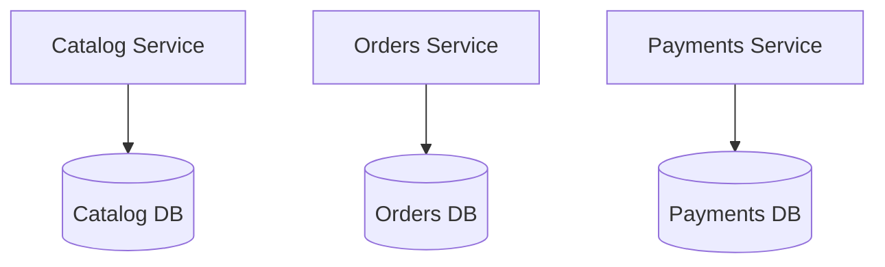
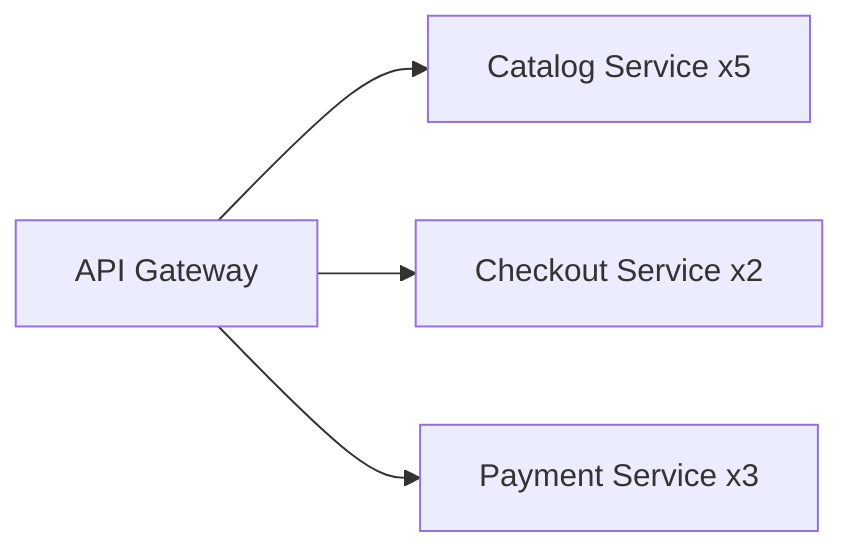
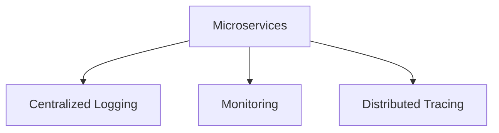
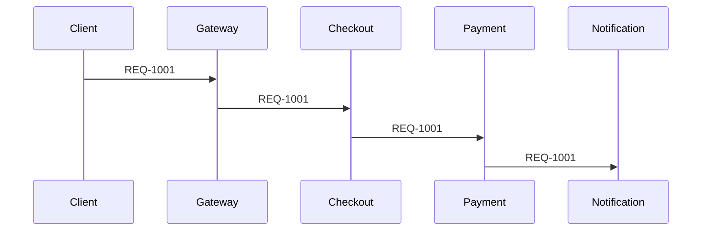

# Day 28 – Microservices Architecture

> Part of the Thynqit Labs – Foundational Engineering Bootcamp

---

# 📌 Overview

As systems grow in:

- traffic
- engineering team size
- deployment frequency
- operational complexity

organizations often evolve from monoliths into:

```plaintext
Microservices Architecture
```

Microservices break large systems into smaller independently deployable services.

Each service focuses on a specific:

- business capability
- domain
- workflow
- operational responsibility

Microservices are commonly used in:

- large-scale SaaS platforms
- cloud-native systems
- distributed platforms
- internet-scale applications

This architecture improves:

- scalability
- deployment flexibility
- team autonomy
- fault isolation

but also introduces significant:

- operational complexity
- distributed system challenges
- infrastructure requirements

Throughout this module, learners continue evolving the same Target.com inspired e-commerce platform introduced in previous weeks.

The platform now evolves from:

```plaintext
Monolithic Architecture
```

into:

```plaintext
Distributed Microservices Architecture
```

---

# 🎯 Learning Objectives

By the end of this module, learners should be able to:

- Understand microservices architecture
- Understand service decomposition
- Understand distributed system communication
- Understand API Gateway concepts
- Understand database-per-service patterns
- Understand service scaling strategies
- Understand distributed system challenges
- Understand trade-offs of microservices

---

# 🧠 Core Concepts

---

# PART 1 – WHAT ARE MICROSERVICES?

---

## 1. Microservices Architecture Definition

Microservices architecture structures applications as:

```plaintext
Small Independently Deployable Services
```

Each service owns:

- its business capability
- its deployment lifecycle
- its runtime
- often its own database

---

## Example Services

```plaintext
Authentication Service
Catalog Service
Cart Service
Checkout Service
Payment Service
Notification Service
```

---

# 2. Microservices Architecture Diagram



---

# 3. Why Companies Adopt Microservices

Microservices help organizations:

- scale services independently
- deploy services independently
- improve fault isolation
- support multiple engineering teams
- adopt different technologies

---

# Example

```plaintext
Catalog traffic spikes heavily
```

Only:

```plaintext
Catalog Service
```

needs scaling.

---

# 4. Service Ownership

Each microservice usually has:

- dedicated ownership
- independent deployment
- separate monitoring
- isolated scaling

---

## Example Ownership

| Team | Service |
|------|------|
| Catalog Team | Product Catalog |
| Payments Team | Payment Service |
| Checkout Team | Order Processing |

---

# 🧠 Engineering Note

Microservices architecture often aligns closely with:

- organizational structure
- engineering team ownership
- independent release cycles

---

# PART 2 – SERVICE COMMUNICATION

---

# 5. API-Based Communication

Microservices communicate using:

- REST APIs
- gRPC
- messaging systems
- event streams

---

## Example Communication Flow



---

# 6. API Gateway

An API Gateway acts as a central entry point.

---

## Responsibilities

| Responsibility | Example |
|------|------|
| Authentication | JWT validation |
| Routing | Service forwarding |
| Rate Limiting | Traffic protection |
| Monitoring | Request tracking |
| Security | API protection |

---

## API Gateway Diagram



---

# PART 3 – DATABASE-PER-SERVICE PATTERN

---

# 7. Database Isolation

Microservices commonly use:

```plaintext
Database Per Service
```

instead of one shared database.

---

## Example

| Service | Database |
|------|------|
| Catalog Service | Catalog DB |
| Orders Service | Orders DB |
| Payments Service | Payments DB |

---

## Database Isolation Diagram



---

# 8. Why Database Isolation Matters

Database-per-service improves:

- service independence
- deployment flexibility
- fault isolation
- scaling flexibility

---

## 🧠 Engineering Note

Database isolation also introduces challenges:

- distributed transactions
- data synchronization
- reporting complexity
- eventual consistency handling

---

# PART 4 – SCALING MICROSERVICES

---

# 9. Independent Scaling

Each service can scale independently.

---

## Example



---

# 10. Autoscaling

Microservices platforms often use:

- Kubernetes
- container orchestration
- autoscaling policies

to dynamically scale services.

---

## Example Scaling Triggers

| Trigger | Example |
|------|------|
| CPU Usage | >70% |
| Traffic Volume | Sudden request spikes |
| Queue Length | Background processing backlog |

---

# PART 5 – DISTRIBUTED SYSTEM CHALLENGES

---

# 11. Distributed System Complexity

Microservices introduce distributed system problems.

---

## Common Challenges

| Challenge | Example |
|------|------|
| Network Failures | Service unreachable |
| Latency | Slow inter-service communication |
| Partial Failures | One service fails |
| Retry Complexity | Duplicate operations |
| Monitoring Complexity | Distributed logs |

---

# 12. Distributed Transactions

In monoliths:

```plaintext
One database transaction
```

is simpler.

In microservices:

```plaintext
Multiple services coordinate transactions
```

which is harder.

---

## Example

```plaintext
Checkout Service
    ↓
Payment Service
    ↓
Inventory Service
```

Failures may happen midway.

---

# 13. Eventual Consistency

Microservices often use:

```plaintext
Eventual Consistency
```

instead of immediate consistency.

---

## Example

Payment succeeds first.
Inventory updates later.

Systems eventually synchronize.

---

# PART 6 – OBSERVABILITY & OPERATIONS

---

# 14. Why Observability Becomes Critical

Distributed systems require visibility across services.

---

## Important Observability Components

| Component | Purpose |
|------|------|
| Centralized Logging | Aggregate logs |
| Monitoring | Detect failures |
| Metrics | System health tracking |
| Distributed Tracing | Track requests across services |

---

## Observability Architecture



---

# 15. Correlation IDs & Distributed Tracing

Requests moving across services require:

```plaintext
Correlation IDs
```

to trace workflows.

---

## Example

```plaintext
REQ-1001
```

tracked across:

- Checkout Service
- Payment Service
- Notification Service

---

## Example Trace Flow



---

# PART 7 – RELIABILITY STRATEGIES

---

# 16. Failure Handling

Distributed systems expect failures.

---

## Common Reliability Strategies

| Strategy | Purpose |
|------|------|
| Retries | Recover temporary failures |
| Circuit Breakers | Prevent cascading failures |
| Timeouts | Avoid hanging requests |
| Redundancy | Backup service instances |
| Queueing | Decouple workloads |

---

# Example Reliability Flow


---

# PART 8 – WHEN TO USE MICROSERVICES

---

# 17. Good Use Cases

Microservices are often suitable for:

- large engineering teams
- high-scale systems
- independently evolving domains
- frequent deployments
- cloud-native platforms

---

# 18. When Microservices Become Problematic

Microservices may create unnecessary complexity when:

- engineering teams are small
- traffic is low
- operational maturity is limited
- deployment frequency is low

---

## 🧠 Engineering Note

Premature microservices adoption often leads to:

- operational overload
- debugging complexity
- infrastructure sprawl
- slower delivery

---

# PART 9 – ARCHITECTURE EVOLUTION

---

# 19. Typical Evolution Journey

Most companies evolve gradually.

---

## Common Evolution Path

```plaintext
Simple Application
    ↓
Monolith
    ↓
Modular Monolith
    ↓
Microservices
    ↓
Distributed Platform Engineering
```

---

# 🌍 Real-World Relevance

Examples of companies using microservices:

| Company | Architecture Evolution |
|------|------|
| Netflix | Monolith → Microservices |
| Uber | Distributed microservices |
| Amazon | Service-oriented systems |
| Spotify | Squad-oriented services |

These systems required:

- strong DevOps maturity
- CI/CD automation
- observability tooling
- cloud-native infrastructure

---

# ⚠️ Common Misconceptions

Microservices are not automatically:

- simpler
- faster
- cheaper
- easier to debug

They introduce substantial operational complexity.

Good architecture decisions depend on:

- business requirements
- engineering maturity
- operational readiness
- scalability needs

---

# 🔄 Reflection Questions

- Why do microservices improve independent scaling?
- Why is observability critical in distributed systems?
- Why are distributed transactions difficult?
- How does API Gateway simplify client communication?
- Why should organizations avoid premature microservices adoption?

---

# 📚 Next Steps

- Review `resources.md`
- Explore the distributed system example in `example.md`
- Complete `assignments.md`

---

# 🧭 Navigation

← Previous Day  
[Day 27](../day-27/README.md)

➡ Next: Resources  
[Resources](./resources.md)