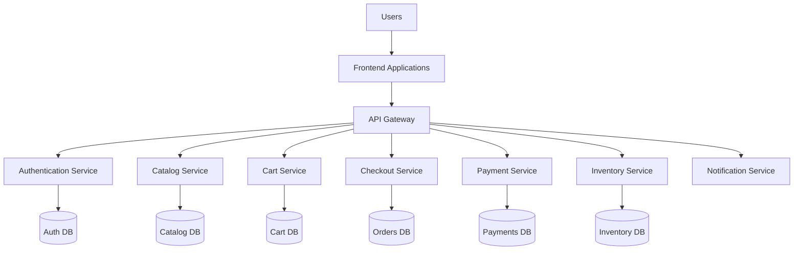
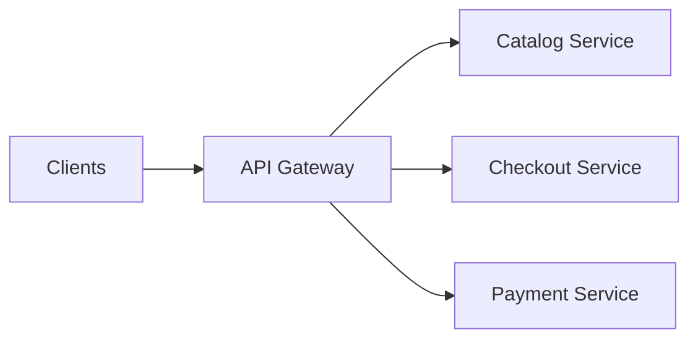
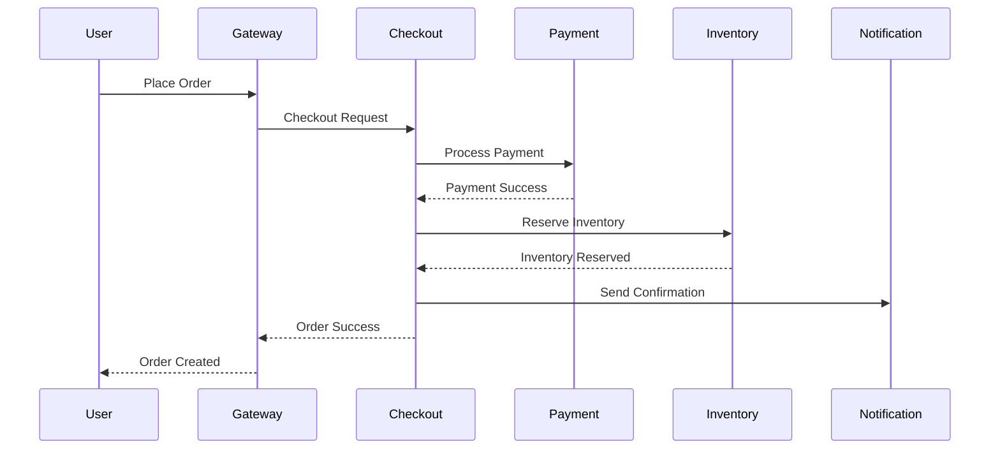
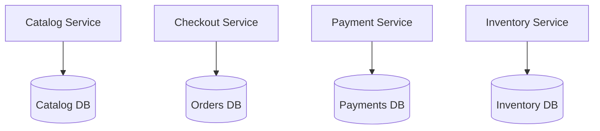
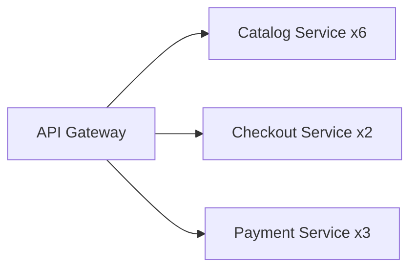
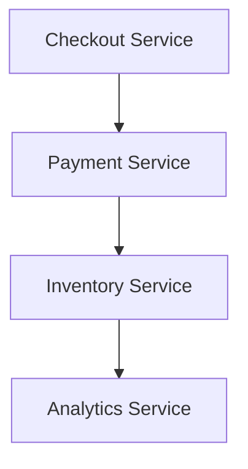
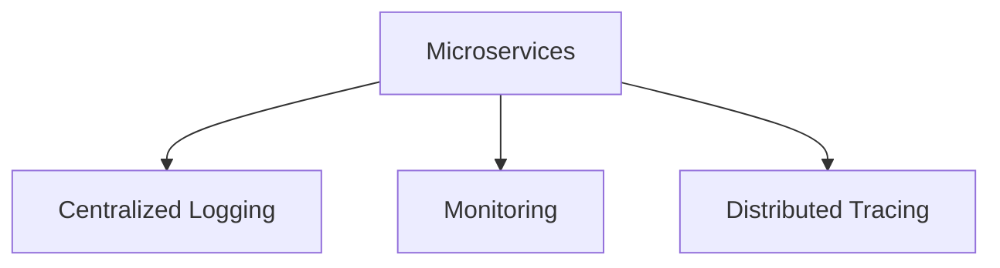
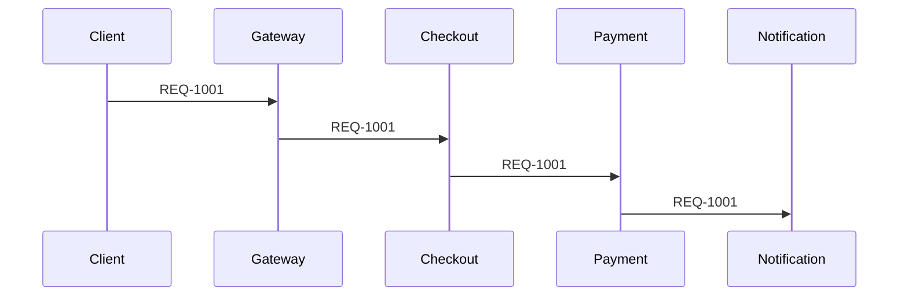
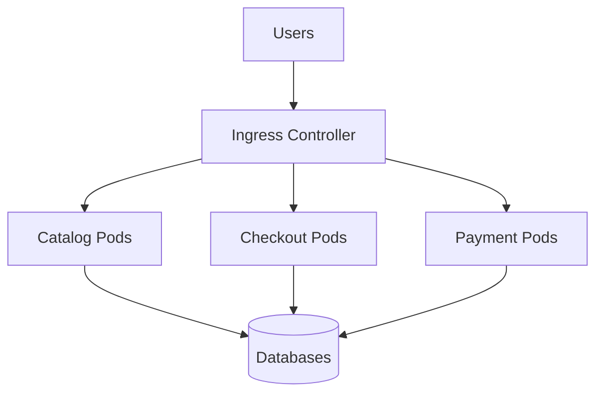
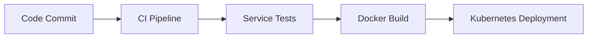

# Example – Day 28: Microservices Architecture

> Part of the Thynqit Labs – Foundational Engineering Bootcamp

---

# 📌 Overview

This document demonstrates a simplified example of a distributed microservices architecture for a Target.com inspired e-commerce platform.

The purpose of this example is to help learners understand:

- how large systems are decomposed into services
- how services communicate
- how APIs flow through distributed systems
- how database-per-service architecture works
- how observability and reliability become critical
- how systems scale independently

This example continues the architecture evolution introduced in:

- Day 26 – System Design Basics
- Day 27 – Monolith Architecture

The platform now evolves into:

```plaintext
Distributed Microservices Architecture
```

---

# Document Information

| Field | Value |
|------|------|
| Platform | Thynqit Commerce Platform |
| Architecture Type | Microservices Architecture |
| Document Version | v1.0 |
| Prepared By | Platform Engineering Team |
| Prepared Date | 2026-05-27 |

---

# 1. Business Context

The platform has grown significantly.

The company now supports:

- millions of users
- global traffic
- mobile applications
- partner integrations
- high-frequency deployments

The engineering organization has also expanded into multiple teams.

Because of this growth, the company evolved from:

```plaintext
Monolith Architecture
```

into:

```plaintext
Microservices Architecture
```

to improve:

- independent scaling
- deployment flexibility
- team autonomy
- fault isolation

---

# 2. High-Level Microservices Architecture

The platform is decomposed into independently deployable services.

---

## Core Services

| Service | Responsibility |
|------|------|
| Authentication Service | Login & identity |
| Catalog Service | Product browsing & search |
| Cart Service | Shopping cart workflows |
| Checkout Service | Order creation |
| Payment Service | Payment processing |
| Notification Service | Email & SMS |
| Inventory Service | Product stock management |

---

# 3. High-Level Architecture Diagram



---

# 4. API Gateway Responsibilities

The API Gateway acts as the central entry point.

---

## Responsibilities

| Responsibility | Example |
|------|------|
| Authentication | JWT validation |
| Routing | Forward requests |
| Rate Limiting | Prevent abuse |
| Monitoring | Track requests |
| Security | Request filtering |

---

## API Gateway Flow



---

# 5. Checkout Request Lifecycle

---

## Workflow

```plaintext
User places order
    ↓
API Gateway routes request
    ↓
Checkout Service validates cart
    ↓
Payment Service processes payment
    ↓
Inventory Service updates stock
    ↓
Notification Service sends confirmation
```

---

## Sequence Diagram



---

# 6. Database-Per-Service Architecture

Each service owns its own database.

---

## Database Isolation Diagram



---

## 🧠 Engineering Note

Database-per-service improves:

- service independence
- deployment flexibility
- scaling isolation

but increases:

- synchronization complexity
- distributed transaction challenges
- reporting complexity

---

# 7. Independent Scaling Example

The Catalog Service receives significantly more traffic than Payments.

---

## Scaling Strategy



---

## Benefits

- only heavily used services scale
- infrastructure becomes more efficient
- deployments become isolated

---

# 8. Background Processing Example

Some workflows run asynchronously.

Examples:

- notifications
- analytics
- payment retries
- recommendation generation

---

## Queue Workflow Diagram


---

# 9. Distributed System Challenges

Microservices introduce distributed system problems.

---

## Example Challenges

| Challenge | Example |
|------|------|
| Network Failures | Service unavailable |
| Partial Failures | Payment succeeds but notification fails |
| Latency | Slow inter-service calls |
| Retry Complexity | Duplicate requests |
| Monitoring Complexity | Distributed debugging |

---

# 10. Eventual Consistency Example

In distributed systems:

```plaintext
All systems may not update instantly.
```

---

## Example Workflow

```plaintext
Payment succeeds
    ↓
Inventory updates later
    ↓
Analytics update asynchronously
```

Systems eventually synchronize.

---

## Eventual Consistency Diagram



---

# 11. Observability Architecture

Distributed systems require centralized visibility.

---

## Observability Components

| Component | Purpose |
|------|------|
| Centralized Logging | Aggregate logs |
| Monitoring | Detect failures |
| Metrics | Track system health |
| Distributed Tracing | Track requests |

---

## Observability Diagram



---

# 12. Correlation IDs & Tracing

Requests moving across services require:

```plaintext
Correlation IDs
```

to trace workflows.

---

## Example Correlation ID

```plaintext
REQ-1001
```

tracked across:

- API Gateway
- Checkout Service
- Payment Service
- Notification Service

---

## Distributed Trace Example



---

# 13. Reliability Strategies

The platform introduces resilience patterns.

---

## Reliability Components

| Strategy | Purpose |
|------|------|
| Retries | Recover temporary failures |
| Circuit Breakers | Prevent cascading failures |
| Timeouts | Avoid hanging requests |
| Queueing | Async decoupling |
| Redundancy | Backup service instances |

---

## Retry Workflow Example


---

# 14. Kubernetes-Based Deployment Example

The engineering team deploys services using Kubernetes.

---

## Simplified Deployment Diagram



---

# 15. CI/CD Pipeline Example

Each service deploys independently.

---

## Example Deployment Flow



---

# 16. Why Microservices Were Adopted

The company adopted microservices because:

| Requirement | Benefit |
|------|------|
| Global Scale | Independent scaling |
| Multiple Teams | Team autonomy |
| Faster Releases | Independent deployments |
| Reliability | Fault isolation |
| Cloud-Native Growth | Elastic infrastructure |

---

# 17. Trade-Off Analysis

Every distributed system introduces trade-offs.

---

## Example Trade-Offs

| Benefit | Trade-Off |
|------|------|
| Independent scaling | Distributed complexity |
| Service isolation | Operational overhead |
| Team autonomy | Monitoring complexity |
| Database isolation | Distributed consistency challenges |

---

# 18. Future Evolution

As systems continue growing, the platform may later evolve into:

- event-driven systems
- service mesh architectures
- platform engineering models
- multi-region infrastructure
- edge computing systems

---

# 19. Key Takeaways

This example demonstrates how microservices:

- decompose systems into services
- scale independently
- improve deployment flexibility
- isolate failures
- introduce distributed system complexity

Microservices require strong maturity in:

- DevOps
- observability
- automation
- reliability engineering
- cloud infrastructure

before they become effective at scale.

---

# 📚 Related Learning Flow

This example continues the architecture evolution journey:

```plaintext
System Design Basics
   ↓
Monolith Architecture
   ↓
Microservices Architecture
   ↓
Scalability & Distributed Systems
```

This mirrors how many real-world internet-scale systems evolve.

---

# 🧭 Navigation

← Back to Resources  
[Resources](./resources.md)

➡ Next: Assignments  
[Assignments](./assignments.md)