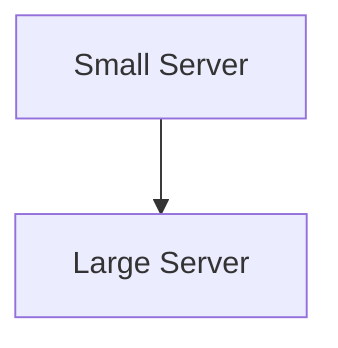
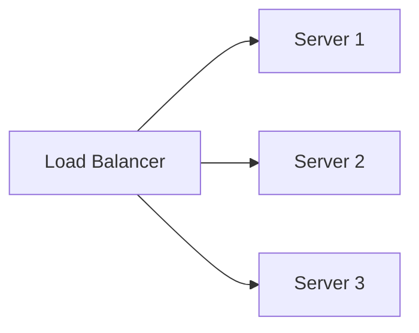
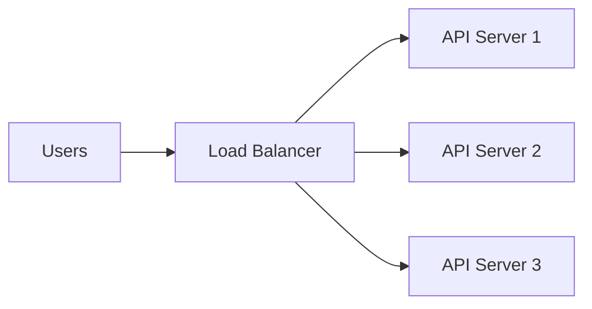
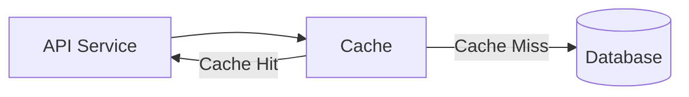
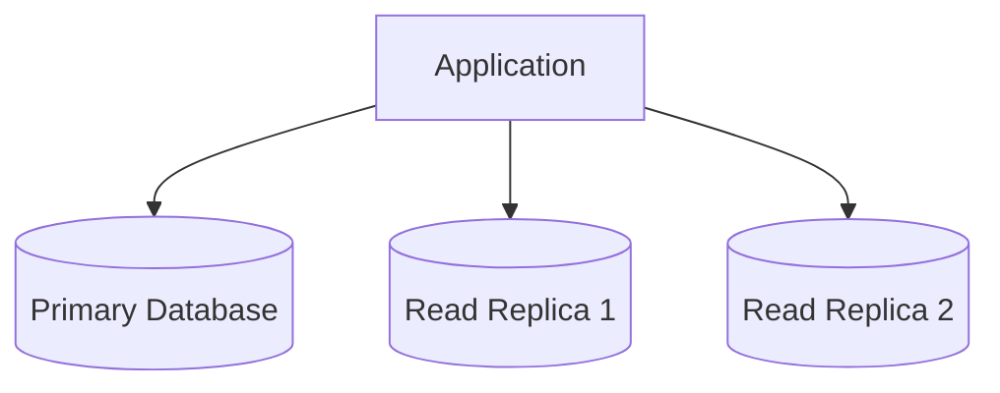
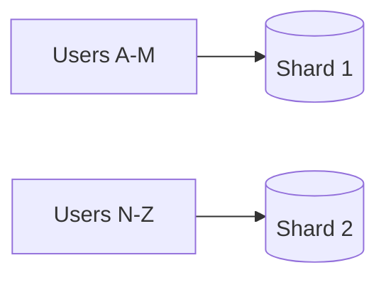
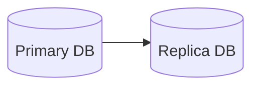
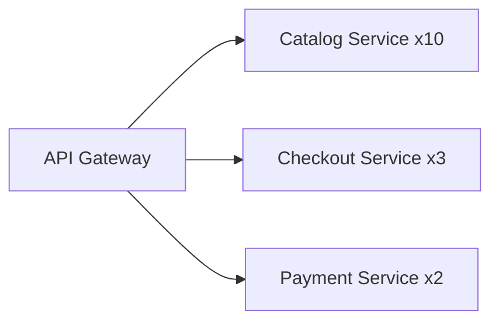
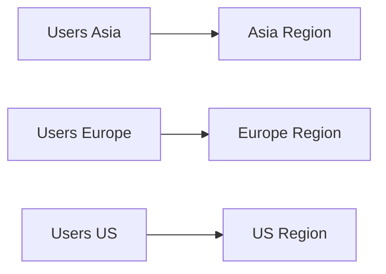

# Day 29 – Scalability & Distributed Systems

> Part of the Thynqit Labs – Foundational Engineering Bootcamp

---

# 📌 Overview

As systems grow in:

- users
- traffic
- data volume
- global usage
- engineering complexity

they must scale efficiently while remaining reliable and performant.

This introduces the need for:

```plaintext
Scalability & Distributed Systems Engineering
```

Modern internet-scale platforms such as:

- Amazon
- Netflix
- Uber
- Spotify
- Swiggy

operate using highly distributed systems designed to handle:

- millions of concurrent users
- large-scale data processing
- global traffic distribution
- fault tolerance
- asynchronous workloads

This module focuses on understanding:

- scalability concepts
- distributed systems fundamentals
- scaling bottlenecks
- data distribution
- asynchronous processing
- consistency trade-offs
- distributed communication patterns

Throughout this module, learners continue evolving the same Target.com inspired e-commerce platform introduced in previous modules.

The platform now evolves from:

```plaintext
Microservices Architecture
```

into:

```plaintext
Scalable Distributed Systems
```

---

# 🎯 Learning Objectives

By the end of this module, learners should be able to:

- Understand scalability concepts
- Understand distributed systems fundamentals
- Understand horizontal vs vertical scaling
- Understand caching strategies
- Understand database scaling approaches
- Understand asynchronous communication
- Understand consistency trade-offs
- Understand distributed bottlenecks
- Understand partitioning and replication basics

---

# 🧠 Core Concepts

---

# PART 1 – WHAT IS SCALABILITY?

---

## 1. Scalability Definition

Scalability refers to a system’s ability to:

```plaintext
Handle increasing load efficiently
```

without major degradation in:

- performance
- reliability
- user experience

---

# 2. Types of Growth

Systems may grow in:

| Growth Type | Example |
|------|------|
| User Growth | More active users |
| Traffic Growth | More API requests |
| Data Growth | Larger databases |
| Geographic Growth | Global traffic |
| Engineering Growth | More teams/services |

---

# 3. Common Scalability Challenges

As systems grow:

- databases become bottlenecks
- APIs become overloaded
- deployments become slower
- latency increases
- infrastructure costs rise

---

# 🧠 Engineering Note

Scalability is not only about handling traffic.

It also involves:

- operational scalability
- engineering team scalability
- deployment scalability
- data scalability

---

# PART 2 – VERTICAL VS HORIZONTAL SCALING

---

# 4. Vertical Scaling

Vertical scaling means increasing resources on a single machine.

Examples:

- more CPU
- more RAM
- larger storage

---

## Vertical Scaling Diagram



---

## Advantages

- simpler setup
- fewer distributed systems challenges
- easier debugging

---

## Limitations

- hardware limits exist
- expensive at scale
- single-machine dependency

---

# 5. Horizontal Scaling

Horizontal scaling means adding more machines.

---

## Horizontal Scaling Diagram



---

## Advantages

- better scalability
- improved availability
- fault tolerance
- cloud-native elasticity

---

## Challenges

- distributed coordination
- synchronization
- networking complexity

---

# 🧠 Engineering Note

Most internet-scale systems rely heavily on:

```plaintext
Horizontal Scaling
```

---

# PART 3 – LOAD BALANCING

---

# 6. What is Load Balancing?

Load balancers distribute incoming traffic across multiple servers.

---

## Example



---

# 7. Benefits of Load Balancing

| Benefit | Description |
|------|------|
| Traffic Distribution | Avoid overloaded servers |
| High Availability | Improve uptime |
| Fault Tolerance | Remove failed servers |
| Scalability | Add new servers dynamically |

---

# PART 4 – CACHING STRATEGIES

---

# 8. Why Caching Matters

Caching reduces repeated expensive operations.

---

## Common Cache Targets

- product data
- search results
- session data
- recommendations
- frequently accessed APIs

---

## Cache Workflow



---

# 9. Types of Caching

| Cache Type | Example |
|------|------|
| CDN Cache | Images & videos |
| Application Cache | Product data |
| Database Cache | Query results |
| Browser Cache | Static assets |

---

# 10. Cache Challenges

Caching introduces complexity such as:

- stale data
- cache invalidation
- synchronization
- consistency management

---

# 🧠 Engineering Note

There are only two hard things in computer science:

```plaintext
Cache invalidation
and naming things.
```

---

# PART 5 – DATABASE SCALING

---

# 11. Database Bottlenecks

Databases are often the first scalability bottleneck.

---

## Common Problems

- slow queries
- heavy reads
- write contention
- large tables
- lock contention

---

# 12. Read Replicas

Read replicas help scale read-heavy workloads.

---

## Read Replica Diagram



---

# 13. Database Partitioning (Sharding)

Large datasets may be split across multiple databases.

---

## Sharding Example



---

# 14. Replication

Replication improves:

- availability
- redundancy
- disaster recovery

---

## Replication Diagram



---

# PART 6 – DISTRIBUTED SYSTEMS FUNDAMENTALS

---

# 15. What is a Distributed System?

A distributed system consists of:

```plaintext
Multiple interconnected systems
```

working together.

---

## Examples

- microservices platforms
- Kubernetes clusters
- distributed databases
- cloud-native applications

---

# 16. Distributed System Challenges

Distributed systems introduce:

| Challenge | Example |
|------|------|
| Network Failures | Service unavailable |
| Partial Failures | One node fails |
| Latency | Slow communication |
| Synchronization | Data coordination |
| Observability | Distributed debugging |

---

# 17. CAP Theorem (High-Level)

Distributed systems cannot fully guarantee all three:

| CAP Component | Meaning |
|------|------|
| Consistency | Same data everywhere |
| Availability | System always responds |
| Partition Tolerance | System survives network splits |

---

## CAP Trade-Off Thinking

Systems usually prioritize:

```plaintext
CP or AP
```

depending on requirements.

---

# 🧠 Engineering Note

Modern distributed systems often prioritize:

```plaintext
Availability + Partition Tolerance
```

with eventual consistency.

---

# PART 7 – ASYNCHRONOUS PROCESSING

---

# 18. Why Async Processing Matters

Not all operations should run synchronously.

---

## Examples

- emails
- analytics
- recommendation generation
- retries
- notifications

---

## Queue Workflow Diagram


---

# 19. Benefits of Queues

| Benefit | Description |
|------|------|
| Decoupling | Reduce service dependencies |
| Scalability | Process workloads independently |
| Reliability | Retry failed tasks |
| Traffic Smoothing | Handle spikes gracefully |

---

# PART 8 – EVENTUAL CONSISTENCY

---

# 20. Immediate vs Eventual Consistency

Distributed systems often use:

```plaintext
Eventual Consistency
```

instead of strict immediate consistency.

---

## Example

```plaintext
Payment completes
    ↓
Inventory updates later
    ↓
Analytics update asynchronously
```

---

## Benefits

- better scalability
- lower coupling
- improved resilience

---

## Challenges

- temporary inconsistencies
- synchronization complexity
- retry handling

---

# PART 9 – SCALING MICROSERVICES

---

# 21. Independent Service Scaling

Different services scale differently.

---

## Example



---

# 22. Autoscaling

Modern cloud systems dynamically scale infrastructure.

---

## Common Scaling Triggers

| Trigger | Example |
|------|------|
| CPU Usage | >70% |
| Request Volume | Traffic spikes |
| Queue Length | Background backlog |

---

# PART 10 – GLOBAL DISTRIBUTED SYSTEMS

---

# 23. Multi-Region Systems

Large systems often deploy globally.

---

## Benefits

- lower latency
- disaster recovery
- regional resilience
- global scalability

---

## Multi-Region Diagram



---

# 24. CDN-Based Global Delivery

CDNs distribute static content globally.

---

## CDN Benefits

- lower latency
- faster content delivery
- reduced origin traffic
- improved scalability

---

# 🌍 Real-World Relevance

Modern large-scale systems use combinations of:

- distributed caching
- horizontal scaling
- replication
- partitioning
- queues
- event-driven systems
- global infrastructure

to operate reliably at internet scale.

---

# ⚠️ Common Misconceptions

Scalability is not only about:

- adding more servers
- increasing infrastructure

True scalability also involves:

- efficient architecture
- operational maturity
- observability
- automation
- failure handling

---

# 🔄 Reflection Questions

- Why do distributed systems prefer horizontal scaling?
- Why are databases often scalability bottlenecks?
- Why is cache invalidation difficult?
- Why do queues improve scalability?
- Why is eventual consistency common in distributed systems?

---

# 📚 Next Steps

- Review `resources.md`
- Explore scalability examples in `example.md`
- Complete `assignments.md`

---

# 🧭 Navigation

← Previous Day  
[Day 28](../day-28/README.md)

➡ Next: Resources  
[Resources](./resources.md)