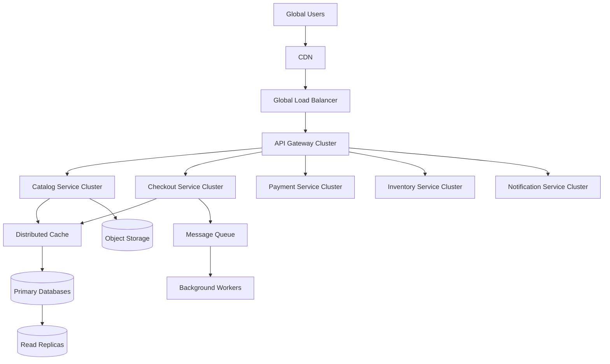
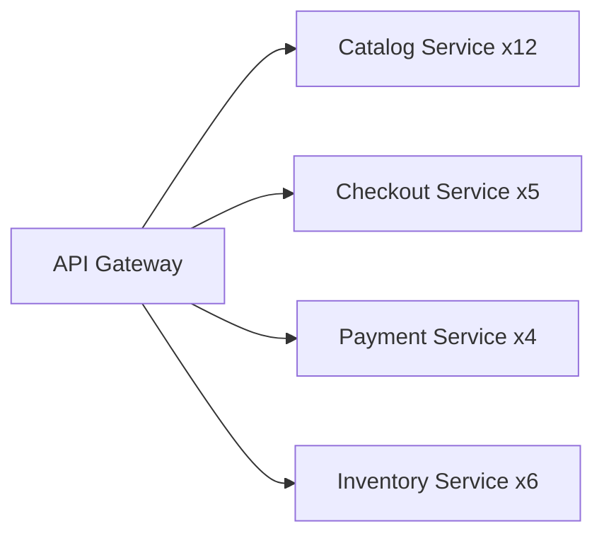
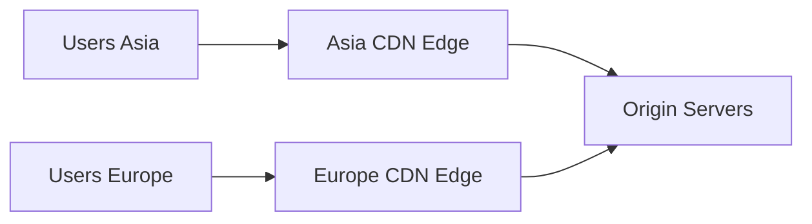
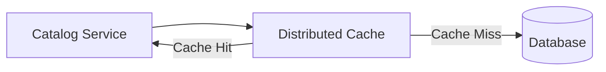
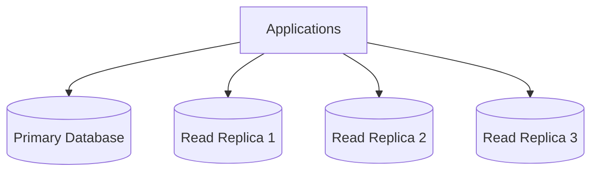
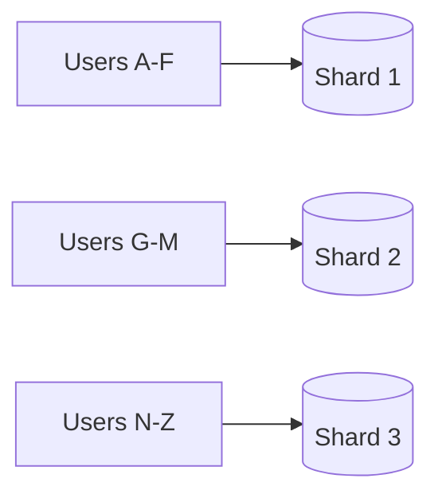
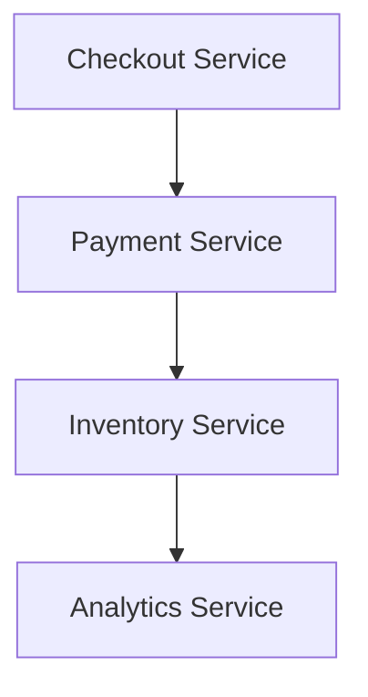
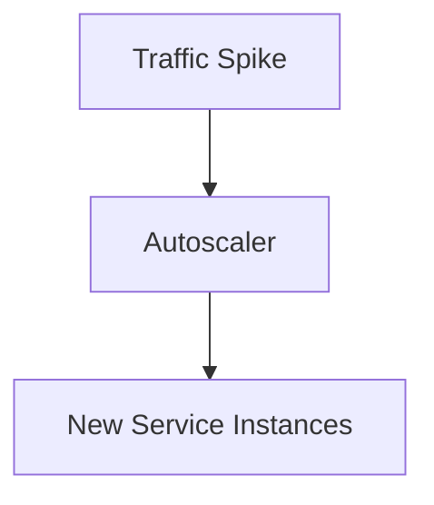
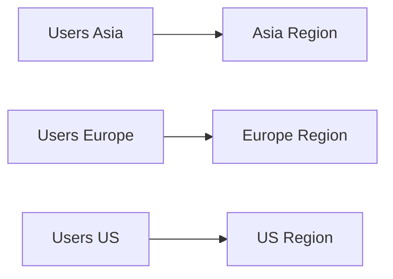
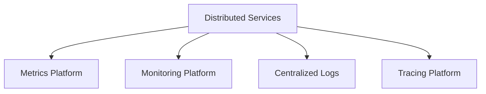

# Example – Day 29: Scalability & Distributed Systems

> Part of the Thynqit Labs – Foundational Engineering Bootcamp

---

# 📌 Overview

This document demonstrates a simplified example of how a Target.com inspired e-commerce platform evolves into a scalable distributed system.

The purpose of this example is to help learners understand:

- how systems scale horizontally
- how distributed infrastructure works
- how caching improves performance
- how databases scale
- how asynchronous systems operate
- how distributed systems handle failures
- how global traffic is managed

This example builds on concepts introduced in:

- Day 26 – System Design Basics
- Day 27 – Monolith Architecture
- Day 28 – Microservices Architecture

The platform now evolves into:

```plaintext
Scalable Distributed Infrastructure
```

---

# Document Information

| Field | Value |
|------|------|
| Platform | Thynqit Commerce Platform |
| Architecture Type | Distributed Scalable System |
| Document Version | v1.0 |
| Prepared By | Platform Engineering Team |
| Prepared Date | 2026-05-28 |

---

# 1. Business Context

The platform now serves:

- millions of daily users
- global customers
- seasonal sales traffic
- mobile and web traffic
- partner integrations

The platform experiences:

- Black Friday traffic spikes
- flash sale traffic bursts
- large product catalog growth
- increasing engineering complexity

The organization now requires:

- high scalability
- low latency
- high availability
- fault tolerance
- global distribution

---

# 2. High-Level Distributed System Architecture

The platform evolves into a globally scalable distributed system.

---

## High-Level Architecture Diagram



---

# 3. Traffic Spike Scenario

During Black Friday sales:

- traffic increases 20x
- product searches spike heavily
- checkout requests surge
- inventory updates increase dramatically

The platform must scale dynamically.

---

# 4. Horizontal Scaling Example

Instead of upgrading one server, the system adds more service instances.

---

## Scaling Diagram



---

## 🧠 Engineering Note

Different services scale differently based on traffic patterns.

For example:

- Catalog receives heavy read traffic
- Checkout requires transaction consistency
- Payments require reliability over throughput

---

# 5. CDN-Based Global Delivery

The platform uses a CDN to reduce latency globally.

---

## CDN Workflow

```plaintext
User opens product page
    ↓
CDN serves product images
    ↓
Origin servers avoided
```

---

## CDN Architecture Diagram



---

# 6. Distributed Caching Strategy

The platform uses distributed caching for:

- product catalog
- recommendations
- session data
- frequently accessed APIs

---

## Cache Workflow Diagram



---

# 7. Cache Invalidation Challenge

When inventory changes:

```plaintext
Database updates
    ↓
Cache must refresh
```

Otherwise users may see stale inventory.

---

## 🧠 Engineering Note

Cache invalidation is difficult because distributed systems must synchronize:

- performance
- consistency
- freshness

simultaneously.

---

# 8. Database Scaling Strategy

The platform database becomes a bottleneck due to:

- massive read traffic
- increasing writes
- reporting workloads

---

# 9. Read Replica Architecture

Read-heavy workloads are distributed across replicas.

---

## Read Replica Diagram



---

# 10. Database Sharding Example

The platform later partitions users across database shards.

---

## Sharding Diagram



---

## Benefits

- distribute storage
- reduce bottlenecks
- improve scalability

---

## Challenges

- cross-shard queries
- data distribution complexity
- operational overhead

---

# 11. Asynchronous Processing Example

Certain workloads are processed asynchronously.

Examples:

- email notifications
- analytics
- recommendation generation
- retry handling

---

## Queue Workflow Diagram


---

# 12. Queue Benefits

Queues improve:

- scalability
- decoupling
- reliability
- traffic smoothing

---

# 13. Eventual Consistency Example

The platform uses eventual consistency for some workflows.

---

## Example

```plaintext
Payment succeeds
    ↓
Inventory updates later
    ↓
Analytics update asynchronously
```

---

## Eventual Consistency Diagram



---

## 🧠 Engineering Note

Eventual consistency improves scalability but may temporarily expose inconsistent data.

---

# 14. Distributed Failure Scenario

Example:

```plaintext
Payment Service becomes unavailable
```

The system must:

- retry safely
- avoid cascading failures
- preserve checkout stability

---

# 15. Reliability Strategy

The platform introduces:

| Strategy | Purpose |
|------|------|
| Retries | Recover temporary failures |
| Circuit Breakers | Prevent cascading failures |
| Replication | Improve availability |
| Autoscaling | Handle traffic spikes |
| Monitoring | Detect failures |

---

## Reliability Diagram


---

# 16. Autoscaling Example

Infrastructure scales dynamically during traffic spikes.

---

## Autoscaling Workflow



---

# 17. Global Multi-Region Deployment

To improve global reliability, the platform deploys across regions.

---

## Multi-Region Architecture



---

## Benefits

- lower latency
- disaster recovery
- regional fault isolation
- global scalability

---

# 18. Observability at Scale

Distributed systems require centralized observability.

---

## Observability Components

| Component | Purpose |
|------|------|
| Metrics | System health |
| Monitoring | Detect incidents |
| Centralized Logging | Aggregate logs |
| Distributed Tracing | Track requests |

---

## Observability Diagram



---

# 19. Trade-Off Analysis

Scaling systems introduces trade-offs.

---

## Examples

| Improvement | Trade-Off |
|------|------|
| Distributed Caching | Cache invalidation complexity |
| Read Replicas | Replication lag |
| Sharding | Operational overhead |
| Async Processing | Eventual consistency |
| Global Regions | Infrastructure cost |

---

# 20. Future Evolution

As the platform grows further, the company may later adopt:

- event-driven systems
- service mesh
- edge computing
- data streaming platforms
- platform engineering models
- multi-cloud infrastructure

---

# 21. Key Takeaways

This example demonstrates how modern systems scale using:

- horizontal scaling
- distributed caching
- database replication
- partitioning
- asynchronous messaging
- autoscaling
- global infrastructure

Scalable distributed systems improve:

- performance
- reliability
- availability
- elasticity

but also introduce:

- operational complexity
- synchronization challenges
- distributed debugging complexity

---

# 📚 Related Learning Flow

This example continues the distributed systems evolution journey:

```plaintext
System Design Basics
   ↓
Monolith Architecture
   ↓
Microservices Architecture
   ↓
Scalable Distributed Systems
   ↓
Performance & Reliability
```

This mirrors how many real-world internet-scale systems evolve.

---

# 🧭 Navigation

← Back to Resources  
[Resources](./resources.md)

➡ Next: Assignments  
[Assignments](./assignments.md)