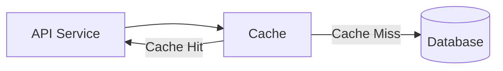
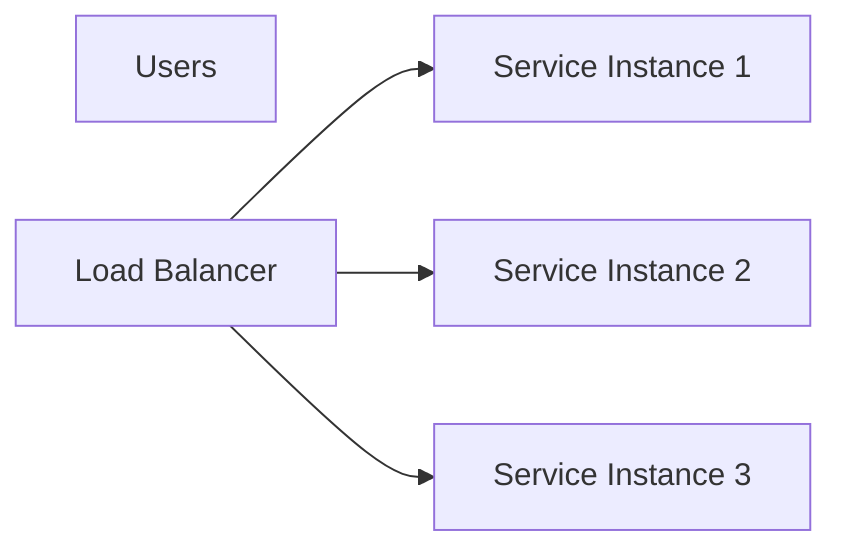
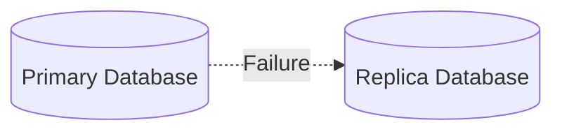
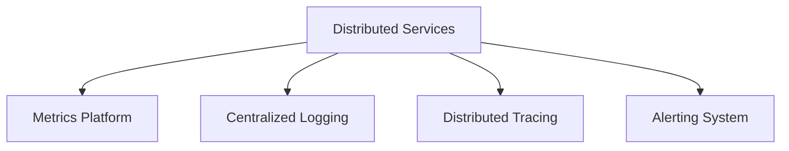

# Day 30 – Performance, Reliability & Resilience

> Part of the Thynqit Labs – Foundational Engineering Bootcamp

---

# 📌 Overview

Modern engineering systems must not only scale — they must also remain:

- fast
- reliable
- fault tolerant
- observable
- resilient under failures

As distributed systems grow, engineering teams must continuously optimize:

- latency
- throughput
- uptime
- recovery strategies
- failure handling
- operational visibility

Large-scale platforms such as:

- Amazon
- Netflix
- Uber
- Spotify
- Google

invest heavily in:

```plaintext
Performance Engineering
Reliability Engineering
Resilience Engineering
```

to ensure systems remain operational during:

- traffic spikes
- hardware failures
- software bugs
- dependency outages
- network disruptions

This module focuses on understanding how modern systems:

- optimize performance
- improve reliability
- recover from failures
- prevent cascading outages
- maintain operational visibility

Throughout this module, learners continue evolving the same Target.com inspired e-commerce platform introduced in previous modules.

The platform now evolves into:

```plaintext
Reliable Internet-Scale Infrastructure
```

---

# 🎯 Learning Objectives

By the end of this module, learners should be able to:

- Understand performance engineering fundamentals
- Understand latency and throughput concepts
- Understand reliability engineering basics
- Understand resilience patterns
- Understand failure handling strategies
- Understand monitoring and observability
- Understand incident response basics
- Understand SLOs, SLIs, and SLAs
- Understand production reliability trade-offs

---

# 🧠 Core Concepts

---

# PART 1 – PERFORMANCE ENGINEERING

---

# 1. What is Performance Engineering?

Performance engineering focuses on ensuring systems remain:

```plaintext
Fast and Efficient
```

under increasing load.

---

# 2. Common Performance Metrics

| Metric | Meaning |
|------|------|
| Latency | Time taken to respond |
| Throughput | Requests processed per second |
| Response Time | End-to-end request duration |
| Error Rate | Failed request percentage |
| Resource Utilization | CPU, memory, disk usage |

---

# 3. Latency vs Throughput

---

## Latency

```plaintext
How fast one request completes
```

---

## Throughput

```plaintext
How many requests system handles
```

---

## Example

| Scenario | Interpretation |
|------|------|
| Low latency | Fast individual requests |
| High throughput | Large traffic handling |

---

# 4. Performance Bottlenecks

Common bottlenecks include:

- slow database queries
- excessive API calls
- network latency
- disk I/O
- synchronous dependencies
- inefficient algorithms

---

# 🧠 Engineering Note

Most large-scale performance issues originate from:

- database bottlenecks
- excessive distributed communication
- inefficient caching
- blocking workflows

---

# PART 2 – PERFORMANCE OPTIMIZATION

---

# 5. Caching for Performance

Caching reduces expensive operations.

---

## Example



---

# 6. CDN Optimization

CDNs improve global performance by caching static assets closer to users.

---

## CDN Benefits

- lower latency
- reduced origin traffic
- faster media delivery
- improved user experience

---

# 7. Database Optimization

Common database optimizations:

| Optimization | Purpose |
|------|------|
| Indexing | Faster queries |
| Read Replicas | Read scalability |
| Partitioning | Data distribution |
| Query Optimization | Reduce latency |

---

# 8. Asynchronous Processing

Async processing prevents blocking operations.

---

## Example Workflows

- notifications
- analytics
- retries
- recommendation generation

---

## Async Workflow Diagram


---

# PART 3 – RELIABILITY ENGINEERING

---

# 9. What is Reliability?

Reliability means systems continue operating correctly over time.

---

# 10. High Availability

High availability minimizes downtime.

---

## Example Strategies

- load balancing
- redundancy
- replication
- failover systems

---

## High Availability Diagram



---

# 11. Redundancy

Critical systems often use duplicates.

Examples:

- multiple servers
- database replicas
- multi-region deployments

---

# 12. Failover

Failover automatically switches traffic to backup systems during failures.

---

## Failover Diagram



---

# 🧠 Engineering Note

Reliable systems assume:

```plaintext
Failures WILL happen.
```

Engineering focuses on:

- detecting failures
- isolating failures
- recovering quickly

---

# PART 4 – RESILIENCE ENGINEERING

---

# 13. What is Resilience?

Resilience means systems continue functioning despite failures.

---

# 14. Common Resilience Patterns

| Pattern | Purpose |
|------|------|
| Retries | Recover temporary failures |
| Circuit Breakers | Prevent cascading failures |
| Timeouts | Avoid hanging requests |
| Bulkheads | Isolate failures |
| Queueing | Decouple workloads |

---

# 15. Retry Pattern

Retries help recover temporary network or service failures.

---

## Retry Workflow


---

# 16. Circuit Breaker Pattern

Circuit breakers stop repeated failing requests.

---

## Circuit Breaker Diagram


---

# 17. Timeouts

Timeouts prevent systems from waiting indefinitely.

---

## Example

```plaintext
Payment Service timeout after 3 seconds
```

---

# 18. Bulkhead Isolation

Bulkheads isolate failures between components.

---

## Example

```plaintext
Analytics failures should not break checkout
```

---

# PART 5 – OBSERVABILITY & MONITORING

---

# 19. Why Observability Matters

Distributed systems require visibility into:

- performance
- failures
- traffic
- latency
- dependencies

---

# 20. Observability Components

| Component | Purpose |
|------|------|
| Metrics | System health visibility |
| Logs | Detailed event tracking |
| Traces | Request flow tracking |
| Alerts | Failure detection |

---

## Observability Architecture



---

# 21. Correlation IDs & Tracing

Distributed requests require:

```plaintext
Correlation IDs
```

to trace workflows.

---

## Example

```plaintext
REQ-1001
```

tracked across:

- API Gateway
- Checkout Service
- Payment Service
- Notification Service

---

# PART 6 – INCIDENT MANAGEMENT

---

# 22. What is an Incident?

An incident is an event causing service degradation or outages.

---

# 23. Incident Lifecycle

```plaintext
Failure Occurs
    ↓
Monitoring Detects Issue
    ↓
Alerts Trigger
    ↓
Engineers Investigate
    ↓
Mitigation Applied
    ↓
Root Cause Analysis
```

---

# 24. Monitoring & Alerting

Monitoring systems detect issues automatically.

---

## Example Monitoring Metrics

- API latency
- CPU utilization
- memory usage
- database errors
- queue backlog

---

# PART 7 – SLOs, SLIs & SLAs

---

# 25. SLI (Service Level Indicator)

Measured system behavior.

---

## Examples

- latency
- uptime
- error rate

---

# 26. SLO (Service Level Objective)

Target reliability goal.

---

## Example

```plaintext
99.9% uptime
```

---

# 27. SLA (Service Level Agreement)

Formal commitment to customers.

---

## Example

```plaintext
99.95% availability guarantee
```

---

# PART 8 – DISASTER RECOVERY

---

# 28. Disaster Recovery Planning

Large systems prepare for catastrophic failures.

---

## Examples

- regional outages
- database corruption
- cloud provider failures

---

# 29. Disaster Recovery Strategies

| Strategy | Purpose |
|------|------|
| Backups | Recover lost data |
| Multi-Region Deployment | Regional resilience |
| Replication | Data redundancy |
| Recovery Testing | Validate recovery plans |

---

# PART 9 – TRADE-OFF THINKING

---

# 30. Reliability vs Complexity

Improving reliability often increases:

- operational complexity
- infrastructure cost
- engineering overhead

---

## Examples

| Improvement | Trade-Off |
|------|------|
| Multi-region deployments | Higher cost |
| Replication | Synchronization complexity |
| Retries | Duplicate request risks |
| Caching | Cache invalidation challenges |

---

# 🧠 Engineering Note

Reliable systems are engineered through:

- gradual improvements
- operational maturity
- strong monitoring
- automated recovery
- failure testing

—not by avoiding failures entirely.

---

# 🌍 Real-World Relevance

Modern engineering organizations invest heavily in:

- Site Reliability Engineering (SRE)
- observability platforms
- incident management
- automated recovery
- chaos engineering
- production monitoring

to maintain internet-scale systems reliably.

---

# ⚠️ Common Misconceptions

Reliability is not achieved by:

- adding more servers only
- overengineering systems
- eliminating every failure

True resilience comes from:

- handling failures gracefully
- recovering quickly
- improving visibility
- automating operations

---

# 🔄 Reflection Questions

- Why do distributed systems require observability?
- Why are retries dangerous without safeguards?
- Why is reliability engineering important at scale?
- Why are circuit breakers useful?
- Why do resilient systems assume failures will happen?

---

# 📚 Next Steps

- Review `resources.md`
- Explore reliability examples in `example.md`
- Complete `assignments.md`

---

# 🧭 Navigation

← Previous Day  
[Day 29](../day-29/README.md)

➡ Next: Resources  
[Resources](./resources.md)