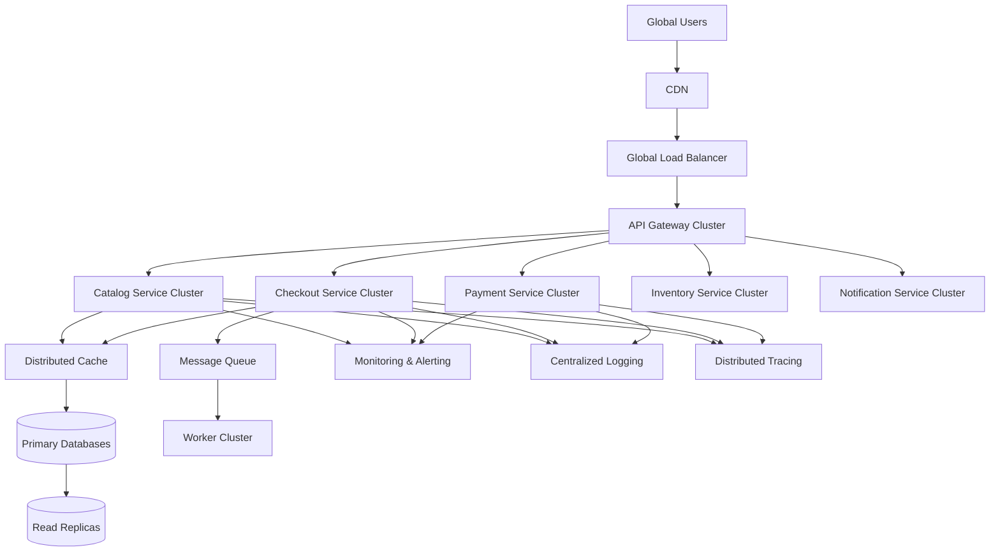
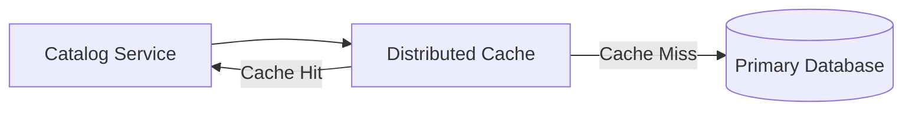
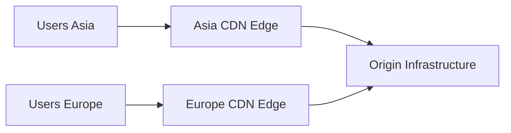
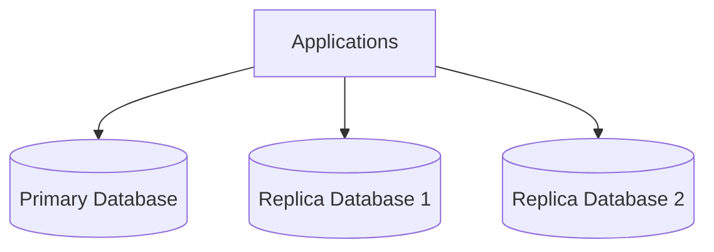
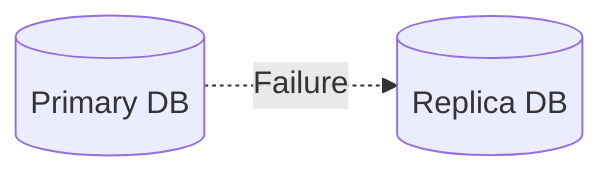
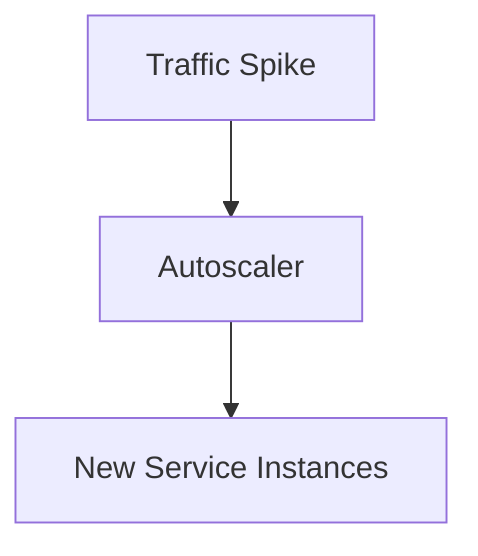
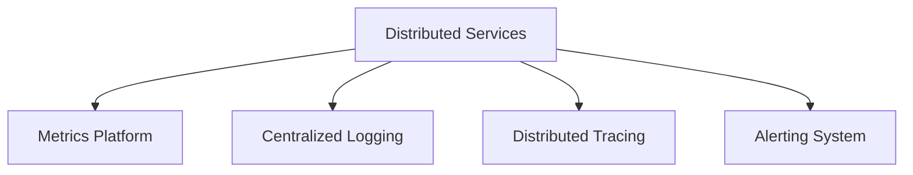
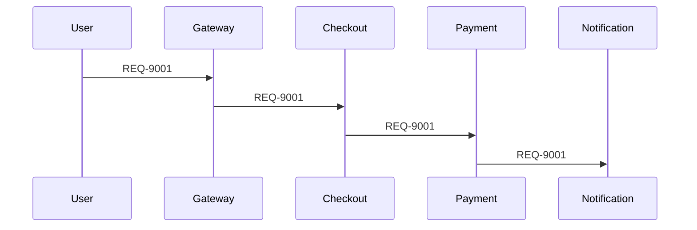

# Example – Day 30: Performance, Reliability & Resilience

> Part of the Thynqit Labs – Foundational Engineering Bootcamp

---

# 📌 Overview

This document demonstrates a simplified example of how a Target.com inspired e-commerce platform improves:

- performance
- reliability
- resilience
- observability
- disaster recovery

to operate reliably at internet scale.

The purpose of this example is to help learners understand:

- how performance bottlenecks are identified
- how systems improve latency and throughput
- how distributed failures are handled
- how resilient systems recover automatically
- how monitoring and observability work
- how production reliability is engineered

This example builds on concepts introduced in:

- Day 26 – System Design Basics
- Day 27 – Monolith Architecture
- Day 28 – Microservices Architecture
- Day 29 – Scalability & Distributed Systems

The platform now evolves into:

```plaintext
Reliable & Resilient Internet-Scale Infrastructure
```

---

# Document Information

| Field | Value |
|------|------|
| Platform | Thynqit Commerce Platform |
| Architecture Type | High Availability Distributed Platform |
| Document Version | v1.0 |
| Prepared By | Site Reliability Engineering Team |
| Prepared Date | 2026-05-29 |

---

# 1. Business Context

The platform now supports:

- global customers
- peak seasonal traffic
- high-frequency transactions
- mobile and web applications
- large-scale asynchronous workloads

The business requires:

- low latency
- high uptime
- reliable payments
- fault tolerance
- disaster recovery
- operational visibility

Any production outage now impacts:

- revenue
- customer trust
- order fulfillment
- brand reputation

The company therefore invests heavily in:

```plaintext
Performance Engineering
Reliability Engineering
Resilience Engineering
```

---

# 2. High-Level Reliable Architecture

The platform is designed for:

- high availability
- fault isolation
- distributed recovery
- global scalability

---

## Reliable Distributed Architecture



---

# 3. Performance Bottleneck Scenario

The engineering team identifies slow checkout performance during flash sales.

---

## Symptoms

| Problem | Observation |
|------|------|
| High API latency | Checkout requests slow |
| Database overload | Heavy reads during sales |
| Payment delays | External dependency latency |
| Queue backlog | Notification processing lag |

---

# 4. Performance Optimization Strategy

The team introduces:

- distributed caching
- read replicas
- CDN optimization
- async processing
- autoscaling

---

# 5. Distributed Caching Example

The product catalog receives heavy read traffic.

The platform introduces distributed caching.

---

## Cache Workflow



---

## Benefits

- reduced database load
- faster API responses
- improved scalability
- lower latency

---

# 6. CDN Performance Optimization

Static assets are globally distributed using CDN edge locations.

---

## CDN Workflow

```plaintext
User opens product page
    ↓
CDN serves images
    ↓
Origin servers avoided
```

---

## CDN Architecture Diagram



---

# 7. Database Reliability Strategy

The platform database is highly critical.

The team introduces:

- read replicas
- failover systems
- backups
- replication

---

## High Availability Database Architecture



---

# 8. Automatic Failover Example

If the primary database fails:

```plaintext
Traffic automatically shifts
to replica database
```

---

## Failover Diagram



---

# 🧠 Engineering Note

Reliable systems assume:

```plaintext
Infrastructure failures WILL happen.
```

The goal is rapid recovery.

---

# 9. Retry Strategy Example

The Payment Service occasionally experiences temporary failures.

The platform introduces retry logic.

---

## Retry Workflow


---

## Retry Rules

| Rule | Example |
|------|------|
| Retry Attempts | 3 attempts |
| Retry Delay | Exponential backoff |
| Timeout | 3 seconds |

---

# 10. Circuit Breaker Example

Repeated payment failures may overload systems.

The platform introduces circuit breakers.

---

## Circuit Breaker Workflow


---

## Benefits

- prevents cascading failures
- isolates unstable dependencies
- protects system stability

---

# 11. Queue-Based Resilience

Notifications and analytics run asynchronously.

---

## Queue Workflow Diagram


---

## Benefits

- non-blocking operations
- traffic smoothing
- retry handling
- improved scalability

---

# 12. Autoscaling During Traffic Spikes

During flash sales:

```plaintext
Traffic increases 20x
```

Infrastructure scales automatically.

---

## Autoscaling Workflow



---

# 13. Observability Architecture

Distributed systems require centralized visibility.

---

## Observability Components

| Component | Purpose |
|------|------|
| Metrics | System health |
| Logs | Event visibility |
| Traces | Request tracking |
| Alerts | Incident detection |

---

## Observability Diagram



---

# 14. Distributed Tracing Example

Requests moving across services require correlation IDs.

---

## Example Correlation ID

```plaintext
REQ-9001
```

tracked across:

- API Gateway
- Checkout Service
- Payment Service
- Notification Service

---

## Distributed Trace Workflow



---

# 15. Monitoring & Alerting Example

Monitoring systems automatically detect production incidents.

---

## Example Alerts

| Alert | Trigger |
|------|------|
| High API Latency | >2 seconds |
| Error Rate Spike | >5% |
| Queue Backlog | >10,000 messages |
| Database CPU | >85% |

---

# 16. Incident Response Workflow

When production incidents occur:

---

## Incident Lifecycle

```plaintext
Failure Occurs
    ↓
Monitoring Detects Issue
    ↓
Alert Triggered
    ↓
Engineers Investigate
    ↓
Mitigation Applied
    ↓
Root Cause Analysis
```

---

# 17. Disaster Recovery Planning

The platform deploys infrastructure across regions.

---

## Multi-Region Architecture


---

## Disaster Recovery Benefits

- regional fault isolation
- backup infrastructure
- lower downtime risk
- global resilience

---

# 18. SLO Example

The engineering team defines reliability objectives.

---

## Example SLOs

| Service | Target |
|------|------|
| Checkout API | 99.95% uptime |
| Payment API | <2 second latency |
| Notifications | 99.9% delivery success |

---

# 19. Trade-Off Analysis

Improving reliability introduces complexity.

---

## Example Trade-Offs

| Improvement | Trade-Off |
|------|------|
| Read Replicas | Replication lag |
| Retries | Duplicate requests |
| Multi-Region Deployments | Higher infrastructure cost |
| Distributed Caching | Cache invalidation complexity |
| Queue Systems | Eventual consistency |

---

# 20. Production Reliability Philosophy

The engineering organization adopts the following philosophy:

```plaintext
Failures are inevitable.
Systems must recover gracefully.
```

Engineering focuses on:

- automated recovery
- observability
- redundancy
- rapid mitigation
- operational maturity

---

# 21. Future Evolution

As the platform continues scaling, future improvements may include:

- chaos engineering
- service mesh
- predictive autoscaling
- edge computing
- AI-based anomaly detection
- advanced SRE automation

---

# 22. Key Takeaways

This example demonstrates how modern systems achieve:

- low latency
- high availability
- distributed resilience
- operational visibility
- disaster recovery
- scalable reliability

through combinations of:

- caching
- retries
- failover
- autoscaling
- observability
- distributed tracing
- monitoring
- redundancy

Reliable systems are not failure-free systems.

They are systems engineered to:

```plaintext
Detect failures quickly
Recover automatically
Maintain customer experience
```

---

# 📚 Related Learning Flow

This example completes the system design evolution journey:

```plaintext
System Design Basics
   ↓
Monolith Architecture
   ↓
Microservices Architecture
   ↓
Scalable Distributed Systems
   ↓
Performance, Reliability & Resilience
```

This mirrors how modern internet-scale systems evolve operationally.

---

# 🧭 Navigation

← Back to Resources  
[Resources](./resources.md)

➡ Next: Assignments  
[Assignments](./assignments.md)